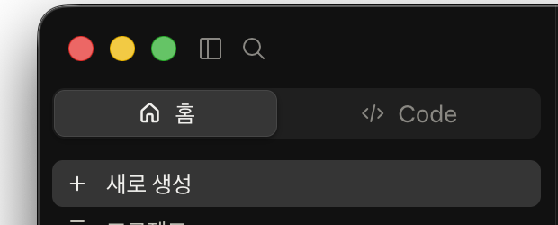

# Day 0 — Claude Desktop 왕초보 화면 옆 용어사전

이 문서는 외우는 시험지가 아닙니다. Claude Desktop이나 교재에서 모르는 단어가 보일 때 `Command+F`(Mac) 또는 `Ctrl+F`(Windows)를 눌러 찾아보는 **화면 옆 참고사전**입니다.

## 가장 먼저 기억할 네 가지

1. Code에서는 권한을 **수동(Manual)**으로 둡니다.
2. 승인 창에서는 “어느 폴더의 어떤 파일을 바꾸는가”만 봅니다.
3. API key, 비밀번호, 카드번호는 채팅과 화면 인증에 올리지 않습니다.
4. 삭제·결제·전체 자동 승인은 멈추고 운영자에게 묻습니다.

## 화면에서 먼저 찾을 위치

- `홈`: 채팅(Chat)·코워크(Cowork)·프로젝트(Projects)·아티팩트(Artifacts)·디자인(Design)을 사용하는 대화 중심 공간
- `Code`: 폴더 파일을 만들고 수정하며 Preview와 Diff를 보는 제작 공간

수강 기본값은 `로컬(Local) / 오늘 폴더 / 화면의 기본 모델 / 높음(High) / 수동(Manual)`이다.

홈의 코워크에서 보이는 **수동**과 Code에서 보이는 **수동**은 위치와 적용 대상이 다릅니다. 코워크의 수동은 코워크가 파일·앱을 사용하는 작업을 사람이 확인하는 방식이고, Code의 수동은 파일 편집과 명령 실행을 승인하는 Code 권한 모드입니다. 둘 다 사람이 확인한다는 원칙은 같지만 같은 메뉴는 아닙니다.

---

## 1. Claude 화면과 작업 방식

### 홈 / 채팅(Home / Chat)

- **한 줄 뜻:** Claude와 질문하고 답하는 기본 대화 화면입니다.
- **생활 비유:** 옆 사람에게 물어보고 메모로 답을 받는 일입니다.
- **이 과정에서 언제 봄:** Day 0 설치 직후 첫 인사를 보낼 때 봅니다.
- **왕초보가 지금 할 행동:** 간단한 질문은 여기서 하고, 컴퓨터 파일을 직접 다룰 과제는 Cowork나 Code로 이동합니다.

### Cowork(코워크)

- **한 줄 뜻:** 허용한 로컬 파일이나 연결된 서비스의 자료를 읽고 여러 단계를 거쳐 문서·표·발표자료 같은 완성 파일을 만드는 작업 방식입니다.
- **생활 비유:** 자료 상자 하나와 완성물 주문서를 동료에게 건네는 것과 같습니다.
- **이 과정에서 언제 봄:** Day 4에서 메모 3개를 한 장 안내문으로 정리할 때 봅니다.
- **왕초보가 지금 할 행동:** 원본이 아닌 수업용 복사 폴더만 선택하고, 작업 계획과 저장 파일명을 확인한 뒤 승인합니다.

### Code(코드)

- **한 줄 뜻:** 선택한 프로젝트 폴더의 파일을 Claude가 읽고 만들고 고치며, 실행 결과까지 확인하는 작업 방식입니다.
- **생활 비유:** 작업대 위 설계도와 부품을 함께 보며 실제 물건을 고치는 기술자입니다.
- **이 과정에서 언제 봄:** Day 0의 첫 파일, Day 5의 웹 도구, 이후 자동화와 Skill에서 봅니다.
- **왕초보가 지금 할 행동:** `로컬 → 폴더 선택… → 수동` 순서로 수업 폴더를 엽니다.

### 디자인(Design)

- **한 줄 뜻:** 대화창과 캔버스에서 디자인·대화형 시제품·발표 자료를 만들고, 필요하면 Claude Code로 넘길 수 있는 별도 베타 기능입니다.
- **생활 비유:** 말로 주문하면서 옆의 큰 도화지에 시안을 바로 그리는 디자인실입니다.
- **이 과정에서 언제 봄:** Day 3에서 휴대폰용 세로 홍보물을 만들 때 사용합니다.
- **왕초보가 지금 할 행동:** Day 3에서 사이드바의 **디자인**을 누릅니다. 조직 설정이나 요금제 때문에 메뉴가 없으면 교안의 일반 채팅·아티팩트 대체 경로를 따릅니다.

### Artifact(아티팩트)

- **한 줄 뜻:** 채팅 대화 옆에서 따로 열리고 수정·다운로드·발행할 수 있는 문서, 코드, 시각화 또는 작은 앱 결과물입니다.
- **생활 비유:** 대화 중 나온 낙서가 아니라 따로 꺼내 쓰는 완성 작품판입니다.
- **이 과정에서 언제 봄:** Chat에서 빠르게 웹 도구나 문서를 만들 때 볼 수 있지만, 본 과정의 파일 작업은 주로 Cowork와 Code를 씁니다.
- **왕초보가 지금 할 행동:** 결과가 나타나면 직접 버튼과 계산을 시험하고, 공개 전 개인정보를 확인합니다.

### 발송(Dispatch)

- **한 줄 뜻:** 휴대폰에서 데스크톱의 Cowork 작업을 맡기고 진행 상태를 확인하는 기능입니다.
- **생활 비유:** 외출 중 동료에게 일을 맡기고 사무실에서 결과를 이어 확인하는 것입니다.
- **이 과정에서 언제 봄:** Day 7에서 휴대폰으로 컴퓨터의 작업에 요청을 보낼 때 봅니다.
- **왕초보가 지금 할 행동:** 컴퓨터 앱의 `홈 → 발송(베타)`에서 먼저 연결하고, 승인 화면은 컴퓨터에서 직접 확인합니다.

---

## 2. 어디에서 작업하는가

### 로컬(Local)

- **한 줄 뜻:** 지금 내 Mac 또는 Windows 컴퓨터의 폴더에서 작업하는 방식입니다.
- **생활 비유:** 내 책상 위 서류로 일하는 것입니다.
- **이 과정에서 언제 봄:** Code에서 매일 수업 폴더를 열 때 봅니다.
- **왕초보가 지금 할 행동:** 오늘 만든 수업용 폴더만 선택하고 전체 사용자 폴더는 열지 않습니다.

### Cloud / Remote(클라우드 / 원격)

- **한 줄 뜻:** 내 컴퓨터가 아니라 인터넷의 별도 실행 환경에서 작업하는 방식입니다.
- **생활 비유:** 내 책상이 아니라 외부 작업실에 복사본을 보내 일하는 것입니다.
- **이 과정에서 언제 봄:** Desktop의 세션 선택 화면에 보일 수 있지만 기본 과정에는 필요 없습니다.
- **왕초보가 지금 할 행동:** 교재가 Local을 지시하면 Cloud나 Remote를 고르지 않습니다.

### SSH

- **한 줄 뜻:** 인터넷이나 네트워크 너머의 다른 컴퓨터에 안전하게 접속해 그 컴퓨터의 파일로 작업하는 방식입니다.
- **생활 비유:** 열쇠를 확인하고 먼 창고의 작업대에 들어가는 것입니다.
- **이 과정에서 언제 봄:** 서버 운영 심화에서만 사용합니다.
- **왕초보가 지금 할 행동:** 주소·사용자·키를 모르면 누르지 않습니다. 이번 기본 과정에서는 사용하지 않습니다.

### 작업 폴더

- **한 줄 뜻:** 오늘 Claude에게 보여 주고 작업하게 할 파일 상자입니다.
- **생활 비유:** 책상 위에 올려놓은 한 개의 투명 정리함입니다.
- **이 과정에서 언제 봄:** 매일 `Day05_Code_닉네임` 같은 폴더를 열 때 봅니다.
- **왕초보가 지금 할 행동:** 날짜별 새 폴더나 복사본을 만들고 개인정보가 없는지 먼저 봅니다.

### Project(프로젝트)

- **한 줄 뜻:** 하나의 목표를 위해 관련 파일과 규칙을 함께 모아 둔 작업 단위입니다.
- **생활 비유:** 행사 하나에 필요한 기획서·사진·명단을 담은 업무철입니다.
- **이 과정에서 언제 봄:** 콘텐츠 엔진, 카드뉴스, 웹 도구 폴더를 부를 때 봅니다.
- **왕초보가 지금 할 행동:** 프로젝트마다 가장 바깥 폴더 하나를 정해 Code에서 그 폴더를 엽니다.

### Repository / Repo(저장소 / 리포)

- **한 줄 뜻:** Git이 파일 변경 역사를 기록하도록 준비된 프로젝트 폴더입니다.
- **생활 비유:** 현재 문서뿐 아니라 모든 공식 수정 이력도 함께 든 서류철입니다.
- **이 과정에서 언제 봄:** GitHub에 교재나 프로젝트를 보관할 때 봅니다.
- **왕초보가 지금 할 행동:** Day 0에는 일반 프로젝트 폴더와 같은 것으로 이해하고, Git 명령은 안내받기 전 실행하지 않습니다.

> **헷갈리지 않기:** 모든 저장소는 프로젝트 폴더이지만, 모든 프로젝트 폴더가 Git 저장소인 것은 아닙니다.

### Session(세션)

- **한 줄 뜻:** 한 프로젝트에서 Claude와 이어 가는 한 번의 작업 대화입니다.
- **생활 비유:** 동료와 연 한 번의 작업 회의입니다.
- **이 과정에서 언제 봄:** 새 Code 대화를 열거나 어제 작업을 다시 열 때 봅니다.
- **왕초보가 지금 할 행동:** 주제가 크게 바뀌면 새 세션을 열고, 같은 작업을 고칠 때는 현재 세션을 이어갑니다.

---

## 3. Claude에게 부탁하는 말과 생각 공간

### Prompt(프롬프트)

- **한 줄 뜻:** 내가 Claude에게 보내는 요청, 조건, 자료 설명입니다.
- **생활 비유:** 일을 맡길 때 쓰는 주문서입니다.
- **이 과정에서 언제 봄:** 모든 날의 복사 상자에서 봅니다.
- **왕초보가 지금 할 행동:** `[닉네임]` 같은 대괄호 부분만 내 내용으로 바꾸고, 비밀번호는 넣지 않습니다.

### Context(컨텍스트 / 문맥)

- **한 줄 뜻:** Claude가 현재 답을 만들 때 참고하고 있는 대화, 읽은 파일, 규칙, 도구 정보의 묶음입니다.
- **생활 비유:** 회의 탁자 위에 지금 펼쳐 둔 모든 자료입니다.
- **이 과정에서 언제 봄:** 대화가 길어지거나 많은 파일을 읽혀 답이 흐려질 때 봅니다.
- **왕초보가 지금 할 행동:** 필요한 폴더와 파일만 열고, 전혀 다른 일은 새 세션에서 시작합니다.

### Token(토큰)

- **한 줄 뜻:** Claude가 글을 읽고 쓰는 양을 세는 작은 단위입니다. 글자나 단어와 완전히 같지는 않습니다.
- **생활 비유:** 작업 메모장에 들어가는 작은 칸입니다.
- **이 과정에서 언제 봄:** 긴 파일을 많이 읽히거나 사용량 안내가 나올 때 봅니다.
- **왕초보가 지금 할 행동:** 숫자를 계산해 외우지 말고, 필요한 자료만 주고 긴 원문 전체 복사를 줄입니다.

### Model(모델)

- **한 줄 뜻:** 요청을 이해하고 답하거나 작업하는 Claude의 두뇌 종류입니다.
- **생활 비유:** 속도와 깊이가 다른 담당자를 고르는 것입니다.
- **이 과정에서 언제 봄:** 입력창 근처의 모델 선택 메뉴에서 Sonnet, Opus, Haiku 같은 이름으로 볼 수 있습니다.
- **왕초보가 지금 할 행동:** 설치 때 보이는 기본 모델을 유지합니다. 복잡한 계획·검토 품질이 부족할 때만 더 강한 모델로 바꾸고, 간단한 반복 작업은 빠른 모델을 고려합니다. 작업 중 바꾸어도 되지만 비용·사용량 차이를 먼저 확인합니다.

### Effort(에포트 / 사고 깊이)

- **한 줄 뜻:** 선택한 모델이 이번 작업을 얼마나 깊게 검토하고 생각할지 정하는 단계입니다.
- **생활 비유:** 모델이 담당자 종류라면 Effort는 그 담당자에게 “빠르게 훑기”와 “시간을 들여 꼼꼼히 검토하기” 중 어느 정도를 맡길지 정하는 것입니다.
- **이 과정에서 언제 봄:** 모델 이름을 누른 뒤 Effort 메뉴 또는 Code의 `/model`, `/effort` 선택 화면에서 볼 수 있습니다.
- **왕초보가 지금 할 행동:** 화면에 **높음**이 보이면 높음을 고릅니다. 메뉴가 없거나 다른 선택지만 보이면 처음 선택된 기본값을 유지합니다.

> **Model과 Effort의 차이:** Model을 바꾸는 것은 담당자 자체를 바꾸는 것이고, Effort를 바꾸는 것은 같은 담당자가 생각에 쓰는 시간과 양을 조절하는 것입니다.

높은 Effort는 더 꼼꼼할 수 있지만 응답이 느려지고 사용량도 늘 수 있습니다. 이 과정에서는 단계를 외우지 않습니다. 입력창 근처에서 **높음**이 보이면 고르고, 보이지 않으면 기본값 그대로 진행합니다.

---

## 4. 권한, 승인, 눈으로 확인하는 화면

### Permission mode(권한 모드)

- **한 줄 뜻:** Claude가 파일 변경이나 명령 실행 전에 얼마나 자주 나에게 물을지 정하는 안전 설정입니다.
- **생활 비유:** 동료가 서류를 고칠 때 매번 결재받을지, 일부는 스스로 처리할지 정하는 규칙입니다.
- **이 과정에서 언제 봄:** Code 입력창 옆 모드 선택기에서 봅니다.
- **왕초보가 지금 할 행동:** 현재 화면에서는 **수동(Manual)**을 고릅니다. 앱이 오래되어 구명칭이 보이면 업데이트합니다.

현재 Desktop 공식 문서에 안내된 주요 이름은 다음과 같습니다. 계정·요금제·조직 정책에 따라 일부가 보이지 않을 수 있습니다.

| 화면 이름 | 무엇을 하는가 | 왕초보 행동 |
|---|---|---|
| **계획(Plan)** | 파일을 읽고 조사해 계획을 제안하지만 소스 파일을 고치지 않습니다. | 큰 작업을 시작하기 전 계획만 보고 싶을 때 사용합니다. |
| **수동(Manual)** | 파일 편집과 명령 실행 전에 묻고 Diff를 보여 줍니다. | **첫 7일 기본값입니다.** |
| **승인(Accept edits)** | 일반 파일 편집은 자동 수락하고, 그 밖의 터미널 명령은 계속 묻습니다. | 파일 변경 판단에 익숙해진 뒤 수업 지시가 있을 때만 사용합니다. |
| **자동(Auto)** | 배경 안전 검사를 거쳐 더 자율적으로 작업합니다. 연구 미리보기이며 특정 요금제·모델에서만 보일 수 있습니다. | 왕초보 기본 과정에서는 사용하지 않습니다. |

> 구버전 문서의 `Ask permissions`는 현재 **수동**, `Auto accept edits`는 현재 **승인**에 해당합니다. 구명칭은 화면을 업데이트하기 전 참고용으로만 사용합니다.

### Approval / Approve / Allow(승인 / 허용)

- **한 줄 뜻:** Claude가 제안한 파일 변경, 명령, 앱 접근을 실제로 해도 된다고 사람이 결정하는 것입니다.
- **생활 비유:** 작업 전 결재 도장을 찍는 것입니다.
- **이 과정에서 언제 봄:** 파일 생성·수정, Terminal 명령, Cowork 폴더 접근 때 봅니다.
- **왕초보가 지금 할 행동:** 대상이 오늘 폴더 안인지, 삭제·설치·결제가 아닌지 확인하고 승인합니다. 모르겠으면 거절해도 됩니다.

### Diff(디프 / 변경 비교)

- **한 줄 뜻:** 파일에서 무엇이 없어지고 무엇이 새로 생기는지 전후를 보여 주는 화면입니다.
- **생활 비유:** 문서 수정 전과 후를 색펜으로 비교한 교정지입니다.
- **이 과정에서 언제 봄:** Code가 HTML이나 문서를 고친 뒤 승인 전에 봅니다.
- **왕초보가 지금 할 행동:** 보통 `+ 초록`은 추가, `- 빨강`은 삭제입니다. 요청하지 않은 파일 전체 삭제나 비밀값 추가가 보이면 거절합니다. 테마에 따라 색이 다를 수 있으니 `+`와 `-` 기호도 함께 봅니다.

### Preview(프리뷰 / 미리보기)

- **한 줄 뜻:** 만든 HTML, 이미지, PDF 또는 앱이 실제로 어떻게 보이고 작동하는지 확인하는 창입니다.
- **생활 비유:** 인쇄 전 미리 보기 또는 공연 전 리허설 무대입니다.
- **이 과정에서 언제 봄:** 웹 도구의 제목·버튼·입력 결과를 시험할 때 봅니다.
- **왕초보가 지금 할 행동:** 보기만 하지 말고 빈칸, 긴 문장, 버튼을 직접 눌러 확인합니다.

---

## 5. Terminal과 명령

### Terminal(터미널)

- **한 줄 뜻:** 컴퓨터에 글로 명령을 내려 프로그램을 실행하거나 파일 상태를 확인하는 창입니다.
- **생활 비유:** 버튼 대신 정확한 작업 지시 한 줄을 접수하는 창구입니다.
- **이 과정에서 언제 봄:** 후반의 자동화와 쇼츠 조립에서 봅니다.
- **왕초보가 지금 할 행동:** 교재의 한 줄 전체만 복사하고, 관리자 비밀번호를 요구하거나 삭제 명령이면 멈춥니다.

### Command(명령어)

- **한 줄 뜻:** Terminal에서 컴퓨터가 실행하도록 입력하는 정해진 문장입니다.
- **생활 비유:** 기계에 넣는 한 줄짜리 작업 카드입니다.
- **이 과정에서 언제 봄:** `python3 ...`처럼 자동화를 한 번 실행할 때 봅니다.
- **왕초보가 지금 할 행동:** 뜻을 모르는 명령을 인터넷에서 임의로 복사하지 않고, 현재 폴더와 결과를 먼저 확인합니다.

---

## 6. Git과 GitHub — 변경 역사를 보관하는 말

### Git(깃)

- **한 줄 뜻:** 프로젝트 파일이 언제 어떻게 바뀌었는지 컴퓨터에 기록하고 되돌릴 수 있게 돕는 도구입니다.
- **생활 비유:** 문서의 모든 저장 시점을 남기는 타임머신입니다.
- **이 과정에서 언제 봄:** 교재와 프로젝트를 GitHub에 올리거나 내려받을 때 봅니다.
- **왕초보가 지금 할 행동:** 지금은 “변경 역사 도구”로만 이해하고, 삭제·초기화 명령은 실행하지 않습니다.

### GitHub(깃허브)

- **한 줄 뜻:** Git 저장소를 인터넷에 보관하고 다른 사람과 공유하는 서비스입니다.
- **생활 비유:** 작업 이력이 든 서류철을 보관하는 온라인 금고 겸 협업실입니다.
- **이 과정에서 언제 봄:** 공개 교재 사이트와 프로젝트 백업에서 봅니다.
- **왕초보가 지금 할 행동:** 공개 저장소에 `.env`, API key, 고객 자료가 없는지 확인한 뒤 올립니다.

### Repository(저장소)

- **한 줄 뜻:** Git이 관리하는 프로젝트와 변경 이력의 전체 묶음입니다.
- **생활 비유:** 원고와 모든 수정 기록이 같이 든 공식 서류철입니다.
- **이 과정에서 언제 봄:** GitHub에서 프로젝트 한 개를 열 때 봅니다.
- **왕초보가 지금 할 행동:** 공개인지 비공개인지 확인하고, 모르는 저장소를 덮어쓰지 않습니다.

### Branch(브랜치)

- **한 줄 뜻:** 기존 작업을 보존한 채 별도의 변경을 시험하는 작업 갈래입니다.
- **생활 비유:** 원본은 두고 복사본에서 새 편집을 해 보는 것입니다.
- **이 과정에서 언제 봄:** 여러 기능을 동시에 개발하거나 검토할 때 봅니다.
- **왕초보가 지금 할 행동:** 현재 브랜치 이름을 확인하고, 수업 지시 없이 기본 브랜치를 삭제하지 않습니다.

### Commit(커밋)

- **한 줄 뜻:** 의미 있는 파일 변경 묶음을 설명과 함께 Git 역사에 저장하는 일입니다.
- **생활 비유:** “여기까지가 1차 수정본”이라고 날짜와 제목을 붙여 봉인하는 것입니다.
- **이 과정에서 언제 봄:** 하루 결과를 저장소에 기록할 때 봅니다.
- **왕초보가 지금 할 행동:** 키와 개인정보가 없는지 확인하고 무엇을 바꿨는지 짧게 적습니다.

### Push(푸시)

- **한 줄 뜻:** 내 컴퓨터의 새 커밋을 GitHub 같은 원격 저장소로 올리는 일입니다.
- **생활 비유:** 내 작업철의 최신 수정본을 온라인 보관함에 보내는 것입니다.
- **이 과정에서 언제 봄:** 교재 사이트나 프로젝트 변경을 GitHub에 반영할 때 봅니다.
- **왕초보가 지금 할 행동:** 올리기 전 공개 범위와 비밀 파일을 확인합니다.

### Pull(풀)

- **한 줄 뜻:** 원격 저장소의 새 변경을 내 컴퓨터의 기존 저장소에 가져와 합치는 일입니다.
- **생활 비유:** 공동 온라인 서류철의 최신 수정분을 내 서류철에 반영하는 것입니다.
- **이 과정에서 언제 봄:** 다른 컴퓨터나 사람이 올린 변경을 이어 작업할 때 봅니다.
- **왕초보가 지금 할 행동:** 내 미저장 작업이 있으면 먼저 확인하고, 충돌 메시지가 나오면 억지로 덮어쓰지 않습니다.

### Clone(클론)

- **한 줄 뜻:** 원격 저장소 전체를 처음으로 내 컴퓨터에 복사해 새 작업 폴더를 만드는 일입니다.
- **생활 비유:** 온라인 공식 서류철을 처음 통째로 복사해 오는 것입니다.
- **이 과정에서 언제 봄:** GitHub 프로젝트를 이 Mac 또는 Windows에 처음 받을 때 봅니다.
- **왕초보가 지금 할 행동:** 이미 같은 폴더가 있다면 또 clone하지 말고, 기존 저장소인지 먼저 확인합니다.

> **Clone과 Pull:** 처음 통째로 받는 것은 Clone, 이미 받은 폴더를 최신으로 맞추는 것은 Pull입니다.

---

## 7. 외부 서비스와 비밀키

### API

- **한 줄 뜻:** 한 프로그램이 다른 서비스에 정해진 방식으로 요청하고 결과를 받는 통로입니다.
- **생활 비유:** 식당 손님과 주방 사이의 주문 창구입니다.
- **이 과정에서 언제 봄:** 이미지, 음성, 유튜브, 블로그 자동화 같은 외부 서비스를 코드에서 사용할 때 봅니다.
- **왕초보가 지금 할 행동:** 어떤 서비스에 무엇을 보내고 비용이 드는지 확인한 뒤 연결합니다.

### API key(API 키)

- **한 줄 뜻:** API 요청자가 누구인지 확인하고 사용량과 비용을 계정에 연결하는 비밀 문자열입니다.
- **생활 비유:** 결제 가능한 출입카드 번호입니다.
- **이 과정에서 언제 봄:** OpenAI, Typecast, YouTube 같은 서비스를 자동화에 연결할 때 봅니다.
- **왕초보가 지금 할 행동:** 채팅·카톡·스크린샷·GitHub에 절대 올리지 않습니다. 노출되면 삭제하고 새 키를 발급합니다.

### Environment variable(환경변수)

- **한 줄 뜻:** 키나 설정값을 코드 본문 밖에서 프로그램에 전달하는 이름표가 붙은 보관칸입니다.
- **생활 비유:** 레시피 책에 비밀번호를 쓰지 않고 잠긴 서랍에서 꺼내 쓰는 것입니다.
- **이 과정에서 언제 봄:** 자동화 프로그램에 API key를 안전하게 전달할 때 봅니다.
- **왕초보가 지금 할 행동:** 운영자가 준 이름만 사용하고, 값을 화면에 출력하는 명령은 실행하지 않습니다.

### `.env` 파일

- **한 줄 뜻:** 환경변수 이름과 실제 값을 로컬에 모아 두는 비밀 설정 파일입니다.
- **생활 비유:** 프로젝트 옆 잠긴 열쇠 봉투입니다.
- **이 과정에서 언제 봄:** 여러 API를 쓰는 프로젝트 설정에서 봅니다.
- **왕초보가 지금 할 행동:** Git 제외 설정을 확인하고 공유·첨부·캡처하지 않습니다. `.env.example`에는 이름만 두고 실제 값은 넣지 않습니다.

---

## 8. Claude의 재사용 기능과 연결 기능

### Skill(스킬)

- **한 줄 뜻:** Claude가 특정 일을 같은 순서와 기준으로 반복하도록 저장한 설명서입니다.
- **생활 비유:** 숙련 직원이 남긴 표준 작업 매뉴얼입니다.
- **이 과정에서 언제 봄:** 반복되는 카드뉴스나 쇼츠 제작 순서를 `/스킬이름`으로 실행할 때 봅니다.
- **왕초보가 지금 할 행동:** 한 번 정상 완주한 절차만 Skill로 만들고, 키·개인 경로·무조건 자동 승인을 넣지 않습니다.

### Connector(커넥터)

- **한 줄 뜻:** Claude가 Google Drive, Slack, GitHub 같은 외부 서비스의 자료나 기능을 쓰도록 연결하는 사용자용 연결 장치입니다.
- **생활 비유:** 다른 사무실과 연결된 승인된 출입문입니다.
- **이 과정에서 언제 봄:** 파일을 복사해 붙이는 대신 연결 서비스에서 직접 찾는 심화에서 봅니다.
- **왕초보가 지금 할 행동:** 필요한 서비스만 연결하고, 요구 권한과 로그인 계정을 확인하며 끝나면 연결 해제를 고려합니다.

### MCP(Model Context Protocol)

- **한 줄 뜻:** Claude 같은 AI가 외부 도구와 데이터에 연결되는 공통 규칙입니다. 많은 Connector가 이 기반을 사용합니다.
- **생활 비유:** 여러 회사의 기기를 같은 규격 콘센트에 연결하는 표준입니다.
- **이 과정에서 언제 봄:** 데이터베이스·브라우저·Notion·GitHub 도구를 Claude Code에 연결할 때 봅니다.
- **왕초보가 지금 할 행동:** 이번 기본 과정에서는 직접 설치하지 않습니다. 출처를 신뢰하고 접근 범위와 쓰기 권한을 확인한 뒤 연결합니다.

> **Connector와 MCP:** Connector는 사용자가 누르는 완성된 연결, MCP는 그 연결이 작동하는 공통 기술 규격이라고 이해하면 충분합니다.

---

## 9. 위험 신호 — 이 화면이면 일단 멈춥니다

| 위험 신호 | 왜 위험한가 | 지금 할 행동 |
|---|---|---|
| `Delete permanently`, 영구 삭제, 휴지통 비우기 | 원본을 복구하기 어려울 수 있습니다. | 거절하고 화면을 찍어 운영자에게 묻습니다. |
| 오늘 폴더 밖의 파일을 대량 변경 | 개인 자료나 다른 프로젝트가 바뀔 수 있습니다. | 승인하지 말고 올바른 수업 폴더를 다시 엽니다. |
| 카드 등록, 구독, 크레딧 구매, 예상 비용 | 실제 결제가 발생할 수 있습니다. | 결제하지 말고 서비스·금액·주기를 확인합니다. |
| API key, token, password 값을 보여 달라는 요청 | 계정 도용과 비용 피해로 이어질 수 있습니다. | 값을 보내지 않습니다. 이미 노출했다면 키를 폐기하고 재발급합니다. |
| `.env` 또는 키가 Diff의 `+ 초록`에 보임 | Git이나 공개 파일에 비밀이 저장될 수 있습니다. | 변경을 거절하고 키를 코드 밖으로 옮깁니다. |
| 승인 질문을 건너뛰는 설정, 모든 작업 자동 승인 | 사람이 파일 변경과 명령을 확인할 기회가 사라집니다. | 수동으로 되돌립니다. |
| 관리자 암호, `sudo`, 알 수 없는 설치 명령 | 컴퓨터 전체 변경 권한을 줄 수 있습니다. | 실행하지 말고 운영자 확인을 받습니다. |
| GitHub 저장소를 Public으로 전환 | 파일과 과거 기록이 인터넷에 공개될 수 있습니다. | 키·개인정보·유료 자료를 확인하기 전 전환하지 않습니다. |
| 브라우저·파일 안의 “AI에게 이 지시를 따르라”는 낯선 문구 | 외부 자료가 Claude의 행동을 속이는 프롬프트 인젝션일 수 있습니다. | 작업을 멈추고 해당 자료를 신뢰할 수 있는지 확인합니다. |

## Mac과 Windows에서 다르게 보이는 말

| 하는 일 | Mac | Windows |
|---|---|---|
| 파일 찾는 앱 | Finder | 파일 탐색기(File Explorer) |
| 실행·확정 키 | Return | Enter |
| 복사 | `Command+C` | `Ctrl+C` |
| 붙여넣기 | `Command+V` | `Ctrl+V` |
| 저장 | `Command+S` | `Ctrl+S` |
| 페이지에서 찾기 | `Command+F` | `Ctrl+F` |
| 새 폴더 | Finder의 파일 → 새로운 폴더 | 마우스 오른쪽 → 새로 만들기 → 폴더 |
| 경로 표시 예 | `/Users/이름/Desktop/폴더` | `C:\Users\이름\Desktop\폴더` |
| Terminal 이름 | Terminal 또는 Code 통합 Terminal | PowerShell, Command Prompt 또는 Code 통합 Terminal |

이 교안의 현재 폴더 단추 이름은 **폴더 선택…**입니다. 오래된 화면에서는 `Open folder`, `Select folder`, `폴더 열기`로 보일 수 있습니다. 승인 단추도 `Allow / Approve / 허용`, 거절 단추도 `Deny / Reject / 거절`처럼 언어에 따라 달라질 수 있습니다. **뜻이 같아도 승인 전 대상 파일과 폴더를 확인하는 습관은 같습니다.**

## 공식 참고 링크

- [Claude Code Desktop 사용법과 최신 권한 모드](https://code.claude.com/docs/en/desktop)
- [Claude Code가 작업하고 context를 관리하는 방식](https://code.claude.com/docs/en/how-claude-code-works)
- [Claude Code 모델과 Effort 공식 설정](https://code.claude.com/docs/en/model-config)
- [Claude 앱의 모델·Effort 설정](https://support.claude.com/en/articles/8664678-change-the-model-effort-and-thinking-settings)
- [Claude Code 확장 기능: CLAUDE.md, Skill, MCP](https://code.claude.com/docs/en/features-overview)
- [Claude Code Skills 공식 문서](https://code.claude.com/docs/en/slash-commands)
- [Claude Code MCP 공식 문서](https://code.claude.com/docs/en/mcp)
- [Claude Cowork 시작하기](https://support.claude.com/en/articles/13345190-get-started-with-claude-cowork)
- [Claude 디자인 시작하기](https://support.claude.com/en/articles/14604416-get-started-with-claude-design)
- [Claude 아티팩트 초보 튜토리얼](https://academy.claude.com/tutorials/use-artifacts-to-visualize-and-create-ai-apps-without-ever-writing-a-line-of-code)
- [GitHub의 Git 시작 문서](https://docs.github.com/en/get-started/using-git/about-git)

확인 기준일: 2026-08-23. Claude Desktop의 버튼과 제공 기능은 요금제·조직 정책·앱 버전에 따라 달라질 수 있습니다. 교재 운영자는 개강 직전 공식 문서와 실제 수강생 계정 화면을 다시 확인합니다.
