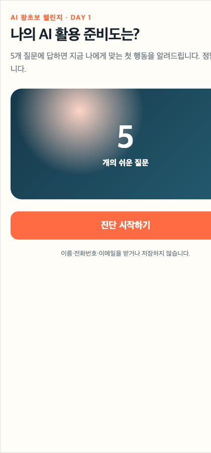

# Day 1 — Artifact 첫걸음부터 AI 진단기 게시까지

## 기능이 무엇이고 화면 어디에 있나요?

**Artifact(아티팩트)**는 Claude와 나눈 대화에서 따로 열어 보고, 직접 눌러 보고, 다시 수정하고, 링크로 공유할 수 있는 문서·도표·작은 앱 결과물이다.


처음에는 아래 순서만 따라 누른다.

1. Claude Desktop 왼쪽 위에서 **홈**을 누른다.
2. 새 대화를 만들고 입력 방식은 **채팅**을 고른다.
3. 모델은 현재 기본값을 유지하고 `Effort`는 **높음(High)**으로 둔다.
4. 아래의 첫 프롬프트를 보내면 대화 옆에 결과물 화면이 열린다.
5. 나중에 다시 찾을 때는 왼쪽 메뉴의 **아티팩트**를 누른다.

화면에 아티팩트 메뉴가 보이지 않아도 채팅에서 결과물 생성을 먼저 요청한다. 앱 버전에 따라 결과물이 대화 오른쪽이나 별도 창에 열릴 수 있다.

## 오늘 완성할 것

질문 다섯 개에 답하면 네 가지 유형 중 하나와 오늘 할 행동을 보여 주는 진단기다.

진단기를 바로 만들기 전에 아주 작은 결과물 세 개를 먼저 만든다.

```text
체크되는 할 일 목록
→ 보기 좋은 1페이지 문서
→ 한눈에 보이는 흐름도
→ AI 활용 준비도 진단기
→ 공개 링크
```

```text
시작
→ 질문 1~5
→ 점수 계산
→ 결과 유형
→ 오늘 할 일 3개
→ 결과 복사
→ 다시 하기
```

[완성 예시 진단기 직접 사용하기](day01-assets/ai-readiness-check/index.html)



## 이 소재를 고른 이유

- 첫 화면, 버튼, 질문 이동, 결과처럼 변화가 눈에 보인다.
- 코딩이나 계산 지식이 없어도 작동 여부를 판단할 수 있다.
- 제목·질문·결과만 바꾸면 어떤 업종에도 응용된다.
- 결과 화면이 오픈카톡 인증 이미지로 좋다.
- 링크를 받은 사람도 참여하므로 수강생 결과물이 곧 홍보물이 된다.
- 이름·연락처를 수집하지 않는 구조로 공개하기 안전하다.

공식 Anthropic 사례에서는 Artifact를 생산성 도구, 교육 게임, 개인화 도우미, 소상공인용 추적 도구로 활용한다. Day 1에서는 설명을 오래 듣기보다 결과물을 하나씩 완성하고, 완성한 화면을 직접 눌러 본다.

## 오늘 배우는 기능

1. Claude Desktop에서 **Artifacts(시각 자료)** 기능 켜기
2. 대화 답변과 오른쪽 Artifact 결과물 구분하기
3. 체크되는 간단한 웹 도구 만들기
4. Markdown 문서를 보기 좋게 렌더링하기
5. Mermaid로 작업 흐름도 만들기
6. 참고 이미지를 첨부해 디자인 방향 전달하기
7. 대화로 한 부분씩 수정하고 직접 검사하기
8. Publish로 링크 생성하기

## 준비물

- 최신 Claude Desktop
- Claude Desktop 홈의 새 채팅
- 공개할 닉네임 하나
- 본인 응용 주제 하나

기본 진단기는 AI를 다시 호출하지 않는 일반 Artifact다. 공유받은 사람의 API 키가 필요 없고 개인정보도 받지 않는다.

## 참고 영상에서 가져온 학습 순서

[편집자P — 03장 아티팩트 활용하기](https://www.youtube.com/watch?v=_B10KZAkDUg)

| 영상 내용 | Day 1에서 하는 일 |
|---|---|
| 1:09 기능 켜기 | 수업 시작 전에 설정 확인 |
| 2:15 투두리스트 | 버튼이 작동하는 첫 Artifact |
| 4:23 Markdown·React·Mermaid | 문서·앱·도표의 차이 체험 |
| 5:55 PDF 보고서 | 같은 내용을 다른 결과물로 바꾸기 |
| 10:47 Mermaid | 진단기 작동 순서를 흐름도로 보기 |
| 13:30 게시·공유 | 최종 진단기 링크 공개 |
| 16:22 디자인 이미지 첨부 | 말로 어려운 디자인을 이미지로 전달 |

영상에서 강조하는 핵심은 **먼저 Markdown으로 내용을 만들고, 필요에 따라 PDF·HTML·다이어그램으로 바꾸는 원소스 멀티유즈**다. Day 1에서는 용어를 외우지 않고 같은 내용이 여러 모양으로 바뀌는 것을 직접 확인한다.

## 0단계 — 첫 Artifact 열기, 5분

1. Claude Desktop을 연다.
2. 왼쪽 위 **홈**을 누른다.
3. 입력창에서 **채팅**을 고른다.
4. 모델은 화면의 기본값, Effort는 **높음**으로 둔다.
5. 아래의 체크리스트 요청을 보낸다.

결과물 영역이 열리지 않으면 왼쪽 아래 프로필 또는 설정에서 `Artifacts`, `시각 자료`, `Capabilities`처럼 보이는 항목을 확인한다. 메뉴 이름이 다르거나 설정이 없으면 5분 넘게 찾지 말고 강사에게 화면을 보여 준다. 계정 이메일이나 결제 화면은 오픈카톡에 올리지 않는다.

**작은 성공 0:** 채팅창에 `오늘 할 일 3개를 체크리스트로 만들어줘`라고 입력했을 때 오른쪽에 별도 결과물 영역이 열린다.

## 완성 패키지

```text
Day01-Artifact/
├── 01_완성예시링크.txt
├── 02_진단구조표.md
├── 03_기준프롬프트.md
├── 04_기능검사표.md
├── 05_개인화입력지.md
├── 06_복구표.md
└── 07_인증예시.png
```

## 1단계 — 완성품 먼저 사용하기, 10분

강사가 제공한 기준 진단기를 휴대폰으로 연다.

반드시 눌러 볼 것:

1. 진단 시작
2. 첫 번째 답변
3. 마지막 질문까지 진행
4. 결과 한 줄 복사
5. 다시 진단

**작은 성공:** 결과 화면까지 도착하고 다시 시작할 수 있다.

## 2단계 — 기능 공부, 15분

- Artifact는 대화 답변이 아니라 따로 열고 다시 쓸 수 있는 결과물이다.
- 처음 나온 것은 완성품이 아니라 초안이다.
- 고칠 때는 한 번에 한 가지를 말한다.
- 공개하기 전에는 정상 입력과 이상 입력을 모두 시험한다.
- Publish 링크를 아는 사람은 결과를 볼 수 있으므로 개인정보를 넣지 않는다.

### 왕초보 용어 네 개만 알기

| 용어 | 쉬운 뜻 | 오늘 보는 예 |
|---|---|---|
| Artifact | 대화 옆에 따로 열리는 결과물 | 진단기 |
| 렌더링 | 글과 기호를 사람이 보기 좋은 화면으로 보여 주기 | 체크리스트·흐름도 |
| Markdown | 제목·목록을 쉽게 표시하는 문서 작성법 | 1페이지 계획서 |
| Mermaid | 글로 순서를 적으면 그림으로 바꿔 주는 방식 | 진단기 흐름도 |

## 3단계 — 첫 번째 작은 성공: 체크되는 할 일 목록, 10분

아래 문장을 그대로 보낸다.

```text
오늘 해야 할 일 3개를 체크할 수 있는 아주 간단한 할 일 목록 Artifact를 만들어 주세요.

할 일은 다음과 같습니다.
1. Claude Desktop 열기
2. Artifact 하나 만들기
3. 결과 화면 인증하기

글자는 크게, 완료한 항목은 줄이 그어지게 해 주세요.
모든 항목을 지우는 버튼이나 로그인 기능은 넣지 마세요.
```

체크 상자를 세 개 모두 눌러 본다. 눌렀을 때 줄이 생기면 성공이다.

**작은 성공 1:** 내가 쓴 문장이 클릭 가능한 도구로 바뀐다.

## 4단계 — 두 번째 작은 성공: Markdown을 1페이지 문서로, 15분

새 대화에서 아래 문장을 보낸다.

```text
아래 내용을 먼저 Markdown 문서 Artifact로 만들어 주세요.

# 나의 이번 주 AI 계획
- 배우기: Claude Desktop의 Artifact
- 만들기: AI 활용 준비도 진단기
- 공유하기: 오픈카톡에 링크와 결과 화면 올리기

초보자가 한눈에 읽도록 제목, 체크리스트, 마지막 응원 문장으로 정리해 주세요.
```

문서가 보이면 이어서 말한다.

```text
같은 내용은 유지하고, 인쇄하거나 PDF로 저장하기 좋은 깔끔한 1페이지 HTML 문서로 바꿔 주세요.
```

다운로드 버튼이 보이면 저장해 본다. 없다면 브라우저 인쇄 메뉴에서 PDF로 저장해도 된다.

**작은 성공 2:** 같은 내용이 Markdown 문서와 1페이지 화면으로 바뀐다.

## 5단계 — 세 번째 작은 성공: Mermaid 흐름도, 10분

새 대화에서 아래 문장을 보낸다.

```text
다음 순서를 Mermaid 흐름도 Artifact로 만들어 주세요.

아이디어 정하기 → Claude에게 요청하기 → 결과 눌러보기 → 한 가지 수정하기 → 다시 검사하기 → 링크 공유하기

처음 보는 사람도 읽을 수 있도록 위에서 아래로 흐르게 하고, 각 상자에는 짧은 말만 넣어 주세요.
```

상자가 잘리지 않고 화살표가 여섯 단계를 순서대로 연결하는지 확인한다.

**작은 성공 3:** 문장으로 쓴 순서가 그림으로 바뀐다.

## 6단계 — 진단 구조 이해, 15분

수강생이 코드를 읽을 필요는 없다. 아래 표만 이해한다.

| 구성 | 기준본 |
|---|---|
| 질문 수 | 5개 |
| 답변 수 | 질문마다 4개 |
| 점수 | 답변마다 0~3점 |
| 결과 | 4개 유형 |
| 행동 | 결과마다 오늘 할 일 3개 |

**검사 질문:** 질문 하나를 건너뛰지 않고 결과 점수가 0~15 안에 나오는가?

## 7단계 — 기준 Artifact 만들기, 25분

Artifacts 공간에서 새 작업을 열고 아래 프롬프트를 그대로 붙여넣는다.

```text
AI 활용 준비도 진단 Artifact를 만들어 주세요.

대상은 AI를 처음 배우는 성인입니다.

진행:
1. 시작 화면에서 "진단 시작하기" 버튼을 누릅니다.
2. 질문은 한 화면에 하나씩 총 5개가 나옵니다.
3. 각 질문에는 쉬운 답변 4개가 있고 0~3점을 가집니다.
4. 답변을 누르면 다음 질문으로 넘어갑니다.
5. 마지막에 총점 0~15점에 따라 결과 유형 4개 중 하나를 보여 줍니다.
6. 각 결과에는 설명과 "오늘 바로 할 일" 3개가 있습니다.
7. 결과 한 줄 복사와 다시 진단하기 버튼이 있습니다.

결과 유형:
- 첫 인사 단계
- 생활 활용 단계
- 콘텐츠 제작 단계
- 자동화 준비 단계

디자인:
- 휴대폰에서 먼저 보기 좋게
- 큰 글자와 큰 버튼
- 따뜻한 주황색과 짙은 남색
- 한 화면에서 질문 하나만 보이게

안전:
- 이름, 전화번호, 이메일을 입력받지 않습니다.
- 외부 API와 로그인을 사용하지 않습니다.
- 입력이나 점수를 외부에 저장하지 않습니다.

완성한 뒤 직접 모든 버튼을 눌러 보고,
질문 5개, 결과 4개, 복사, 다시 하기가 작동하는지 검사해 주세요.
```

**작은 성공:** 오른쪽에 진단기가 나타나고 첫 질문에서 다음 질문으로 넘어간다.

## 8단계 — 참고 이미지로 디자인 방향 주기, 10분

말로 색상과 분위기를 설명하기 어려우면 [완성 예시 진단기](day01-assets/ai-readiness-check/index.html)를 휴대폰에서 캡처한다. 캡처 이미지를 현재 대화에 첨부하고 아래처럼 말한다.

```text
첨부한 화면의 디자인 원칙만 참고해 주세요.
- 밝은 배경
- 큰 제목과 큰 버튼
- 주황색 강조
- 둥근 모서리

문구와 질문 내용은 현재 진단기의 것을 유지하고,
첨부 이미지의 로고·이름·문장을 그대로 복사하지 마세요.
```

이미지는 **내용 복사본**이 아니라 색·간격·버튼 모양을 설명하는 참고 자료다.

**작은 성공 4:** “예쁘게 해줘” 대신 눈에 보이는 기준을 주고 화면이 달라진다.

## 9단계 — 수정 세 번, 20분

한꺼번에 보내지 않고 하나씩 실행한다.

```text
시작 화면 제목 아래에 "5개 질문, 약 1분"을 추가해 주세요. 다른 것은 바꾸지 마세요.
```

```text
질문 진행 상황을 1/5 숫자와 진행 막대로 함께 보여 주세요. 다른 것은 바꾸지 마세요.
```

```text
결과 화면의 가장 중요한 오늘 할 일을 주황색 상자로 강조해 주세요. 다른 것은 바꾸지 마세요.
```

매번 수정 직후 직접 눌러 기능이 망가지지 않았는지 확인한다.

## 10단계 — 네 결과물을 한눈에 모으기, 15분

지금까지 만든 결과물을 캡처한다.

1. 체크가 완료된 할 일 목록
2. 완성된 1페이지 AI 계획서
3. 여섯 단계가 연결된 작업 흐름도
4. 결과가 나온 AI 활용 준비도 진단기

Claude에게 네 장을 첨부하고 아래처럼 요청한다.

```text
첨부한 네 결과물을 한눈에 보여 주는 "나의 Claude 첫날 결과판"을 만들어 주세요.

구성:
- 제목: 나의 Claude 첫날 결과판
- 결과물 1: 체크되는 할 일 목록
- 결과물 2: 1페이지 AI 계획서
- 결과물 3: 나의 작업 흐름도
- 결과물 4: AI 활용 준비도 진단기
- 마지막 문장: 오늘 나는 AI로 네 가지 결과물을 완성했다.

휴대폰에서 한 장으로 캡처하기 쉽게 세로형으로 만들어 주세요.
```

**작은 성공 5:** 하루 동안 만든 네 결과물이 한 장의 포트폴리오 화면으로 남는다.

## 11단계 — 내 것으로 응용, 45분

다음 중 하나를 고른다.

- 내 콘텐츠 유형 진단
- 내 강의 준비도 진단
- 내 블로그 운영 단계 진단
- 우리 가게 메뉴 추천
- 나에게 맞는 유튜브 채널 진단

처음부터 다시 만들지 않는다. 기준 진단기에서 다섯 가지만 바꾼다.

1. 제목
2. 질문 5개
3. 결과 유형 4개
4. 결과별 오늘 할 일
5. 주색

```text
현재 작동하는 구조는 그대로 유지하고 아래 내용만 바꿔 주세요.

새 진단 이름: [내 콘텐츠 유형 진단]
진단 대상: [무엇을 올릴지 고민하는 초보 강사]
질문 주제 5개: [말하기, 글쓰기, 디자인, 영상, 사람들과 대화]
결과 유형 4개: [글형, 카드형, 영상형, 소통형]
주색: [초록색]

질문과 결과 설명을 먼저 표로 보여 주세요.
내가 확인한 뒤 Artifact를 수정해 주세요.
기존 시작·진행·복사·다시 하기 기능은 삭제하지 마세요.
```

## 12단계 — 게시와 휴대폰 검사, 20분

1. Publish를 누른다.
2. 공개 링크를 복사한다.
3. 휴대폰의 시크릿/비공개 브라우저에서 링크를 연다.
4. 로그인 요구 여부를 확인한다.
5. 질문 1개와 결과 화면까지 다시 검사한다.
6. 결과 화면만 캡처한다.

AI를 호출하는 기능을 Artifact 안에 넣었다면 이용자는 Claude 로그인이 필요할 수 있다. Day 1 기본 과정은 AI 호출 없이 작동하는 점수형 진단기로 제한한다.

## 최종 인증

- 필수: 진단기 공개 링크 1개
- 필수: `나의 Claude 첫날 결과판` PNG 1장
- 필수: 고친 것 세 가지
- 선택: 본인의 진단 결과 화면 1장

```text
[왕초보2기 Day 1 / 닉네임]
만든 것: 내 콘텐츠 유형 진단기
배운 기능: Artifact 생성·수정·검사·게시
작은 성공: 할 일 목록 / 1페이지 문서 / 흐름도
고친 것: 질문 / 결과 유형 / 색상
오늘의 결과: Claude로 네 가지 결과물을 직접 완성함
결과 링크: ______
```

## 완료 판정

### 초록 성공

- 체크되는 할 일 목록을 완성했다.
- 1페이지 AI 계획서와 흐름도를 완성했다.

### 파란 성공

- 질문·결과·색을 자기 주제로 바꿨다.
- 진단 결과 화면까지 직접 실행했다.
- 휴대폰에서 게시 링크가 열린다.
- 첫날 결과판 한 장을 완성했다.

### 별 성공

- 실제 외부 사람 세 명에게 보내 사용 후기를 받았다.
- 이해하지 못한 질문이나 잘못 나온 결과를 한 번 개선했다.

## 레퍼런스

- [Anthropic 공식 Artifact 소개](https://claude.com/blog/build-artifacts)
- [Claude Academy Artifact 실습](https://academy.claude.com/tutorials/use-artifacts-to-visualize-and-create-ai-apps-without-ever-writing-a-line-of-code)
- [Artifact 기능·게시 공식 안내](https://support.claude.com/en/articles/9487310-what-are-artifacts-and-how-do-i-use-them)
- [Anthropic Artifact 소개 영상](https://www.youtube.com/watch?v=iSn77jvjojA)
- [편집자P — 바로바로 클로드 03장 아티팩트 활용하기](https://www.youtube.com/watch?v=_B10KZAkDUg)
