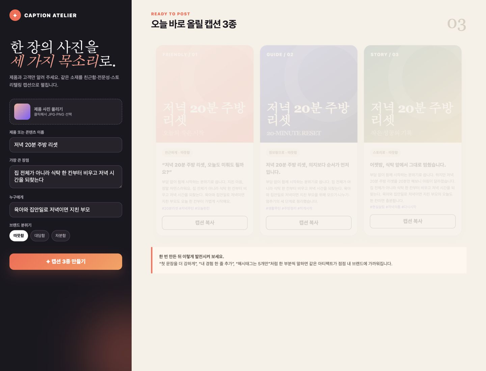
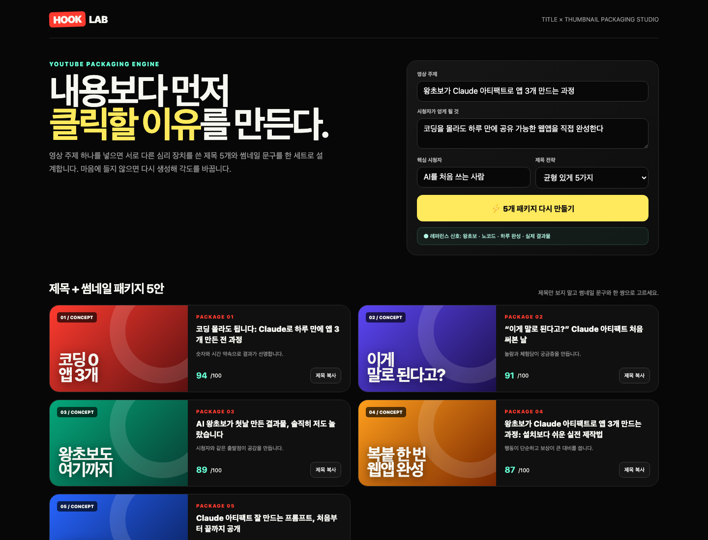
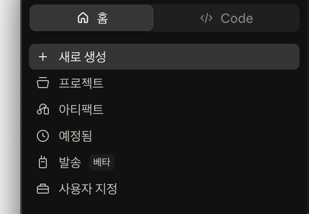

# Day 1 — 말로 만드는 콘텐츠 스튜디오 2종

## 오늘 만드는 것 — 실제로 쓰는 웹앱 2개

코드를 한 줄도 직접 쓰지 않고, **실제로 보여 주고 다시 쓸 만한 웹앱 2개**를 만듭니다.
오늘은 받을 자료도, 첨부할 파일도 없습니다. 말로만 만듭니다.

| 작품 | 완성되는 것 | 직접 눌러 볼 기능 |
|---|---|---|
| 1. Caption Atelier | 인스타 콘텐츠 스튜디오 | 정보 입력, 캡션 3종 생성, 복사 |
| 2. Hook Lab | 유튜브 제목·썸네일 스튜디오 | 패키지 5안 생성, 재생성, 최종안 선택 |

먼저 완성품을 직접 눌러 보세요.

- [작품 1 — Caption Atelier 완성 예시](day01-assets/instagram-studio/index.html)
- [작품 2 — Hook Lab 완성 예시](day01-assets/youtube-studio/index.html)





> **오늘의 합격 기준:** 작품 2개가 화면에 열리고, 각 작품의 버튼을 직접 눌렀으며, 그중 가장 마음에 드는 하나를 내 주제로 바꾸고 **공개 링크 또는 대표 화면 PNG**를 남기면 성공입니다.

```text
완성품 2개 구경하기 → Claude에게 작품 1 만들기 → 작품 2 만들기
→ 마음에 드는 작품을 내 것으로 바꾸기 → 게시 → 오픈카톡 인증
```

## 예상 시간

| 구간 | 시간 | 끝났을 때 보이는 것 |
|---|---:|---|
| 완성품 2개 눌러 보기 | 10분 | 오늘 도착할 수준을 미리 확인 |
| Caption Atelier 제작 | 45분 | 실제 캡션 3종과 게시물 미리보기 |
| Hook Lab 제작 | 45분 | 제목·썸네일 패키지 5안 |
| 내 브랜드로 수정·게시·인증 | 40분 | 공개 링크 또는 대표 PNG |

총 2시간 20분 정도입니다. Claude의 생성 시간이 길면 작품을 줄이지 말고, 기다리는 동안 다음 작품의 입력 내용을 먼저 준비합니다.

진도가 맞는지 확인할 기준은 `55분: 작품 1`, `1시간 40분: 작품 2`, `2시간 20분: 인증 완료`입니다. 15분 이상 늦어지면 같은 프롬프트를 반복해 보내지 말고, 현재 화면을 캡처해 질문합니다.

## 아티팩트가 정확히 무엇인가요?

채팅 답변은 읽고 지나가는 글입니다. **아티팩트(Artifact)는 대화 옆에 따로 열려 입력하고, 누르고, 고치고, 공유할 수 있는 완성 작품**입니다.

오늘은 아래 네 가지를 몸으로 익힙니다.

1. 말로 웹앱의 기능과 분위기를 주문합니다.
2. 대화 옆 결과물을 직접 눌러 작동을 확인합니다.
3. 마음에 들지 않는 부분을 말로 다시 고칩니다.
4. 게시 링크를 만들어 다른 사람도 써 보게 합니다.

## Claude Desktop에서 누를 곳



1. 왼쪽 위 **홈**을 누릅니다.
2. **새로 생성**을 누릅니다.
3. 입력 방식은 **채팅**을 고릅니다.
4. 모델은 Day 0에서 정한 **화면의 기본 모델**을 그대로 사용합니다. 작품마다 바꾸지 않습니다.
5. Effort는 **높음**이 보이면 높음, 없으면 기본값을 사용합니다.
6. 아래 입력칸에 교재의 요청문을 붙여넣습니다.

왼쪽의 **아티팩트**는 **게시(Publish)한 작품만** 모이는 보관함입니다. 방금 만든 작품이 거기 안 보여도 사라진 게 아니라, 만든 **그 대화 안에** 그대로 있습니다. 오늘 첫 제작은 그 메뉴에서 시작하지 않고, 아래 고정 위치의 새 채팅에서 시작합니다.

**오늘 고정 위치:** 두 작품 모두 `홈 → 새로 생성 → 채팅`에서 시작합니다. **Cowork나 Code를 누르지 않습니다.** 작품 하나가 끝날 때마다 새 채팅을 열어 이전 작품의 코드가 섞이지 않게 합니다.

## 준비물

**오늘은 받을 자료가 없습니다.** 압축을 풀 일도, 파일을 첨부할 일도 없습니다.
두 작품 모두 교재의 요청문을 붙여넣는 것으로 시작합니다.

사진도 필요 없습니다. 게시물 미리보기는 Claude가 만든 색상 표지로 나옵니다.

## 왜 이 두 작품인가요?

아티팩트로는 회의록, 체크리스트, 계산기, 대시보드까지 다양하게 만들 수 있습니다.
오늘 고른 두 작품은 각각 **글 생성**과 **콘텐츠 기획**이라는 서로 다른 능력을 담당합니다. 둘 다 내가 올릴 콘텐츠를 바로 만들어 주는 쪽이라, 첫날 결과가 눈에 보입니다.

---

## 작품 1 — Caption Atelier 인스타 콘텐츠 스튜디오

### 완성되면 무엇이 좋은가요?

생활 경험·제품·콘텐츠 정보를 넣으면 같은 소재를 **친근한 말투, 정보형 말투, 이야기 말투** 세 가지로 만들어 비교하고 바로 복사할 수 있습니다.

새 채팅을 열고 아래 요청문을 보냅니다.

```text
몇 가지 정보를 넣으면 실제 인스타그램 캡션 3종을 만들어 주는 AI 아티팩트를 만들어 주세요.
결과물은 React가 아니라 **단일 HTML 파일 한 장**으로 만들어 주세요.

작품 이름: CAPTION ATELIER — 인스타 콘텐츠 스튜디오

입력:
- 생활 경험·제품·콘텐츠 이름
- 가장 큰 장점
- 핵심 고객
- 브랜드 분위기: 따뜻함 / 대담함 / 차분함 중 선택

결과:
- "캡션 3종 만들기" 버튼을 누르면 친근한 글, 정보형 글, 스토리텔링 글을 각각 카드로 표시
- 각 카드에는 첫 문장 훅, 본문, 행동 요청, 해시태그 5개가 들어가야 함
- 각 카드마다 "캡션 복사" 버튼 (복사가 막힌 환경에서는 그 캡션 글자를 대신 선택해 주고 직접 복사하라고 안내)
- 입력한 이름과 분위기에 어울리는 색으로 만든 정사각형 게시물 미리보기 3개
- **사진 업로드 칸은 만들지 마세요.** 아티팩트 안에서는 내 컴퓨터 사진을 못 불러옵니다

AI 작동:
- 아티팩트에서 사용할 수 있는 Claude 기능으로 입력 내용을 실제 분석해 결과를 생성
- 외부 API 키는 요구하지 않음
- AI 기능을 사용할 수 없는 환경에서도 버튼을 누르면 입력 내용을 반영한 기본 결과가 나오게 함

디자인:
- 패션 잡지 편집실 같은 고급스러운 화면
- 왼쪽은 어두운 입력 패널, 오른쪽은 밝은 결과 갤러리
- 코랄, 보라, 딥그린으로 세 결과를 구분
- 휴대폰에서도 카드가 한 장씩 크게 보이게 함

설명만 쓰지 말고 실제 작동하는 아티팩트를 완성한 뒤 생성, 복사 버튼을 점검해 주세요.
```

### 직접 눌러 보기

1. 예시 대신 내가 기록할 생활 경험·제품·콘텐츠 정보를 씁니다.
2. **캡션 3종 만들기**를 누릅니다.
3. 세 카드의 첫 문장이 서로 다른지 읽습니다.
4. **캡션 복사**를 누르고 메모장에 붙여넣습니다.

> **게시물 미리보기에 내 사진을 넣고 싶다면** — 아티팩트 화면 안에서는 내 컴퓨터의 사진을 불러올 수 없습니다. 대신 **대화 입력칸의 `+`로 사진을 첨부한 뒤** 아래 문장을 보내면 Claude가 작품 안에 직접 넣어 줍니다. 선택 사항이고, 사진 없이도 완성됩니다.
>
> ```text
> 방금 첨부한 사진을 게시물 미리보기의 배경으로 넣어 주세요.
> 나머지 기능과 디자인은 그대로 두세요.
> ```

평범한 문장이 나오면 이렇게 고칩니다.

```text
지금 결과는 광고 문구가 너무 평범합니다. 기능과 화면은 유지하고, 세 캡션의 첫 문장이 서로 완전히 다른 호기심을 만들게 고쳐 주세요. 추상적인 칭찬 대신 내가 입력한 장점과 고객의 실제 고민이 보이게 해 주세요.
```

**작품 1 성공:** 같은 소재로 만든 성격이 다른 캡션 3개와 게시물 미리보기가 한 화면에 보입니다.

---

## 작품 2 — Hook Lab 유튜브 제목·썸네일 스튜디오

### 완성되면 무엇이 좋은가요?

영상 주제를 넣으면 제목만 나열하지 않고, **제목과 썸네일 문구를 한 쌍**으로 보여 줍니다. 서로 다른 클릭 심리를 쓴 5안을 비교해 최종안을 고를 수 있습니다.

새 채팅을 열고 아래 요청문을 보냅니다.

```text
영상 주제를 넣으면 유튜브 제목과 썸네일 문구를 한 세트로 기획하는 AI 아티팩트를 만들어 주세요.
결과물은 React가 아니라 **단일 HTML 파일 한 장**으로 만들어 주세요.

작품 이름: HOOK LAB — 유튜브 제목·썸네일 패키징 스튜디오

입력:
- 영상 주제
- 시청자가 영상을 보고 얻게 될 것
- 핵심 시청자
- 제목 전략: 호기심 / 신뢰 / 숫자와 성과 / 균형 있게
- 선택 입력: 내가 조사해 온 최신 키워드나 참고 메모

결과:
- 서로 다른 심리 장치를 쓴 제목 5개
- 각 제목과 짝이 되는 짧은 썸네일 문구
- 16:9 썸네일 미리보기 카드 5개
- 왜 클릭될 가능성이 있는지 한 줄 설명
- 제목·썸네일 기준을 확인하는 100점 만점 자가점검 점수와 추천 1개
- 제목 복사, 다시 생성, 최종안 선택 버튼 (복사가 막힌 환경에서는 제목 글자를 대신 선택해 주고 직접 복사하라고 안내)

제목 규칙:
- 다섯 개를 같은 문장의 말바꾸기로 만들지 말 것
- 각각 숫자·반전·질문·전후 변화·구체적 이익 중 다른 전략을 쓸 것
- 과장된 거짓말이나 영상 내용에 없는 약속은 금지
- 제목과 썸네일 문구가 똑같은 말을 반복하지 않게 할 것

디자인:
- 검은 배경의 전문 유튜브 기획실
- 빨강, 노랑, 민트 포인트
- 큰 썸네일 문구와 카드별 색상 대비
- 데스크톱 2열, 휴대폰 1열

AI 작동:
- 최신 정보를 확인했다고 임의로 주장하지 말고, 사용자가 입력한 참고 메모만 근거로 사용
- 외부 API 키는 요구하지 않음
- 완성 뒤 생성, 재생성, 복사, 선택 버튼을 모두 점검

설명하지 말고 바로 작동하는 완성 아티팩트를 만들어 주세요.
```

### 직접 눌러 보기

아래 예시로 먼저 확인한 뒤 내 주제로 바꿉니다.

```text
영상 주제: 저녁 20분 만에 주방을 되돌리는 실제 과정
얻게 될 것: 지친 날에도 식탁 한 칸부터 다시 시작하는 순서를 배운다
핵심 시청자: 육아와 집안일로 저녁이면 지친 부모
참고 메모: 20분, 현실 살림, 작은 성공, 실제 과정
```

- [ ] 서로 다른 제목 5개가 보입니다.
- [ ] 각 카드에 제목과 다른 썸네일 문구가 보입니다.
- [ ] **다시 생성**을 누르면 다른 각도가 나옵니다.
- [ ] **제목 복사**가 작동합니다.
- [ ] **최종안 선택**을 누르면 고른 안이 표시됩니다.

결과가 밋밋하면 이렇게 고칩니다.

```text
기능은 그대로 두고 썸네일 5장이 실제 유명 크리에이터의 기획 보드처럼 한눈에 강하게 대비되게 다시 디자인해 주세요. 문구는 8글자 안팎으로 더 짧게 하고, 제목 5개는 서로 다른 클릭 심리를 쓰는지 다시 검사해 주세요.
```

**작품 2 성공:** 제목 5개와 썸네일 미리보기 5개가 보이고 재생성·복사·선택이 작동합니다.

---

## 가장 마음에 드는 하나를 내 작품으로 만들기

두 작품 중 하나를 고릅니다. 같은 대화에서 `[ ]`만 내 내용으로 바꿔 보냅니다.

```text
지금 작동하는 모든 기능은 유지하고 아래 내용으로 내 작품처럼 바꿔 주세요.

- 작품 이름: [내 브랜드 이름]
- 주 대상: [누가 사용할지]
- 첫 화면 핵심 문장: [사용자가 얻을 변화]
- 주색 2개: [원하는 색]
- 예시 데이터와 문구: [내 기록·제품·콘텐츠에 맞는 가상 또는 공개 정보]

수정 뒤 모든 버튼이 계속 작동하는지 다시 검사해 주세요.
```

한 번에 여러 곳을 다시 고치지 말고, 결과를 본 뒤 가장 거슬리는 것 하나씩 말합니다.

```text
첫 화면 제목만 지금보다 짧고 강하게 고쳐 주세요. 다른 디자인과 기능은 바꾸지 마세요.
```

```text
휴대폰에서 열었을 때 가장 중요한 결과 카드가 먼저 보이게 순서와 크기만 고쳐 주세요. 기능은 유지하세요.
```

## 게시하고 휴대폰에서 검사하기

1. 가장 마음에 드는 작품(아티팩트)을 크게 엽니다.
2. 작품 화면 **오른쪽 위의 `게시`(Publish)** 를 누릅니다.
3. 공개되는 내용에 개인정보·고객 정보·유료 자료가 없는지 확인합니다.
4. **링크 복사**를 눌러 주소를 복사합니다.
5. 휴대폰에서 그 링크를 열고 핵심 버튼을 다시 누릅니다.

> **`공유`는 찾지 마세요.** 회사·팀 계정에만 있는 메뉴라 우리 화면에는 없습니다. 우리가 누를 것은 **`게시` 하나뿐**입니다.

**게시하면 왼쪽 메뉴 `아티팩트` 목록에도 들어갑니다.** 링크를 다시 복사하고 싶으면 그 목록에서 내 작품 카드의 **`⋮` → `링크 복사`** 를 누르면 됩니다.
반대로 **`아티팩트` 목록에 내 작품이 이미 보인다면 게시는 이미 끝난 것**이고, 거기서 바로 `⋮` → `링크 복사`를 하면 됩니다.

`게시`가 어디에도 보이지 않으면 앱을 업데이트한 뒤 [claude.ai](https://claude.ai/)의 같은 대화에서 다시 확인합니다. 그래도 없으면 완성 화면을 캡처해 인증합니다. **캡처만으로도 오늘은 완주입니다.**

> **`.jsx` 파일이 받아졌다면** — 「다운로드 및 열기」를 눌렀을 때 *"이 .jsx 파일을 열 앱 선택"* 창이 뜨고 워드나 메모장 같은 목록이 보이는 경우입니다. **아무것도 고르지 말고 창을 닫으세요.** 개발자용 소스 파일이라 두 번 눌러도 열리지 않는 게 정상이고, 지우셔도 됩니다.
> 내 작품은 만든 **그 대화 안에** 그대로 남아 있습니다. 남기는 방법은 **게시 링크**나 **화면 캡처** 두 가지이고, 게시하면 왼쪽 **아티팩트** 보관함에도 들어갑니다.

## 오픈카톡 인증 — 30초

📸 **인증 캡처:** 더 마음에 드는 작품 **하나가 크게 보이는** 화면 1장

```text
[왕초보2기 Day 1 / 닉네임]
✅ 콘텐츠 스튜디오 2종 완성
💬 소감:
```

공개 링크가 있으면 함께 올려도 좋습니다 — 선택입니다.

## 마지막 합격 확인

- [ ] 인스타 스튜디오에서 캡션 3종을 만들고 하나를 복사했습니다.
- [ ] 유튜브 스튜디오에서 제목·썸네일 5안을 만들고 최종안을 골랐습니다.
- [ ] 가장 좋은 작품 하나를 내 브랜드·주제로 바꿨습니다.
- [ ] 휴대폰에서 대표 작품을 열어 핵심 버튼을 눌렀습니다.
- [ ] 공개해도 되는 내용만 보이게 인증했습니다.

다섯 칸이 체크되면 Day 1 완주입니다.

내일 Day 2에서는 오늘처럼 매번 소개를 다시 적지 않도록, 자료와 규칙을 기억하는 **프로젝트** 작업방을 만듭니다. 오늘 가장 마음에 든 작품의 주제를 한 줄로 메모해 두면 Day 2의 콘텐츠 방향을 고르기 쉽습니다.

## 참고 자료

- [영상 1 — Claude 아티팩트 실무 활용 예제](https://www.youtube.com/watch?v=IB5UjrVFyZ0)
- [영상 2 — Claude Artifacts 전체 사용법과 앱 예제](https://www.youtube.com/watch?v=iBGJ6haInyQ)
- [Anthropic 공식 아티팩트 안내](https://support.claude.com/en/articles/9487310-what-are-artifacts-and-how-do-i-use-them)
- [Anthropic 공식 게시·공유 안내](https://support.claude.com/en/articles/9547008-publish-and-share-artifacts)
