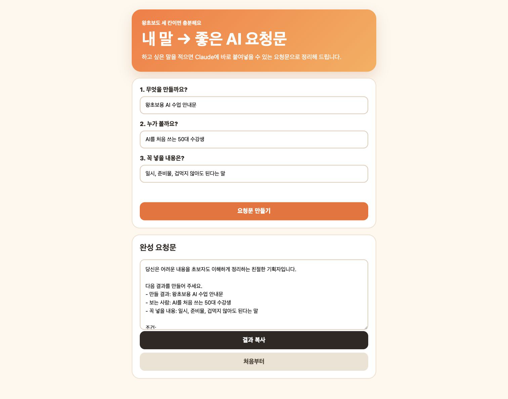

# Day 1 — 내 말을 좋은 AI 요청문으로 바꾸는 프롬프트 제조기

## 오늘 완성할 결과부터 봅니다

막연한 내 말을 세 칸에 적으면, Claude가 알아듣기 좋은 요청문으로 바꿔 주는 **프롬프트 제조기**를 만듭니다.

[완성 예시 제조기를 먼저 눌러 보기](day01-assets/prompt-maker/index.html)



예시에서 아래처럼 입력해 보세요.

- 무엇을 만들까요?: `왕초보용 AI 수업 안내문`
- 누가 볼까요?: `AI를 처음 쓰는 50대 수강생`
- 꼭 넣을 내용은?: `일시, 준비물, 겁먹지 않아도 된다는 말`

**요청문 만들기**를 누르고, 결과를 복사해 새 Claude 채팅에 붙여넣습니다. 실제 안내문이 나오면 오늘 도구의 쓸모를 이미 확인한 것입니다.

> **오늘의 합격 기준:** 입력 3칸 → 요청문 만들기 → 결과 복사 → 새 채팅에 붙여넣기 → 실제 답변 받기까지 되면 성공입니다.

```text
완성품 먼저 누르기 → 새 채팅 열기 → 작은 성공
→ 제조기 만들기 → 내 말로 바꾸기 → 실제 답 받기 → 저장·인증
```

## 이 도구가 왜 필요한가요?

“블로그 글 써 줘”처럼 짧게 말하면 결과가 마음에 들지 않을 때가 많습니다. 제조기는 내가 채운 세 칸을 **역할 / 결과 / 조건**이 있는 요청으로 정리합니다.

1. **역할:** 초보자에게 친절한 기획자 역할을 제조기가 자동으로 붙입니다.
2. **결과:** `무엇을 만들까요?`에 쓴 내용을 넣습니다.
3. **조건:** `누가 볼까요?`와 `꼭 넣을 내용은?`에 쓴 내용, 쉬운 말과 보기 좋은 형식을 넣습니다.

앞으로 수업안, 블로그 글, 카드뉴스, 웹페이지, 쇼츠를 부탁할 때 계속 다시 쓸 수 있습니다.

## 나와 Claude가 나눠서 하는 일

| 내가 하는 일 | Claude가 하는 일 |
|---|---|
| 세 칸에 내 생각을 씀 | 내용을 좋은 요청문으로 정리함 |
| 만들기·복사 버튼을 누름 | 누를 수 있는 제조기를 만듦 |
| 새 채팅에서 실제 답을 확인함 | 요청문에 맞는 결과를 만듦 |
| 한 부분씩 수정 요청함 | 기능을 유지하며 화면을 고침 |

## 세 단어만 알고 시작합니다

- **프롬프트:** AI에게 보내는 요청문
- **아티팩트(Artifact):** 대화 옆에 열려 직접 누를 수 있는 결과물
- **게시(Publish):** 다른 사람도 열 수 있는 링크를 만드는 기능

## Claude Desktop에서 누를 곳


1. Claude Desktop 왼쪽 위 **홈**을 누릅니다.
2. **새 생성**을 누릅니다.
3. 입력 방식은 **채팅**을 고릅니다.
4. 모델과 Effort는 기본값 그대로 둡니다.
5. 아래 입력칸에 교재의 요청문을 붙여넣습니다.

왼쪽 **아티팩트**는 만든 결과를 다시 찾는 곳입니다. 첫 결과는 새 채팅에서 요청하면 대화 옆이나 별도 화면에 열립니다.

## 시간표

| 구간 | 시간 | 눈에 보이는 성공 |
|---|---:|---|
| 완성 예시 눌러 보기 | 10분 | 좋은 요청문 1개 |
| 작은 성공 만들기 | 15분 | 입력과 버튼이 작동 |
| 제조기 만들기 | 35분 | 입력 3칸·복사 버튼 |
| 내 것으로 바꾸기 | 25분 | 내 제목·예시·색상 |
| 실제 답 받기·저장·인증 | 35분 | Claude 답변과 PNG |

---

## 1 — 완성 예시로 먼저 성공하기

1. 위의 **완성 예시 제조기**를 엽니다.
2. 예시 문장대로 세 칸을 채웁니다.
3. **요청문 만들기**를 누릅니다.
4. 아래에 생긴 요청문을 천천히 읽습니다.
5. **결과 복사**를 누릅니다.
6. Claude Desktop의 **새 생성 → 채팅**을 누릅니다.
7. 복사한 내용을 붙여넣고 보냅니다.

**작은 성공:** Claude가 왕초보용 AI 수업 안내문을 실제로 써 줍니다.

## 2 — 아주 작은 제조기 만들기

새 채팅에 아래 문장을 그대로 보냅니다.

```text
대화 옆에서 직접 누를 수 있는 HTML 아티팩트를 만들어 주세요.
입력칸 하나에 하고 싶은 일을 쓰고 "요청문 만들기"를 누르면
아래 결과 칸에 "다음 일을 초보자도 이해하게 만들어 주세요: [입력 내용]"이 나오게 해 주세요.
"결과 복사" 버튼도 넣어 주세요.
설명만 하지 말고 실제 작동하는 결과물을 바로 만들어 주세요.
```

입력칸에 `여행 준비 목록`을 쓰고 두 버튼을 누릅니다.

**성공 화면:** 결과에 `여행 준비 목록`이 들어 있고 복사 완료 안내가 보입니다.

### 결과물이 열리지 않으면

같은 대화에 한 줄만 보냅니다.

```text
설명은 멈추고, 방금 요청한 것을 실제로 누를 수 있는 HTML 아티팩트로 만들어 주세요.
```

그래도 안 되면 오류 화면을 운영자에게 `Day 1 / 작은 제조기가 안 열림`이라고 보냅니다. 임의 결제나 설치는 하지 않습니다.

## 3 — 메인 프롬프트 제조기 만들기

새 채팅을 열고 아래 문장을 그대로 보냅니다.

```text
내 말을 좋은 AI 요청문으로 바꾸는 "프롬프트 제조기"를 실제 HTML 아티팩트로 만들어 주세요.

입력 3칸:
1. 무엇을 만들까요? — 예: 왕초보용 AI 수업 안내문
2. 누가 볼까요? — 예: AI를 처음 쓰는 50대 수강생
3. 꼭 넣을 내용은? — 예: 일시, 준비물, 겁먹지 않아도 된다는 말

작동:
- "요청문 만들기"를 누르면 아래에 완성 요청문을 보여 주세요.
- 완성 요청문에는 역할, 만들 결과, 보는 사람, 꼭 넣을 내용, 쉬운 말 사용, 보기 좋은 형식, 확인 질문 금지가 들어가야 합니다.
- 빈칸이 있으면 어느 칸을 채울지 쉬운 말로 알려 주세요.
- "결과 복사"와 "처음부터" 버튼을 넣어 주세요.
- 복사하면 "복사했어요. 새 Claude 채팅에 붙여넣으세요."라고 보여 주세요.

화면:
- 휴대폰에서도 읽기 쉬운 큰 글자와 큰 버튼
- 밝은 크림색 배경, 주황색 강조, 둥근 카드
- 이름, 이메일, 전화번호를 묻지 않습니다.
- 로그인, 외부 API, 외부 저장을 사용하지 않습니다.

설명만 쓰지 말고 실제 결과물을 만든 뒤 입력, 만들기, 복사, 초기화를 직접 검사해 주세요.
```

**성공 화면:** 입력칸 3개, 주황색 **요청문 만들기**, 결과 칸, **결과 복사**가 보입니다.

## 4 — 내가 직접 네 번 검사하기

- [ ] 한 칸을 비우고 만들기를 누르면 채울 칸을 알려 줍니다.
- [ ] 세 칸을 채우면 긴 요청문이 생깁니다.
- [ ] 결과 복사를 누르면 복사 완료 문장이 보입니다.
- [ ] 처음부터를 누르면 세 입력칸과 결과가 비워집니다.

안 되는 행동 하나만 정확히 고쳐 달라고 합니다.

```text
지금 "결과 복사"를 눌러도 복사 완료 안내가 보이지 않습니다.
글과 디자인은 바꾸지 말고 복사 기능과 완료 안내만 고친 뒤 다시 검사해 주세요.
```

**성공 화면:** 네 칸을 모두 체크했습니다.

## 5 — 내 것으로 바꾸기

| 바꿀 것 | 예시 |
|---|---|
| 제조기 이름 | 별빛쌤의 수업 요청문 제조기 |
| 첫 입력 예시 | 스마트폰 기초 수업안 |
| 주색 | 초록색 |

같은 제조기 대화에서 `[ ]` 안만 바꿉니다.

```text
현재 작동하는 입력, 만들기, 복사, 처음부터 기능은 그대로 유지해 주세요.
아래 세 가지만 바꿔 주세요.

- 제목: [별빛쌤의 수업 요청문 제조기]
- 첫 입력칸 예시: [스마트폰 기초 수업안]
- 주색: [초록색]

수정 뒤 네 기능이 계속 작동하는지 검사해 주세요.
```

**성공 화면:** 내 제목과 색이 보이고 요청문도 계속 만들어집니다.

## 6 — 내 실제 일로 효용 증명하기

이번에는 예시가 아니라 이번 주에 정말 필요한 일을 적습니다.

1. 세 칸에 내 실제 일을 입력합니다.
2. **요청문 만들기 → 결과 복사**를 누릅니다.
3. Claude Desktop에서 **새 생성 → 채팅**을 누릅니다.
4. 붙여넣고 보냅니다.
5. 실제 답변을 끝까지 읽습니다.

답이 너무 어렵다면 새 채팅에서 한 줄 더 보냅니다.

```text
같은 내용을 전문용어 없이 더 쉬운 말로 다시 써 주세요.
```

**완성 성공:** 제조기 화면 하나와, 그 요청문으로 받은 실제 Claude 답변 하나가 있습니다.

## 7 — 저장하고 휴대폰에서 확인하기

### 모두 하는 PNG 저장

- Mac: 제조기의 완성 요청문이 보이게 열기 → `Shift + Command + 4` → 제조기만 드래그 → `D01_닉네임_프롬프트제조기.png`
- Windows: `Windows + Shift + S` → **사각형 캡처** → 제조기만 저장 → `D01_닉네임_프롬프트제조기.png`

새 채팅에서 받은 실제 답변도 첫 부분이 보이게 캡처합니다. 파일명은 `D01_닉네임_실제답변.png`입니다. 다른 대화 목록, 이메일, 결제 화면은 넣지 않습니다.

### 게시가 보이는 사람만

1. 아티팩트의 **게시(Publish)** 또는 공유 메뉴를 누릅니다.
2. 개인정보가 없는지 확인하고 링크를 복사합니다.
3. 휴대폰 비공개 창에서 링크를 열어 만들기와 복사를 다시 누릅니다.

게시가 없으면 앱을 업데이트한 뒤 [claude.ai](https://claude.ai/)의 같은 대화에서 확인합니다. 그래도 없으면 결제하지 않고 PNG 두 장만 제출하면 완주입니다.

## 8 — 오픈카톡 인증

```text
[왕초보2기 Day 1 / 닉네임]
오늘 만든 것: 내 말을 좋은 AI 요청문으로 바꾸는 프롬프트 제조기
실제로 부탁한 일: __________
받은 결과: __________
내가 직접 누른 것: 입력 / 만들기 / 복사 / 새 채팅 붙여넣기
공개 링크: ________ / 게시 미지원
```

함께 올릴 것:

1. `D01_닉네임_프롬프트제조기.png`
2. `D01_닉네임_실제답변.png`
3. 게시가 되는 사람만 공개 링크

## 마지막 확인

- [ ] 무엇·누구·꼭 넣을 내용 세 칸이 보입니다.
- [ ] 요청문 만들기와 결과 복사가 작동합니다.
- [ ] 내 제목·예시·색으로 바꿨습니다.
- [ ] 새 Claude 채팅에서 실제 답을 받았습니다.
- [ ] PNG 두 장을 저장했습니다.
- [ ] 인증 문구를 채웠습니다.

여섯 칸이 체크되면 Day 1 완주입니다.

## 참고 자료

- [Anthropic 공식 아티팩트 안내](https://support.claude.com/en/articles/9487310-what-are-artifacts-and-how-do-i-use-them)
- [Anthropic 공식 게시·공유 안내](https://support.claude.com/en/articles/9547008-publish-and-share-artifacts)
