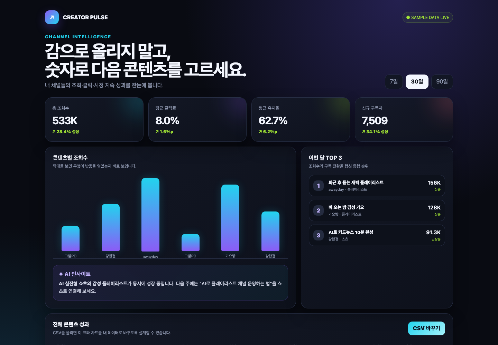

# Day 1 — 말로 만드는 AI 크리에이터 스튜디오 3종

## 오늘은 연습용 장난감을 만들지 않습니다

코드를 한 줄도 직접 쓰지 않고, **실제로 보여 주고 다시 쓸 만한 웹앱 3개**를 만듭니다.

| 작품 | 완성되는 것 | 직접 눌러 볼 기능 |
|---|---|---|
| 1. Creator Pulse | 내 콘텐츠 성과 대시보드 | 기간 변경, 차트, TOP 3, CSV 교체 |
| 2. Caption Atelier | 인스타 콘텐츠 스튜디오 | 사진·정보 입력, 캡션 3종 생성, 복사 |
| 3. Hook Lab | 유튜브 제목·썸네일 스튜디오 | 패키지 5안 생성, 재생성, 최종안 선택 |

먼저 완성품을 직접 눌러 보세요.

- [작품 1 — Creator Pulse 완성 예시](day01-assets/creator-dashboard/index.html)
- [작품 2 — Caption Atelier 완성 예시](day01-assets/instagram-studio/index.html)
- [작품 3 — Hook Lab 완성 예시](day01-assets/youtube-studio/index.html)




> **오늘의 합격 기준:** 작품 3개가 화면에 열리고, 각 작품의 버튼을 직접 눌렀으며, 그중 가장 마음에 드는 하나를 내 주제로 바꾸고 공개 링크까지 만들면 성공입니다.

```text
완성품 3개 구경하기 → Claude에게 작품 1 만들기
→ 작품 2 만들기 → 작품 3 만들기
→ 가장 마음에 드는 작품을 내 것으로 바꾸기 → 게시 → 오픈카톡 인증
```

## 예상 시간

| 구간 | 시간 | 끝났을 때 보이는 것 |
|---|---:|---|
| 완성품 3개 눌러 보기 | 10분 | 오늘 도착할 수준을 미리 확인 |
| Creator Pulse 제작 | 40분 | 데이터가 움직이는 대시보드 |
| Caption Atelier 제작 | 45분 | 실제 캡션 3종과 게시물 미리보기 |
| Hook Lab 제작 | 45분 | 제목·썸네일 패키지 5안 |
| 내 브랜드로 수정·게시·인증 | 40분 | 공개 링크 또는 대표 PNG |

총 3시간 정도입니다. Claude의 생성 시간이 길면 작품을 줄이지 말고, 기다리는 동안 다음 작품의 입력 내용을 먼저 준비합니다.

## 아티팩트가 정확히 무엇인가요?

채팅 답변은 읽고 지나가는 글입니다. **아티팩트(Artifact)는 대화 옆에 따로 열려 입력하고, 누르고, 고치고, 공유할 수 있는 완성 작품**입니다.

오늘은 아래 네 가지를 몸으로 익힙니다.

1. 말로 웹앱의 기능과 분위기를 주문합니다.
2. 대화 옆 결과물을 직접 눌러 작동을 확인합니다.
3. 마음에 들지 않는 부분을 말로 다시 고칩니다.
4. 게시 링크를 만들어 다른 사람도 써 보게 합니다.

## Claude Desktop에서 누를 곳


1. 왼쪽 위 **홈**을 누릅니다.
2. **새로 생성**을 누릅니다.
3. 입력 방식은 **채팅**을 고릅니다.
4. 모델은 화면의 기본 모델을 그대로 사용합니다. 선택할 수 있다면 성능이 가장 좋은 모델을 고릅니다.
5. Effort는 **높음**이 보이면 높음, 없으면 기본값을 사용합니다.
6. 아래 입력칸에 교재의 요청문을 붙여넣습니다.

왼쪽의 **아티팩트**는 완성한 작품을 나중에 다시 찾는 보관함입니다. 첫 제작은 `아티팩트` 메뉴에서 시작해도 되고, 새 채팅에서 아래 요청문을 보내도 됩니다.

## 준비물

작품 1에만 데이터 파일 하나가 필요합니다.

[Creator Pulse 실습 데이터 다운로드](day01-assets/input/creator-performance.csv)

링크를 눌렀을 때 글자 표가 보이면 `Command + S` 또는 `Ctrl + S`로 저장해도 됩니다. 파일 이름은 `creator-performance.csv` 그대로 둡니다. 작품 2의 사진은 선택입니다. 사진이 없으면 Claude가 만든 색상 표지로 완주할 수 있습니다.

## 두 영상에서 실제로 만든 예제

첫 번째 영상은 아티팩트를 문서·트래커·계산기·대시보드로 나눠 네 작품을 시연합니다.

| 시점 | 영상 속 작품 | 작동하는 부분 |
|---:|---|---|
| [02:32](https://www.youtube.com/watch?v=IB5UjrVFyZ0&t=152s) | 편집 가능한 회의록 | 안건·할 일 추가, PDF·Word 다운로드 |
| [05:09](https://www.youtube.com/watch?v=IB5UjrVFyZ0&t=309s) | 신상품 출시 체크리스트 | 담당자·마감일·완료율 표시 |
| [07:23](https://www.youtube.com/watch?v=IB5UjrVFyZ0&t=443s) | 발주 수량 계산기 | 숫자에 따라 발주 필요·중단 판정 |
| [10:06](https://www.youtube.com/watch?v=IB5UjrVFyZ0&t=606s) | 분기 실적 대시보드 | 기간 변경, 그래프, 이상 수치 강조 |

두 번째 영상은 더 넓은 범위의 앱과 시각화를 보여 줍니다.

| 시점 | 영상 속 작품 | 종류 |
|---:|---|---|
| [00:09](https://www.youtube.com/watch?v=iBGJ6haInyQ&t=9s) | 할인 판매가 계산기 | 계산 앱 |
| [03:29](https://www.youtube.com/watch?v=iBGJ6haInyQ&t=209s) | 편집·다운로드 가능한 회의록 | 문서 앱 |
| [05:07](https://www.youtube.com/watch?v=iBGJ6haInyQ&t=307s) | 월 매출 대시보드와 한 장 PPT | 데이터 시각화 |
| [06:24](https://www.youtube.com/watch?v=iBGJ6haInyQ&t=384s) | 여러 사람이 함께 쓰는 점심 메뉴 투표기 | 공유 앱 |
| [07:50](https://www.youtube.com/watch?v=iBGJ6haInyQ&t=470s) | 엑셀 인터랙티브 차트 | 커스텀 비주얼 |
| [09:16](https://www.youtube.com/watch?v=iBGJ6haInyQ&t=556s) | 클릭 가능한 마케팅 진행 흐름 | 커스텀 비주얼 |
| [12:53](https://www.youtube.com/watch?v=iBGJ6haInyQ&t=773s) | 인스타 캡션 생성기 | AI 앱 |
| [14:12](https://www.youtube.com/watch?v=iBGJ6haInyQ&t=852s) | 유튜브 제목·썸네일 문구 생성기 | AI 앱 |
| [15:24](https://www.youtube.com/watch?v=iBGJ6haInyQ&t=924s) | 고객 문의 답변 도우미 | AI 앱 |
| [17:30](https://www.youtube.com/watch?v=iBGJ6haInyQ&t=1050s) | 구글 캘린더 주간 대시보드 | 커넥터 앱 |
| [18:49](https://www.youtube.com/watch?v=iBGJ6haInyQ&t=1129s) | Gmail 분류 보드 | 커넥터 앱 |
| [20:19](https://www.youtube.com/watch?v=iBGJ6haInyQ&t=1219s) | Gamma 주간 업무 보고 슬라이드 | 외부 서비스 연동 |
| [23:20](https://www.youtube.com/watch?v=iBGJ6haInyQ&t=1400s) | 함께 쓰는 방명록 | 공유 저장 앱 |
| [24:29](https://www.youtube.com/watch?v=iBGJ6haInyQ&t=1469s) | 다시 열어도 남는 할 일 트래커 | 개인 저장 앱 |
| [26:07](https://www.youtube.com/watch?v=iBGJ6haInyQ&t=1567s) | 엑셀 명단을 넣는 이벤트 추첨기 | 공유·파일 앱 |
| [30:05](https://www.youtube.com/watch?v=iBGJ6haInyQ&t=1805s) | 캠페인 성과 대시보드 | Claude Code 라이브 아티팩트 |
| [33:02](https://www.youtube.com/watch?v=iBGJ6haInyQ&t=1982s) | 프로젝트 진행 대시보드 | Claude Code 라이브 아티팩트 |
| [34:39](https://www.youtube.com/watch?v=iBGJ6haInyQ&t=2079s) | 일별 주문·매출 대시보드 | Claude Code 라이브 아티팩트 |

Day 1에서는 이 가운데 **대시보드, 인스타 캡션 앱, 유튜브 제목·썸네일 앱**을 골랐습니다. 세 작품이 각각 데이터 시각화, 이미지·글 생성, 콘텐츠 기획이라는 서로 다른 능력을 보여 주기 때문입니다.

---

## 작품 1 — Creator Pulse 성과 대시보드

### 완성되면 무엇이 좋은가요?

엑셀이나 CSV 숫자를 한 줄씩 읽는 대신, 조회수·클릭률·유지율·구독자 증가를 한 화면에서 보고 다음에 만들 콘텐츠까지 판단할 수 있습니다.

### 만들기

1. Claude Desktop에서 **새로 생성 → 채팅**을 엽니다.
2. 입력칸 옆 `+`를 눌러 앞에서 받은 `creator-performance.csv`를 첨부합니다.
3. 아래 요청문을 그대로 붙여넣고 보냅니다.

```text
첨부한 creator-performance.csv를 읽고, 실제로 눌러 쓸 수 있는 HTML 아티팩트를 만들어 주세요.

작품 이름: CREATOR PULSE — 콘텐츠 성과 대시보드

반드시 들어갈 것:
- 상단에 총 조회수, 평균 CTR, 평균 시청 유지율, 신규 구독자 KPI 카드 4개
- 콘텐츠별 조회수를 비교하는 막대그래프
- 조회수와 구독 전환을 함께 고려한 TOP 3 콘텐츠 카드
- 전체 콘텐츠 성과 표
- 데이터를 보고 다음 콘텐츠 방향을 알려 주는 "AI 인사이트" 카드
- 7일 / 30일 / 90일 버튼을 누르면 숫자와 차트가 바뀌는 동작
- CSV 바꾸기 버튼으로 다른 CSV도 올릴 수 있는 동작

디자인:
- 검은색에 가까운 고급스러운 대시보드
- 보라색, 청록색, 연두색을 포인트로 사용
- 큰 숫자, 둥근 카드, 은은한 빛 효과
- 데스크톱에서는 넓게, 휴대폰에서는 한 열로 보기 좋게
- 샘플 문구가 아니라 첨부 파일의 채널명과 콘텐츠명을 실제로 표시

중요:
- 설명문만 주지 말고 대화 옆에서 바로 작동하는 완성 아티팩트를 만들어 주세요.
- 외부 API 키나 별도 가입은 요구하지 마세요.
- 완성한 뒤 기간 버튼, 차트, 표, CSV 버튼을 직접 점검해 주세요.
```

### 직접 눌러 보기

- [ ] `7일`, `30일`, `90일`을 눌렀을 때 선택된 버튼과 숫자가 바뀝니다.
- [ ] 막대그래프와 TOP 3가 보입니다.
- [ ] 표에 `awayday`, `그밤PD`, `가요방`, `강한결` 중 여러 채널이 보입니다.
- [ ] `CSV 바꾸기` 버튼이 반응합니다.

### 더 멋지게 고치기

대시보드가 평범하면 같은 대화에 아래 한 문장만 보냅니다.

```text
기능과 데이터는 그대로 두고, 첫 화면이 전문 데이터 분석 서비스처럼 느껴지게 시각 완성도를 크게 높여 주세요. KPI 숫자 대비, 그래프 색, 카드 간격, 모바일 화면까지 다시 디자인한 뒤 기능도 재검사해 주세요.
```

**작품 1 성공:** 내가 준 데이터가 숫자 카드와 그래프로 보이고 기간 버튼이 작동합니다.

---

## 작품 2 — Caption Atelier 인스타 콘텐츠 스튜디오

### 완성되면 무엇이 좋은가요?

사진 한 장과 제품·수업 정보를 넣으면 같은 소재를 **친근한 말투, 전문가 말투, 이야기 말투** 세 가지로 만들어 비교하고 바로 복사할 수 있습니다.

새 채팅을 열고 아래 요청문을 보냅니다.

```text
사진과 몇 가지 정보를 넣으면 실제 인스타그램 캡션 3종을 만들어 주는 AI 아티팩트를 만들어 주세요.

작품 이름: CAPTION ATELIER — 인스타 콘텐츠 스튜디오

입력:
- 제품 또는 콘텐츠 사진 업로드
- 제품·수업·콘텐츠 이름
- 가장 큰 장점
- 핵심 고객
- 브랜드 분위기: 따뜻함 / 대담함 / 차분함 중 선택

결과:
- "캡션 3종 만들기" 버튼을 누르면 친근한 글, 전문가 글, 스토리텔링 글을 각각 카드로 표시
- 각 카드에는 첫 문장 훅, 본문, 행동 요청, 해시태그 5개가 들어가야 함
- 각 카드마다 "캡션 복사" 버튼
- 올린 사진을 활용한 정사각형 인스타 게시물 미리보기 3개
- 사진이 없어도 세련된 색상 표지로 결과가 나오게 함

AI 작동:
- 아티팩트에서 사용할 수 있는 Claude 기능으로 입력 내용을 실제 분석해 결과를 생성
- 외부 API 키는 요구하지 않음
- AI 기능을 사용할 수 없는 환경에서도 버튼을 누르면 입력 내용을 반영한 기본 결과가 나오게 함

디자인:
- 패션 잡지 편집실 같은 고급스러운 화면
- 왼쪽은 어두운 입력 패널, 오른쪽은 밝은 결과 갤러리
- 코랄, 보라, 딥그린으로 세 결과를 구분
- 휴대폰에서도 카드가 한 장씩 크게 보이게 함

설명만 쓰지 말고 실제 작동하는 아티팩트를 완성한 뒤 사진, 생성, 복사 버튼을 점검해 주세요.
```

### 직접 눌러 보기

1. 사진이 있으면 저작권과 개인정보 문제가 없는 사진 한 장을 올립니다. 없으면 건너뜁니다.
2. 예시 대신 내가 홍보할 수업·제품·콘텐츠 정보를 씁니다.
3. **캡션 3종 만들기**를 누릅니다.
4. 세 카드의 첫 문장이 서로 다른지 읽습니다.
5. **캡션 복사**를 누르고 메모장에 붙여넣습니다.

평범한 문장이 나오면 이렇게 고칩니다.

```text
지금 결과는 광고 문구가 너무 평범합니다. 기능과 화면은 유지하고, 세 캡션의 첫 문장이 서로 완전히 다른 호기심을 만들게 고쳐 주세요. 추상적인 칭찬 대신 내가 입력한 장점과 고객의 실제 고민이 보이게 해 주세요.
```

**작품 2 성공:** 같은 소재로 만든 성격이 다른 캡션 3개와 게시물 미리보기가 한 화면에 보입니다.

---

## 작품 3 — Hook Lab 유튜브 제목·썸네일 스튜디오

### 완성되면 무엇이 좋은가요?

영상 주제를 넣으면 제목만 나열하지 않고, **제목과 썸네일 문구를 한 쌍**으로 보여 줍니다. 서로 다른 클릭 심리를 쓴 5안을 비교해 최종안을 고를 수 있습니다.

새 채팅을 열고 아래 요청문을 보냅니다.

```text
영상 주제를 넣으면 유튜브 제목과 썸네일 문구를 한 세트로 기획하는 AI 아티팩트를 만들어 주세요.

작품 이름: HOOK LAB — 유튜브 제목·썸네일 패키징 스튜디오

입력:
- 영상 주제
- 시청자가 영상을 보고 얻게 될 것
- 핵심 시청자
- 제목 전략: 호기심 / 신뢰 / 숫자와 성과 / 균형 있게
- 선택 입력: 내가 조사해 온 최신 키워드나 참고 메모

결과:
- 서로 다른 심리 장치를 쓴 제목 5개
- 각 제목과 짝이 되는 짧은 썸네일 문구
- 16:9 썸네일 미리보기 카드 5개
- 왜 클릭될 가능성이 있는지 한 줄 설명
- 100점 만점 예상 점수와 AI 추천 1개
- 제목 복사, 다시 생성, 최종안 선택 버튼

제목 규칙:
- 다섯 개를 같은 문장의 말바꾸기로 만들지 말 것
- 각각 숫자·반전·질문·전후 변화·구체적 이익 중 다른 전략을 쓸 것
- 과장된 거짓말이나 영상 내용에 없는 약속은 금지
- 제목과 썸네일 문구가 똑같은 말을 반복하지 않게 할 것

디자인:
- 검은 배경의 전문 유튜브 기획실
- 빨강, 노랑, 민트 포인트
- 큰 썸네일 문구와 카드별 색상 대비
- 데스크톱 2열, 휴대폰 1열

AI 작동:
- 가능하면 최신 정보를 확인해 참고하되, 확인하지 못하면 입력한 참고 메모를 사용
- 외부 API 키는 요구하지 않음
- 완성 뒤 생성, 재생성, 복사, 선택 버튼을 모두 점검

설명하지 말고 바로 작동하는 완성 아티팩트를 만들어 주세요.
```

### 직접 눌러 보기

아래 예시로 먼저 확인한 뒤 내 주제로 바꿉니다.

```text
영상 주제: 왕초보가 Claude 아티팩트로 앱 3개 만드는 과정
얻게 될 것: 코딩을 몰라도 하루 만에 공유 가능한 웹앱을 직접 완성한다
핵심 시청자: AI를 처음 쓰는 사람
참고 메모: 왕초보, 노코드, 하루 완성, 실제 결과물
```

- [ ] 서로 다른 제목 5개가 보입니다.
- [ ] 각 카드에 제목과 다른 썸네일 문구가 보입니다.
- [ ] **다시 생성**을 누르면 다른 각도가 나옵니다.
- [ ] **제목 복사**가 작동합니다.
- [ ] **최종안 선택**을 누르면 고른 안이 표시됩니다.

결과가 밋밋하면 이렇게 고칩니다.

```text
기능은 그대로 두고 썸네일 5장이 실제 유명 크리에이터의 기획 보드처럼 한눈에 강하게 대비되게 다시 디자인해 주세요. 문구는 8글자 안팎으로 더 짧게 하고, 제목 5개는 서로 다른 클릭 심리를 쓰는지 다시 검사해 주세요.
```

**작품 3 성공:** 제목 5개와 썸네일 미리보기 5개가 보이고 재생성·복사·선택이 작동합니다.

---

## 가장 마음에 드는 하나를 내 작품으로 만들기

세 작품 중 하나를 고릅니다. 같은 대화에서 `[ ]`만 내 내용으로 바꿔 보냅니다.

```text
지금 작동하는 모든 기능은 유지하고 아래 내용으로 내 작품처럼 바꿔 주세요.

- 작품 이름: [내 브랜드 이름]
- 주 대상: [누가 사용할지]
- 첫 화면 핵심 문장: [사용자가 얻을 변화]
- 주색 2개: [원하는 색]
- 예시 데이터와 문구: [내 채널·수업·제품에 맞는 가상 또는 공개 정보]

수정 뒤 모든 버튼이 계속 작동하는지 다시 검사해 주세요.
```

한 번에 여러 곳을 다시 고치지 말고, 결과를 본 뒤 가장 거슬리는 것 하나씩 말합니다.

```text
첫 화면 제목만 지금보다 짧고 강하게 고쳐 주세요. 다른 디자인과 기능은 바꾸지 마세요.
```

```text
휴대폰에서 열었을 때 가장 중요한 결과 카드가 먼저 보이게 순서와 크기만 고쳐 주세요. 기능은 유지하세요.
```

## 게시하고 휴대폰에서 검사하기

1. 가장 마음에 드는 아티팩트를 엽니다.
2. 오른쪽 위 **게시(Publish)** 또는 공유 메뉴를 누릅니다.
3. 공개되는 내용에 개인정보·고객 정보·유료 자료가 없는지 확인합니다.
4. 게시 링크를 복사합니다.
5. 휴대폰에서 링크를 열고 핵심 버튼을 다시 누릅니다.

게시 메뉴가 보이지 않으면 앱을 업데이트한 뒤 [claude.ai](https://claude.ai/)의 같은 대화에서도 확인합니다. 그래도 없으면 결제하지 말고 완성 화면을 PNG로 캡처해 제출합니다.

## 오픈카톡 인증

대표 화면은 세 작품을 작게 모은 화면이 아니라, **가장 자신 있는 작품 하나가 크게 보이는 화면**으로 올립니다.

```text
[왕초보2기 Day 1 / 닉네임]
오늘 만든 것: AI 크리에이터 아티팩트 3종
대표 작품: __________
이 작품이 해 주는 일: __________
내가 직접 작동시킨 기능: __________
공개 링크: __________ / 게시 미지원
내일 더 고칠 한 가지: __________
```

파일 이름:

```text
D01_닉네임_크리에이터스튜디오.png
```

함께 올릴 것:

1. 가장 멋진 작품의 전체 화면 PNG 1장
2. 게시가 되는 사람은 공개 링크 1개
3. 위 인증 문구

## 마지막 합격 확인

- [ ] 성과 대시보드의 숫자와 그래프가 보이고 버튼이 작동합니다.
- [ ] 인스타 스튜디오에서 캡션 3종을 만들고 하나를 복사했습니다.
- [ ] 유튜브 스튜디오에서 제목·썸네일 5안을 만들고 최종안을 골랐습니다.
- [ ] 가장 좋은 작품 하나를 내 브랜드·주제로 바꿨습니다.
- [ ] 휴대폰에서 대표 작품을 열어 핵심 버튼을 눌렀습니다.
- [ ] 공개해도 되는 내용만 보이게 인증했습니다.

여섯 칸이 체크되면 Day 1 완주입니다.

## 참고 자료

- [영상 1 — Claude 아티팩트 실무 활용 예제](https://www.youtube.com/watch?v=IB5UjrVFyZ0)
- [영상 2 — Claude Artifacts 전체 사용법과 앱 예제](https://www.youtube.com/watch?v=iBGJ6haInyQ)
- [Anthropic 공식 아티팩트 안내](https://support.claude.com/en/articles/9487310-what-are-artifacts-and-how-do-i-use-them)
- [Anthropic 공식 게시·공유 안내](https://support.claude.com/en/articles/9547008-publish-and-share-artifacts)
