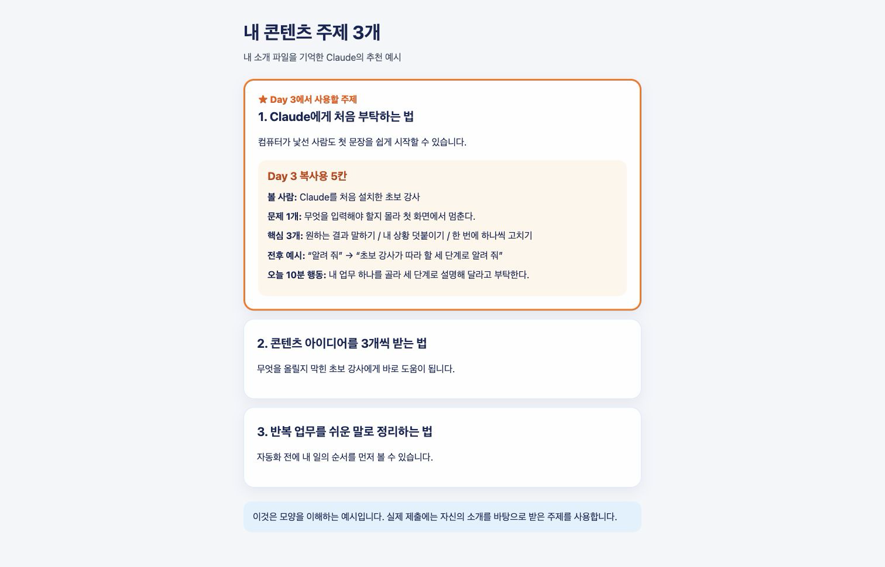

# Day 2 — 프로젝트로 나를 기억하는 콘텐츠 작업방 만들기

## 오늘 결과부터 봅니다

오늘은 Claude가 내 소개를 기억하고 **나에게 맞는 콘텐츠 주제 3개**를 추천하게 만듭니다.

[완성 결과 예시 열기](day02-assets/expected/content-topics-example.html)



> **프로젝트(Projects)란?** 내 자료를 한 번 넣어 두면 새 채팅에서도 다시 설명하지 않아도 되는 작업방입니다.

```text
내 소개 작성 → 프로젝트 만들기 → 소개 파일 넣기 → 주제 3개 받기 → 새 채팅에서 기억 확인 → 1개 선택
```

오늘 결과는 한 가지입니다.

- `내 콘텐츠 주제 3개 + ★ 주제의 Day 3 복사용 5칸`이 보이는 화면 1~2장

예상 시간은 약 70분입니다.

## 준비물

1. Claude Desktop에 로그인합니다.
2. [Day 2 시작 자료 ZIP](downloads/day02-start.zip)을 받습니다.
3. Mac은 ZIP을 두 번 누릅니다. Windows는 ZIP을 오른쪽 클릭하고 **모두 압축 풀기**를 누릅니다.
4. 압축을 푼 `day02-assets` 폴더를 엽니다.

**성공 화면:** 폴더 안에 `my-profile.txt`가 보입니다.

전화번호, 이메일, 주소, 고객 이름은 적지 않습니다.

---

## 1 — 내 소개 파일을 채웁니다

1. `my-profile.txt`를 두 번 누릅니다.
2. Mac은 TextEdit, Windows는 메모장으로 엽니다.
3. **콜론 오른쪽의 값 네 곳만** 내 말로 바꿉니다.
4. 값 양쪽의 `[`와 `]`도 함께 지웁니다.
5. 맨 위 `[내 콘텐츠 소개]`와 아래 `[안전 규칙]`은 제목이므로 그대로 둡니다.

```text
내 이름 또는 닉네임: [밤PD]
내가 하는 일: [AI를 처음 배우는 사람에게 쉬운 사용법을 가르친다]
내 콘텐츠를 볼 사람: [컴퓨터가 낯선 40~60대 강사와 1인 사업자]
내가 자주 말하고 싶은 주제: [Claude 사용법, 콘텐츠 만들기, 업무 자동화]
```

완성된 한 줄은 아래처럼 대괄호가 없습니다.

```text
내 이름 또는 닉네임: 밤PD
```

6. Mac은 `Command + S`, Windows는 `Ctrl + S`를 누릅니다.
7. 파일을 닫았다 다시 열어 내 내용이 남아 있는지 봅니다.

**성공 화면:** 콜론 오른쪽 네 값에는 `[`와 `]`가 없고, 두 섹션 제목은 그대로 있습니다.

## 2 — 프로젝트를 엽니다

1. Claude Desktop을 엽니다.
2. 왼쪽 위 **☰ 메뉴**를 누릅니다.
3. 왼쪽 메뉴의 **프로젝트(Projects)** 를 누릅니다.


위 실제 화면에서 `① 왼쪽 프로젝트`를 누릅니다. 다음 화면부터는 아래 **버튼 글자**를 순서대로 찾습니다.

```text
② 새 프로젝트 → ③ 프로젝트 이름 지정 → ④ 프로젝트 만들기
→ ⑤ 오른쪽 컨텍스트의 + (파일 추가)
→ ⑥ 중앙 'Claude에게 프롬프트를 입력하세요' 입력칸
```

예전 화면이나 영어 화면에서는 `컨텍스트 +`가 `Project knowledge +`처럼 보일 수 있습니다. 이 교재는 아래 실제 최신 한국어 화면의 **컨텍스트**를 기준으로 합니다.

**성공 화면:** 프로젝트 목록과 **새 프로젝트** 버튼이 보입니다.

프로젝트가 보이지 않으면 앱을 업데이트한 뒤 브라우저에서 [claude.ai/projects](https://claude.ai/projects)를 엽니다.

## 3 — 내 콘텐츠 작업방을 만듭니다

1. **새 프로젝트(+ New Project)** 를 누릅니다.
2. `닉네임`을 오픈카톡에서 쓰는 실제 이름으로 바꿔 입력합니다. 예: `내 콘텐츠 작업방 밤PD`
3. **프로젝트 만들기**를 누릅니다.

설명 입력칸이 보여도 비워 둬도 됩니다. 다른 설정은 누르지 않습니다.


**성공 화면:** 화면 위쪽에 내 실제 이름이 들어간 프로젝트 이름이 보입니다. 예: `내 콘텐츠 작업방 밤PD`

## 4 — 내 소개 파일 한 개를 넣습니다

1. 프로젝트 홈 오른쪽의 **컨텍스트**를 찾습니다.
2. **컨텍스트** 제목 오른쪽의 `+`를 누릅니다. 이 `+`의 기능 이름이 **파일 추가**입니다.
3. 작은 메뉴가 나타나는 버전에서만 메뉴의 **파일 추가**를 한 번 더 누릅니다.
4. `my-profile.txt`를 선택합니다.
5. **열기**를 누르고 기다립니다.


캡처의 `왕초보2기 화면연습`은 위치를 보여 주기 위한 예시 이름입니다. 수강생 화면에는 앞 단계에서 만든 `내 콘텐츠 작업방 본인닉네임`이 보이면 정상입니다.

**성공 화면:** 오른쪽 컨텍스트에 `my-profile.txt`가 보입니다.

보이지 않으면 `+`를 연속해서 누르지 말고 30초 기다립니다. 그래도 없으면 한 번만 다시 선택합니다.

## 5 — 내 콘텐츠 주제 3개를 받습니다

1. 프로젝트 홈 중앙의 **Claude에게 프롬프트를 입력하세요** 입력칸을 누릅니다. 앱 버전에 따라 캡처처럼 `메시지를 입력하세요...`로 보일 수도 있습니다.
2. 아래 문장을 복사해 붙여넣습니다.
3. **Enter**를 누르면 이 프로젝트의 첫 채팅이 시작됩니다.

```text
오른쪽 컨텍스트의 my-profile.txt를 읽어 주세요.
나와 내 콘텐츠를 볼 사람에게 맞는 콘텐츠 주제 3개를 추천해 주세요.

각 주제는 아래처럼 써 주세요.
1. 제목
2. 이 주제가 내 사람에게 필요한 이유 한 문장

세 주제 중 Day 3 인스타 카드뉴스로 만들기 가장 쉬운 하나에는 ★를 붙여 주세요.
선택한 이유는 한 문장만 써 주세요.

★ 주제 아래에만 'Day 3 복사용 5칸'을 붙여 주세요.
- 볼 사람
- 그 사람이 겪는 문제 1개
- 꼭 전할 핵심 3개
- 전후 예시(보기 전 / 본 뒤)
- 오늘 바로 할 10분 행동

어려운 전문용어와 과장된 성과는 쓰지 마세요.
각 제목과 이유, Day 3 복사용 각 칸은 한 문장으로 짧게 써 주세요.
전체가 화면 캡처 1~2장 안에 들어오게 간결하게 정리해 주세요.
먼저 결과부터 보여 주세요.
```

**성공 화면:** 번호가 붙은 콘텐츠 주제 3개가 보이고, ★ 주제 아래에 `Day 3 복사용 5칸`이 모두 채워져 있습니다.

주제가 내 일과 맞지 않으면 아래 한 줄만 보냅니다.

```text
my-profile.txt를 다시 읽고, 내가 하는 일과 볼 사람에게 더 가까운 주제 3개로 바꿔 주세요.
```

## 6 — 새 채팅에서도 나를 기억하는지 봅니다

1. 지금 프로젝트 이름에 내 실제 카톡 이름이 들어 있는지 확인합니다.
2. 화면 위쪽의 **프로젝트 이름**을 눌러 프로젝트 홈으로 돌아갑니다.
3. 중앙의 **Claude에게 프롬프트를 입력하세요** 입력칸을 누릅니다. `메시지를 입력하세요...`도 같은 곳입니다.
4. 내 소개를 다시 쓰지 않고 아래 한 줄만 보냅니다. Enter를 누르면 두 번째 채팅이 시작됩니다.

```text
내가 하는 일과 내 콘텐츠를 볼 사람을 두 줄로 말해 주세요.
```

**성공 화면:** `my-profile.txt`에 적은 내 일과 볼 사람이 맞게 나옵니다.

이것이 프로젝트의 핵심입니다. 소개 파일을 한 번 넣었기 때문에 새 채팅에서도 처음부터 다시 설명하지 않았습니다.

### 처음 주제 채팅으로 돌아가는 곳

1. 두 번째 채팅 화면 위쪽의 **프로젝트 이름**을 누릅니다.
2. 프로젝트 홈 중앙의 **최근 항목** 표를 찾습니다.
3. 최근 항목에서 주제 3개를 만든 첫 대화를 누릅니다. 자동 제목은 사람마다 다를 수 있습니다.
4. 결과 안에 `★`와 `Day 3 복사용 5칸`이 보이는지 확인합니다.

첫 대화를 찾지 못해도 실패가 아닙니다. 지금 새 채팅에 아래 복구 문장을 보내면 같은 결과를 다시 받을 수 있습니다.

```text
오른쪽 컨텍스트의 my-profile.txt를 기준으로 콘텐츠 주제 3개를 다시 추천해 주세요.
Day 3 카드뉴스로 만들기 쉬운 하나에 ★를 붙이고,
그 주제 아래에 볼 사람 / 문제 1개 / 핵심 3개 / 전후 예시 / 오늘 10분 행동을
각각 한 문장으로 짧게 써 주세요.
```

## Day 3에 옮길 때 보는 표

Day 3 실행서의 대괄호에 아래처럼 옮깁니다.

| Day 2 복사용 칸 | Day 3에서 붙여넣을 칸 |
|---|---|
| 볼 사람 | 볼 사람 |
| 그 사람이 겪는 문제 1개 | 문제 |
| 꼭 전할 핵심 3개 | 공식 또는 핵심 3가지 |
| 전후 예시 | 전후 예시 |
| 오늘 바로 할 10분 행동 | 오늘 할 행동 |

## 7 — 결과를 PNG로 저장합니다

주제 3개와 ★ 주제의 `Day 3 복사용 5칸`이 보이게 합니다. 한 화면에 다 들어오면 1장, 글자가 작아지면 위·아래로 나누어 2장을 저장합니다.

### Mac

1. `Shift + Command + 4`를 함께 누릅니다.
2. 결과 부분만 드래그합니다.
3. 데스크탑에 생긴 PNG 이름을 `D02_닉네임_콘텐츠주제.png`로 바꿉니다.

### Windows

1. `Windows + Shift + S`를 함께 누릅니다.
2. **사각형 캡처**로 결과 부분만 드래그합니다.
3. 오른쪽 아래 알림을 눌러 저장합니다.
4. 파일 이름을 `D02_닉네임_콘텐츠주제.png`로 정합니다.

두 장으로 저장했다면 파일 이름 뒤에 `_1`, `_2`를 붙입니다.

**성공 화면:** Finder 또는 파일 탐색기에 `D02_닉네임_콘텐츠주제.png` 한 장 또는 `_1.png`, `_2.png` 두 장이 보입니다.

## 오픈카톡 인증

PNG 1~2장과 아래 글을 올립니다.

```text
[왕초보2기 Day 2 / 닉네임]
오늘 만든 것: 나를 기억하는 콘텐츠 작업방 + 콘텐츠 주제 3개
내 콘텐츠를 볼 사람: __________
Day 3에서 쓸 주제: __________
결과물: D02_닉네임_콘텐츠주제.png 1장 또는 2장
오늘 배운 것: 내 소개를 한 번 넣고 새 채팅에서도 다시 설명하지 않는 방법
```

API 키, 이메일, 다른 대화 제목, 실제 고객 정보는 화면에 보이지 않게 합니다.

## 끝났는지 확인합니다

- [ ] 내 실제 카톡 이름이 들어간 콘텐츠 작업방이 있습니다.
- [ ] 프로젝트 안에 `my-profile.txt` 한 개가 보입니다.
- [ ] 새 채팅에서 내 일과 볼 사람을 맞게 말했습니다.
- [ ] 콘텐츠 주제 3개와 ★ 주제의 `Day 3 복사용 5칸`이 보입니다.
- [ ] `D02_닉네임_콘텐츠주제.png`를 저장했습니다.

다섯 개가 모두 체크되면 Day 2가 끝났습니다.

## 막혔을 때

| 보이는 상황 | 지금 할 일 |
|---|---|
| 프로젝트가 안 보임 | 앱 업데이트 후 `claude.ai/projects`를 엽니다. |
| 파일이 안 올라감 | 오른쪽 컨텍스트의 `+ (파일 추가)`에서 `my-profile.txt` 한 개만 다시 선택합니다. 작은 메뉴가 보일 때만 `파일 추가`를 한 번 더 누릅니다. |
| 내 소개를 틀리게 말함 | `컨텍스트의 my-profile.txt를 다시 읽고 파일에 적힌 내용만 말해 주세요.` |
| 주제가 너무 어려움 | `컴퓨터 왕초보도 이해할 쉬운 말로 다시 써 주세요.` |
| 5칸이 일부 빠짐 | `★ 주제 아래에 볼 사람, 문제 1개, 핵심 3개, 전후 예시, 오늘 10분 행동을 각각 한 문장으로 채워 주세요.` |
| 첫 주제 대화를 못 찾음 | 위쪽 프로젝트 이름 → 프로젝트 홈 → 최근 항목을 확인합니다. 그래도 없으면 6단계 아래 복구 문장을 현재 채팅에 보냅니다. |

## 공식 도움말

- [Anthropic 공식 — 프로젝트 생성과 관리](https://support.claude.com/en/articles/9519177-how-can-i-create-and-manage-projects)
