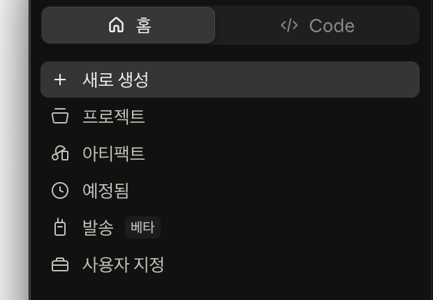
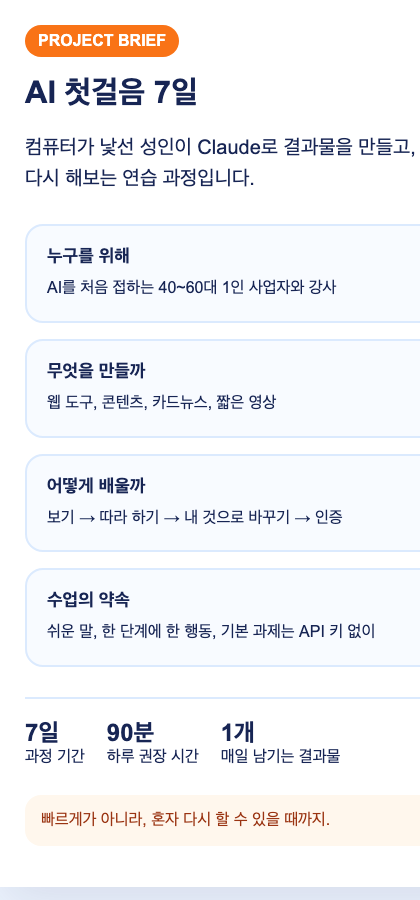

# Day 2 — Claude 프로젝트(Projects)로 나만의 AI 작업방 만들기

## 오늘 한눈에 보기

**연습 자료 3개 → 자료를 기억하는 프로젝트 → 누르는 한 장 안내 페이지**

| 순서 | 눈에 보이는 작은 성공 |
|---|---|
| 기능 익히기 | 프로젝트 안에 자료 파일 3개가 보임 |
| 쉬운 연습 | 사실 카드·FAQ·환영 공지가 대화에 생김 |
| 메인 실습 | 준비물 버튼이 있는 안내 페이지가 열림 |
| 내 것으로 응용 | 제목·대상·내용·FAQ가 내 주제로 바뀜 |

내가 할 일은 자료 세 개 넣기, 결과 눌러 보기, 내 내용 네 칸 바꾸기입니다. Claude는 자료를 읽고 같은 규칙으로 결과를 만듭니다.

## 이 기능은 무엇인가요?

**프로젝트**는 한 가지 일을 위한 자료와 규칙, 대화를 한곳에 모아 두는 Claude의 작업방입니다. 오늘 넣은 소개·과정·FAQ 문서는 그 프로젝트 안에서 새 대화를 열어도 다시 활용할 수 있습니다.

중요한 차이가 하나 있습니다. 프로젝트의 **이름과 설명만 적어서는 Claude가 그 내용을 아는 것이 아닙니다.** Claude가 계속 참고할 내용은 `프로젝트 지식(Project knowledge)`에 올리고, 계속 지킬 말투와 규칙은 `프로젝트 지침(Project instructions)`에 저장합니다.

2026년 8월 기준 프로젝트 기능은 무료 계정에서도 사용할 수 있으며 무료 계정은 최대 5개 프로젝트를 만들 수 있습니다. 화면과 제공 범위는 바뀔 수 있습니다.

## Claude Desktop 화면에서 어디에 있나요?

처음에는 아래 순서만 따라 누릅니다.

1. Claude Desktop을 엽니다.
2. 화면 왼쪽 위의 **☰ 메뉴**가 접혀 있으면 한 번 누릅니다.
3. 왼쪽 메뉴의 **프로젝트**를 한 번 누릅니다.
4. 프로젝트 목록 오른쪽 위의 **새 프로젝트(+ New Project)**를 누릅니다.
5. 이름을 적고 **만들기(Create)**를 누르면 프로젝트 작업방이 열립니다.
6. 작업방 오른쪽 **프로젝트 지식(Project knowledge)**의 `+`는 참고 자료를 넣는 곳입니다.
7. **프로젝트 지침 설정(Set project instructions)**은 Claude가 계속 지킬 말투와 규칙을 적는 곳입니다.
8. 가운데 **새 채팅(New chat)**을 누르면 이 자료와 규칙을 사용하는 새 대화가 시작됩니다.



운영자 캡처 목록과 번호 콜아웃:

- 캡처 D2-1, 프로젝트 목록: `① 왼쪽 프로젝트` `② 새 프로젝트`
- 캡처 D2-2, 새 프로젝트 창: `① 프로젝트 이름` `② 설명` `③ 만들기`
- 캡처 D2-3, 프로젝트 안: `① 새 채팅` `② 프로젝트 지식의 +` `③ 프로젝트 지침 설정`
- 캡처 D2-4, 결과 화면: `① 생성된 결과` `② 게시` `③ 링크 복사`
- Mac과 Windows에서 각각 캡처하고, 계정 이메일과 다른 대화 제목은 가립니다.

### Day 1과 선택해서 이어 쓰기

Day 1의 웹 도구를 완성했다면 공개해도 안전한 `index.html`을 오늘 프로젝트 지식에 **선택해서** 추가할 수 있습니다. 그러면 Claude에게 `Day 1 웹 도구의 대상, 핵심 기능, 다음에 고칠 점을 세 줄로 정리해 주세요.`라고 요청하고, 그 내용을 오늘 안내 페이지에 넣습니다. Day 1 파일이 없거나 개인정보가 들어 있다면 올리지 않고 제공된 가상 자료 세 개만 사용해도 Day 2를 완전히 끝낼 수 있습니다.

## 오늘 남는 결과

작은 결과물 세 개와 메인 결과물 한 개가 남습니다.



1. 과정 핵심 사실 카드
2. 초보자 FAQ 5개
3. 오픈카톡 환영 공지
4. 세 내용을 합친 **한 장짜리 과정 안내 페이지와 공개 링크**

마지막에는 자기 주제로 제목과 대상, FAQ를 바꾼 버전도 만듭니다.

## 시간표 — 총 2시간 40분

| 순서 | 시간 | 하는 일 | 눈에 보이는 완료 표시 |
|---|---:|---|---|
| 기능 이해 | 20분 | 프로젝트 위치와 지식·지침 차이 확인 | 연습 프로젝트가 생김 |
| 작은 결과 3개 | 45분 | 세 자료를 올리고 세 결과 생성 | 채팅에 결과 3개가 보임 |
| 메인 결과물 | 45분 | 안내 페이지 아티팩트 생성·게시 확인 | 한 장 화면과, 게시 가능하면 링크가 생김 |
| 자기 주제 응용 | 30분 | 최소 3곳을 자기 내용으로 변경 | 제목·대상·FAQ가 달라짐 |
| 휴대폰 검수·인증 | 20분 | 링크 열기, 캡처, 카톡 인증 | 다른 사람이 링크를 열 수 있음 |

## 준비물

- 로그인된 Claude Desktop
- [Day 2 시작 자료 ZIP 한 번에 받기](downloads/day02-start.zip)
- [압축을 푼 뒤 처음 읽을 안내](day02-assets/README_FIRST.md)
- 휴대폰
- 자기 주제 한 가지와 공개해도 되는 설명 세 줄

실제 고객 명단, 전화번호, 주소, 계약서, 미공개 매출은 올리지 않습니다. 오늘은 제공된 가상 자료로 먼저 완주합니다.

## 1단계 — 연습 프로젝트 만들기

1. **프로젝트 → 새 프로젝트**를 누릅니다.
2. 이름을 `왕초보2기 Day2 닉네임`으로 적습니다.
3. 설명은 `AI 첫걸음 과정 안내물을 만드는 연습방`이라고 적습니다.
4. **만들기**를 누릅니다.
5. **프로젝트 지침 설정**을 열어 아래 문장을 그대로 붙여넣고 저장합니다.

```text
나는 컴퓨터 왕초보입니다.
항상 쉬운 한국어와 짧은 문장으로 답해 주세요.
프로젝트 지식이나 지금 메시지에서 내가 직접 준 사실만 사용하고, 없는 날짜·가격·성과는 만들지 마세요.
먼저 완성 결과를 보여 주고, 설명은 그 아래에 세 줄 이내로 적어 주세요.
공개 결과물에는 전화번호, 이메일, 개인 이름을 넣지 마세요.
```

**성공 화면:** 프로젝트 이름 아래에서 새 대화를 시작할 수 있고, 지침을 다시 열면 붙여넣은 문장이 보입니다.

## 2단계 — 프로젝트 지식 넣기

1. 오른쪽 **프로젝트 지식**의 `+`를 누릅니다.
2. `day02-assets` 안의 다음 세 파일을 한꺼번에 선택합니다.
   - `01_brand.txt` — 브랜드 소개
   - `02_course.txt` — 과정 정보
   - `03_faq.txt` — 자주 묻는 질문
3. 파일명 세 개가 프로젝트 지식 영역에 보일 때까지 기다립니다.

Mac은 파일 선택 창에서 `Command`를 누른 채 여러 파일을 누르고, Windows는 `Ctrl`을 누른 채 누릅니다. 여러 개 선택이 어렵다면 한 파일씩 세 번 올려도 됩니다.

**성공 화면:** 프로젝트 지식에 파일명 세 개가 모두 보입니다.

## 3단계 — 작은 결과물 세 개 만들기

프로젝트 안에서 **새 채팅**을 누르고 아래 프롬프트를 차례대로 보냅니다. 한꺼번에 보내지 않습니다.

### 결과 1: 핵심 사실 카드

```text
프로젝트 지식의 02_course.txt만 확인해서 아래 네 칸을 채워 주세요.

과정명 / 대상 / 기간 / 매일 남는 결과물

각 칸은 한 문장으로 쓰고, 자료에 없는 내용은 추측하지 마세요.
휴대폰에서 한 화면에 보이는 간단한 표로 보여 주세요.
```

### 결과 2: FAQ 5개

```text
프로젝트 지식의 03_faq.txt에서 초보자에게 가장 중요한 질문 5개를 골라 주세요.
답은 각각 두 문장 이내로 줄여 주세요.
원문에 없는 가격이나 약속은 추가하지 마세요.
제목은 '처음 오신 분이 가장 많이 묻는 것'으로 해 주세요.
```

### 결과 3: 환영 공지

```text
프로젝트 지식과 프로젝트 지침을 사용해서 오픈카톡 환영 공지를 써 주세요.
제목 1줄, 본문 5줄, 마지막 행동 1줄로 만드세요.
대상, 준비물, 5분 막힘 규칙을 포함하고 과장 표현은 쓰지 마세요.
```

각 결과가 보이면 채팅 아래에 이어서 설명하지 말고, 화면을 한 번 캡처합니다.

## 4단계 — 메인 결과물 만들기

같은 프로젝트의 새 대화에서 아래 프롬프트를 붙여넣습니다.

```text
프로젝트 지식과 프로젝트 지침만 사용해서 'AI 첫걸음 7일' 한 장 안내 페이지를 만들어 주세요.

반드시 넣을 것:
1. 과정명과 한 줄 소개
2. 누구를 위한 과정인지
3. 기간과 하루 권장 시간
4. 만들게 되는 결과물
5. 자주 묻는 질문 3개
6. 마지막에 '준비물 확인하기' 버튼
7. 맨 아래에 짧은 환영 공지 5줄

요구사항:
- 휴대폰에서 읽는 세로형 HTML 아티팩트로 만드세요.
- 버튼과 글자를 크게 만들고, 밝은 배경에 남색과 주황색을 사용하세요.
- 버튼을 누르면 준비물 목록이 화면 안에서 열리게 하세요.
- 자료에 없는 가격, 후기, 인원, 날짜는 넣지 마세요.
- 완성 뒤 제가 눌러 볼 곳을 딱 두 군데만 알려 주세요.
```

오른쪽 결과 화면에서 아래 두 가지를 직접 눌러 봅니다.

- `준비물 확인하기` 버튼
- FAQ 하나

버튼이 움직이고 글자가 휴대폰 크기에서 읽히면 **게시**를 누르고 **링크 복사**를 누릅니다. 계정에 따라 조직 내부 공유만 가능할 수 있습니다. 게시가 없다면 결과 화면 캡처와 내려받은 파일로 기본 완주합니다.

> 프로젝트에서 만든 결과를 공유하면 같은 대화의 첨부파일에 접근 가능한 경우가 있습니다. 오늘은 공개 가능한 가상 자료만 넣었기 때문에 공유할 수 있습니다. 실제 고객 자료가 있는 프로젝트에서는 공개하지 마세요.

완성 예시: [프로젝트 브리핑 예시 열기](day02-assets/expected/project-brief-example.html)

## 5단계 — 자기 주제로 바꾸기

아래 네 줄의 대괄호만 바꿔 같은 결과 대화에 보냅니다.

```text
방금 안내 페이지의 구조와 기능은 유지하고 제 주제로 바꿔 주세요.

내 주제: [반려견 산책 모임]
볼 사람: [처음 반려견을 키우는 동네 주민]
제공하는 것 3개: [주말 산책 / 기본 예절 정보 / 동네 친구 만들기]
FAQ 한 개: [비가 오면 어떻게 하나요? / 단체방에서 당일 공지합니다.]

없는 정보는 만들지 말고, 바뀐 문장을 먼저 요약한 뒤 새 버전을 만들어 주세요.
```

제목, 대상, 제공하는 것, FAQ가 모두 달라졌는지 확인하고 새 버전을 게시합니다.

## 완성 판정

- [ ] 프로젝트 안에 내 프로젝트가 있다.
- [ ] 프로젝트 지식에 자료 세 개가 보인다.
- [ ] 프로젝트 지침이 쉬운 말과 사실 확인 규칙을 담고 있다.
- [ ] 작은 결과물 세 개가 실제 화면에 보인다.
- [ ] 메인 안내 페이지의 버튼이 작동한다.
- [ ] 자기 주제 네 가지가 반영됐다.
- [ ] 휴대폰에서 결과 링크가 열리거나, 결과 전체 캡처가 있다.
- [ ] 공개 결과에 개인정보와 자료에 없는 사실이 없다.

앞의 여덟 항목 중 일곱 개 이상이면 완료입니다. 단, 프로젝트 지식이 없거나 메인 결과 화면이 없으면 완료가 아닙니다.

## 막혔을 때 가장 짧은 복구

| 보이는 상황 | 할 일 |
|---|---|
| 프로젝트가 안 보임 | 앱을 최신 버전으로 업데이트하고 [claude.ai/projects](https://claude.ai/projects)를 브라우저에서 엽니다. |
| 파일을 여러 개 못 고름 | 한 파일씩 `+`를 세 번 눌러 올립니다. |
| Claude가 엉뚱한 숫자를 씀 | `프로젝트 지식에 없는 숫자는 삭제하고 출처 파일명을 옆에 써 주세요.`라고 보냅니다. |
| 결과 화면이 안 생김 | `설명문이 아니라 실제로 누를 수 있는 HTML 아티팩트를 만들어 주세요.`라고 보냅니다. |
| 게시가 없음 | 게시를 멈추고 결과 전체 화면 캡처와 내려받기 버튼이 있으면 HTML 파일을 저장합니다. |
| 링크가 휴대폰에서 안 열림 | 시크릿 창에서 먼저 시험하고, 기본 완주는 전체 화면 PNG로 제출합니다. |

## 오픈카톡 인증

올릴 것은 **대표 화면 한 장과 링크 하나**입니다. 세 개의 작은 결과 캡처를 모두 올리지 않습니다.

```text
[왕초보2기 Day 2 / 닉네임]
오늘 만든 것: 자료와 규칙을 기억하는 Claude 프로젝트 + 한 장 안내 페이지
내 주제: ___
결과물: 공개 링크 또는 대표 화면 첨부
프로젝트에서 배운 것: 새 대화에서도 프로젝트 지식과 지침을 다시 쓰는 방법
내가 직접 바꾼 것: 제목 / 대상 / 제공 내용 / FAQ
```

## 공식 레퍼런스와 따라 볼 영상

- [Anthropic 공식 — 프로젝트 생성과 관리](https://support.claude.com/en/articles/9519177-how-can-i-create-and-manage-projects): 프로젝트 지식, 지침, 새 대화 간 사용 범위
- [Anthropic 공식 — 아티팩트 게시와 공유](https://support.claude.com/en/articles/9547008-publish-and-share-artifacts): 요금제별 게시와 공유 차이, 첨부파일 공유 주의
- [Anthropic 공식 YouTube — Getting started with Claude.ai](https://www.youtube.com/watch?v=0vZ_UVLhSQQ): 파일 첨부와 기본 대화 화면을 처음 보는 사람용 영상

영상은 버튼 위치를 익히는 참고 자료입니다. 오늘 제출할 내용은 영상 예제가 아니라 자기 프로젝트 결과입니다.
