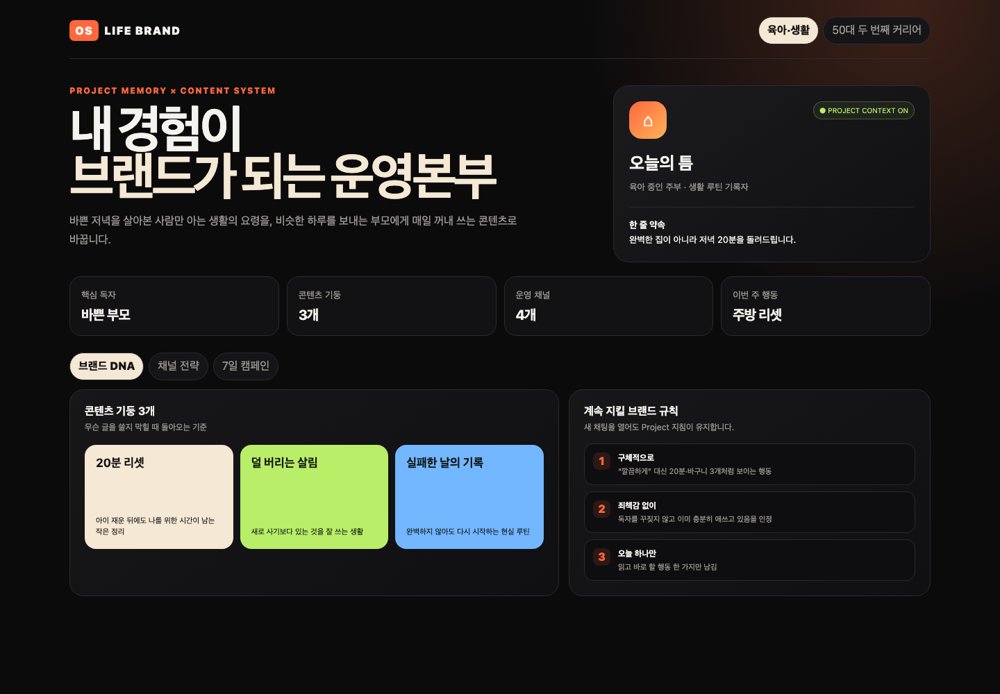
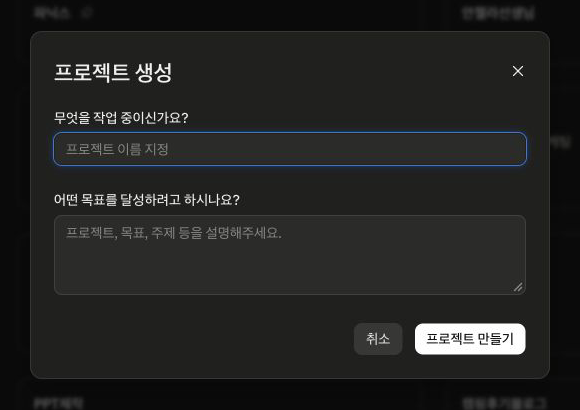
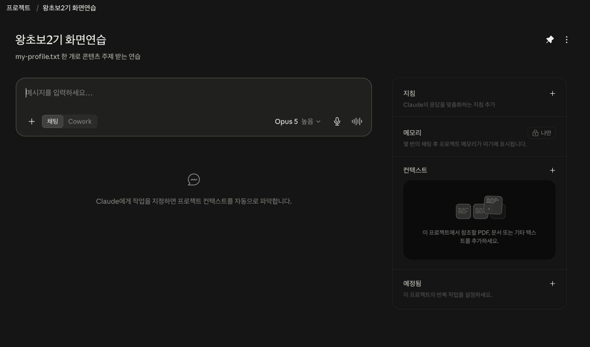

# Day 2 — 프로젝트로 LIFE BRAND 운영본부 만들기

## 오늘 만드는 것을 먼저 눌러 보세요

[완성 예시 LIFE BRAND OS 열기](day02-assets/brand-os/index.html)



위 화면에서 다음을 직접 눌러 봅니다.

1. 위쪽의 **육아·생활 / 50대 두 번째 커리어**를 번갈아 누릅니다.
2. **브랜드 DNA / 채널 전략 / 7일 캠페인**을 차례로 누릅니다.
3. 사례와 탭을 바꿨을 때 대상·말투·약속이 각 사례 안에서 흐트러지지 않는지 봅니다.

오늘은 이와 같은 **내 콘텐츠 운영본부 한 화면**을 만듭니다.

- 내가 누구에게 무엇을 약속하는지
- 계속 다룰 콘텐츠 기둥 3개
- 유튜브·인스타·블로그·쓰레드의 역할
- 이번 주 7일 콘텐츠

완성 결과는 버튼을 눌러 내용을 바꿔 볼 수 있는 웹 화면입니다.

```text
기능 알기 → 제공 자료로 작은 성공 → 새 채팅 기억 시험 → 내 내용으로 응용 → 웹 화면 완성
```

예상 시간은 2시간입니다.

| 구간 | 시간 | 성공 화면 |
|---|---:|---|
| ZIP 풀기·프로젝트 만들기 | 20분 | 프로젝트 이름이 화면 위에 보임 |
| 컨텍스트 4개·지침 넣기 | 25분 | 오른쪽에 파일 4개와 저장된 지침이 보임 |
| 작은 성공·새 채팅 기억 시험 | 20분 | 소개를 다시 쓰지 않아도 대상과 약속을 말함 |
| 운영본부 만들고 탭 검사 | 40분 | 탭 3개가 실제로 내용을 바꿈 |
| 내 내용 응용·Day 3 브리프·인증 | 15분 | 브리프 7칸과 인증 PNG가 준비됨 |

## 프로젝트가 왜 필요한가요?

일반 채팅은 새로 열 때마다 “나는 누구이고 누구에게 말하는지”를 다시 설명해야 합니다. **프로젝트(Projects)** 는 자주 쓰는 자료와 지침을 한 작업방에 보관합니다. 그래서 새 채팅을 열어도 같은 대상과 말투를 이어 갈 수 있습니다.

| 기능 | 쉬운 뜻 | 오늘 확인할 것 |
|---|---|---|
| 프로젝트 | 한 주제 전용 작업방 | 내 작업방 이름이 보인다 |
| 컨텍스트 | Claude가 참고할 자료 서랍 | 자료 파일 4개가 보인다 |
| 지침 | 이 작업방에서 늘 지킬 규칙 | 새 채팅도 같은 말투를 쓴다 |

## 준비물

1. [Day 2 시작 자료 ZIP](downloads/day02-start.zip)을 받습니다.
2. ZIP을 풀어 생긴 `day02-assets` 폴더를 엽니다.
3. `day02-assets → project-packs` 안에서 하나만 고릅니다.

| 연습 선택 | 폴더 | 주제 |
|---|---|---|
| A — 기본 추천 | `home` | 육아 중인 주부의 20분 생활 리셋 |
| B — 선택 | `career` | 은퇴를 앞둔 50대의 두 번째 커리어 |

처음에는 자기 소개를 쓰지 않습니다. 제공된 자료로 기능부터 성공시킨 다음, 마지막에 내 내용으로 바꿉니다.

전화번호·주소·고객 이름·회사 기밀은 프로젝트에 넣지 않습니다.

---

## 1단계 — 프로젝트 위치를 찾습니다

1. Claude Desktop을 엽니다.
2. 왼쪽 위 **☰**를 누릅니다.
3. 왼쪽 메뉴의 **프로젝트**를 누릅니다.


**이렇게 되면 성공:** 프로젝트 목록과 **새 프로젝트** 버튼이 보입니다.

메뉴가 없으면 앱을 업데이트합니다. 그래도 없으면 브라우저에서 [claude.ai/projects](https://claude.ai/projects)를 엽니다.

## 2단계 — 연습용 프로젝트를 만듭니다

1. **새 프로젝트**를 누릅니다.
2. 이름을 `Day2 생활 브랜드 연구소 닉네임`으로 적습니다.
3. **프로젝트 만들기**를 누릅니다.



**이렇게 되면 성공:** 화면 위쪽에 내가 적은 프로젝트 이름이 보입니다.

## 3단계 — 자료 4개를 넣습니다

기본 추천인 `project-packs/home` 폴더를 엽니다. 아래 네 파일을 모두 선택합니다.

```text
01_about-me.txt
02_audience.txt
03_channels.txt
04_goal.txt
```

1. 프로젝트 화면 오른쪽의 **컨텍스트**를 찾습니다.
2. 제목 옆 `+`를 누릅니다.
3. **파일 추가**를 누르고 네 파일을 선택합니다.
4. 파일 이름 4개가 나타날 때까지 기다립니다.



**이렇게 되면 성공:** 오른쪽 컨텍스트에 파일 네 개가 보입니다.

## 4단계 — 지침을 넣습니다

프로젝트 화면에서 **지침**, **프로젝트 지침** 또는 **Set instructions**를 찾습니다. 앱 버전에 따라 점 세 개 `···` 안에 있을 수 있습니다. 아래를 그대로 붙여넣고 저장합니다.

```text
이 프로젝트에서는 컨텍스트의 네 파일을 먼저 읽는다.
대상, 브랜드 약속, 채널 역할을 서로 모순되게 바꾸지 않는다.
막연한 조언 대신 시간·순서·행동이 보이는 문장으로 쓴다.
독자에게 죄책감을 주거나 성공을 보장하지 않는다.
결과부터 보여 주고, 어려운 전문용어를 쓰지 않는다.
개인정보와 자료에 없는 사실은 만들지 않는다.
```

**이렇게 되면 성공:** 저장된 지침의 첫 줄이 다시 보입니다.

## 5단계 — 작은 성공: 프로젝트가 기억하는지 묻습니다

프로젝트 중앙 입력칸에 아래 문장을 보냅니다.

```text
컨텍스트의 네 파일과 프로젝트 지침을 읽어 주세요.
1. 이 사람은 누구인지
2. 가장 중요한 독자는 누구인지
3. 한 줄 약속은 무엇인지
4. 절대 하지 말아야 할 표현은 무엇인지
각각 한 문장으로만 말해 주세요.
```

**이렇게 되면 성공:** `육아 중인 주부`, `바쁜 부모`, `저녁 20분`, `완벽·성공 보장 금지`가 내용에 맞게 나옵니다.

## 6단계 — 진짜 기능 확인: 새 채팅 시험

1. 위쪽 프로젝트 이름을 눌러 프로젝트 홈으로 돌아갑니다.
2. 같은 프로젝트에서 **새 채팅**을 시작합니다.
3. 소개를 다시 적지 말고 아래 한 줄만 보냅니다.

```text
내 핵심 독자와 한 줄 약속을 말한 뒤, 오늘 올릴 쓰레드 첫 문장 하나를 써 주세요.
```

**이렇게 되면 성공:** 앞 채팅을 복사하지 않았는데도 같은 독자와 약속을 알고 있습니다. 이것이 Day 2의 핵심 기능입니다.

기억하지 못하면 새 일반 채팅을 연 것은 아닌지 확인합니다. 화면 위쪽에 `Day2 생활 브랜드 연구소 닉네임`이 보여야 합니다.

## 7단계 — 운영본부 웹 화면을 만듭니다

같은 프로젝트의 새 채팅에 아래 프롬프트를 붙여넣습니다.

```text
컨텍스트 4개와 프로젝트 지침을 기준으로
내 콘텐츠 운영본부를 인터랙티브 HTML 아티팩트 하나로 만들어 주세요.

화면 맨 위:
- 브랜드 이름과 한 줄 약속
- 핵심 독자, 콘텐츠 기둥 수, 운영 채널 수, 이번 주 행동

누를 수 있는 탭 3개:
1. 브랜드 DNA: 콘텐츠 기둥 3개와 브랜드 규칙 3개
2. 채널 전략: 유튜브·인스타그램·블로그·쓰레드의 서로 다른 역할과 예시 제목
3. 7일 캠페인: 날짜별 주제, 한 문장 내용, 사용할 채널

디자인:
- 잡지 편집 화면처럼 크고 대담한 제목
- 검정 바탕에 크림색·주황색·연두색 포인트
- 휴대폰에서도 읽히게 반응형
- 탭을 누르면 실제 내용이 바뀌어야 함
- 외부 API, 로그인, 개인정보 사용 금지

설명만 하지 말고 바로 실행 가능한 HTML 결과를 만들어 주세요.
```

**이렇게 되면 성공:** 화면 위에 브랜드 이름이 보이고, 세 탭을 누를 때 아래 내용이 실제로 바뀝니다.

### 결과가 평범할 때 한 번만 업그레이드

```text
내용은 유지하고 첫눈에 유료 브랜드 전략 대시보드처럼 보이게 다시 디자인해 주세요.
제목 대비, 숫자 카드, 색 블록, 여백을 과감하게 쓰고
세 탭의 화면 구성을 서로 다르게 만들어 주세요.
작동하던 버튼은 그대로 작동해야 합니다.
```

## 8단계 — 내 내용으로 응용합니다

작은 성공을 확인한 뒤에만 내 자료로 바꿉니다.

1. 연습용 네 파일을 복사해 새 폴더 `my-brand`에 넣습니다.
2. 각 파일의 콜론 오른쪽 내용만 내 이야기로 고칩니다.
3. 전화번호·주소·고객 실명은 지웁니다.
4. 기존 사례와 섞이지 않도록 **새 프로젝트** `Day2 내 콘텐츠 운영본부 닉네임`을 만듭니다.
5. 새 프로젝트 컨텍스트에 수정한 네 파일만 넣고, 4단계의 지침을 다시 붙여넣습니다.
6. 아래 문장을 보냅니다.

```text
my-brand의 네 자료와 프로젝트 지침만 기준으로 내 콘텐츠 운영본부를 만들어 주세요.
7단계의 화면 구성과 버튼 기능을 사용하고, 제공 연습 사례의 내용은 넣지 마세요.
```

내 주제가 아직 없다면 응용을 건너뛰어도 완주입니다. 제공 사례를 제대로 작동시킨 것이 먼저입니다.

## 9단계 — Day 3에 보낼 브리프를 받습니다

```text
지금 운영본부에서 인스타 카드뉴스로 가장 눈에 띄게 만들 주제 하나를 골라 주세요.
아래 7칸만 채워 주세요.
- 브랜드 이름
- 대상
- 주제
- 한 줄 약속
- 핵심 순서 3개
- 말투
- 절대 쓰지 않을 표현
```

1. 시작 자료의 `day02-assets → templates → my-brand-brief.txt`를 엽니다.
2. Claude가 답한 일곱 칸을 같은 항목에 붙여넣습니다.
3. **파일 → 다른 이름으로 저장**을 눌러 `D02_닉네임_Day3브리프.txt`로 저장합니다.
4. Day 3에서 이 파일을 바로 첨부합니다.

저장이 어렵다면 답 전체가 보이게 캡처하고, Day 3 시작 전에 운영자와 함께 텍스트 파일로 옮깁니다.

## 오픈카톡 인증 — 30초

📸 **인증 캡처:** 세 탭 중 가장 멋진 화면 1장

```text
[왕초보2기 Day 2 / 닉네임]
✅ LIFE BRAND 운영본부 완성
✅ 새 채팅 기억 시험 성공
💬 소감:
```

## 끝났는지 확인합니다

- [ ] 컨텍스트 파일 4개가 보입니다.
- [ ] 프로젝트 지침을 저장했습니다.
- [ ] 새 채팅이 대상과 약속을 기억했습니다.
- [ ] 탭 3개가 실제로 작동합니다.
- [ ] Day 3용 브리프 7칸을 받았습니다.
- [ ] `D02_닉네임_Day3브리프.txt` 또는 브리프 캡처가 있습니다.
- [ ] `D02_닉네임_브랜드OS.png`를 저장했습니다.

## 막혔을 때

| 보이는 상황 | 지금 보낼 한 문장 |
|---|---|
| 파일을 못 읽음 | `컨텍스트에 보이는 파일 이름 네 개를 먼저 말해 주세요.` |
| 다른 인물 이야기가 섞임 | `방금 올린 my-brand 자료만 기준으로 다시 작성해 주세요.` |
| 탭이 눌리지 않음 | `세 탭을 실제 버튼으로 만들고, 누르면 해당 영역만 보이도록 기능을 고쳐 주세요.` |
| 글만 나오고 화면이 없음 | `설명하지 말고 실행 가능한 HTML 아티팩트를 만들어 주세요.` |
| 새 채팅이 기억하지 못함 | 같은 프로젝트 안인지 확인하고 `프로젝트 컨텍스트와 지침을 먼저 읽어 주세요.` |

## 참고한 자료

- [Anthropic 공식 — 프로젝트 생성과 관리](https://support.claude.com/en/articles/9519177-how-can-i-create-and-manage-projects)
- [Anthropic 공식 영상 — Getting started with projects](https://www.youtube.com/watch?v=GJ5jTgcbRHA)

공식 자료의 `자료 보관 + 지침 + 새 채팅에서도 재사용` 원리를 생활 경험 브랜드 운영본부 실습으로 바꿨습니다.
