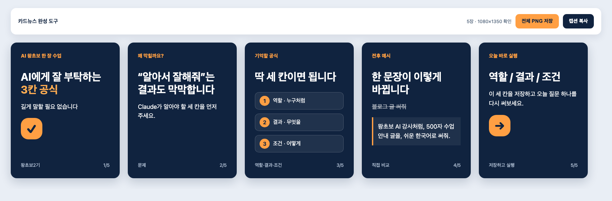

# Day 3 — Claude 디자인으로 인스타 카드뉴스 5장 만들기

## 오늘 결과부터 봅니다

오늘은 Day 2에서 Claude가 추천한 주제 3개 중 하나를 골라 **AI 강사 브랜딩용 인스타 카드뉴스 5장**을 만듭니다. Day 2를 못 끝냈다면 기본 주제 **AI에게 잘 부탁하는 3칸 공식**으로 그대로 완주합니다.



[완성 예시를 큰 화면으로 보기](day03-assets/expected/cardnews-example.html)

완성 예시의 버튼은 **위치를 미리 보는 시연용**이라 파일을 내려받지 않습니다. 실제 PNG ZIP은 수강생이 디자인에서 만든 결과의 버튼으로 8단계에서 저장합니다.

```text
1장 표지 훅 → 2장 문제 → 3장 공식 → 4장 전후 예시 → 5장 저장·실행 CTA
```

각 장은 4:5(1080×1350), 한 장당 메시지 하나, 같은 색·글꼴·여백을 씁니다. 인스타그램 업로드는 오늘 하지 않습니다. 결과 5장을 확인해 오픈카톡에 인증하면 완주입니다.

카드뉴스는 긴 설명을 한 장씩 나눠 보여 줍니다. 보는 사람은 옆으로 넘기며 한 메시지씩 이해하고, 필요한 내용을 저장해 다시 볼 수 있습니다. 강사는 얼굴을 공개하지 않아도 자기 수업 내용과 말투를 꾸준히 보여 줄 수 있습니다.

오늘은 두 번 만듭니다. 먼저 **정답이 있는 기본 예제**로 카드 5장과 수정·저장 버튼을 연습하고, 같은 틀을 복사해 **Day 2에서 고른 내 주제**로 바꿉니다.

## 디자인 기능과 정확한 위치

**디자인(Design)** 은 왼쪽 채팅으로 부탁하고 오른쪽 캔버스에서 디자인을 만들고 고치는 Claude의 베타 기능입니다.

1. Claude Desktop을 엽니다.
2. 왼쪽 위 **☰** 가 접혀 있으면 누릅니다.
3. 왼쪽 메뉴 **디자인**을 누릅니다.
4. **새 프로젝트**를 누릅니다.
5. 왼쪽 **채팅**에 부탁을 보내고 오른쪽 **캔버스**에서 결과를 봅니다.
6. 한 부분만 고칠 때는 캔버스 요소를 선택해 직접 편집하거나 댓글을 남깁니다.
7. 완성하면 오른쪽 위 **내보내기**를 누릅니다.


Claude 디자인의 공식 **내보내기** 목록에는 PNG가 없습니다. 대신 오늘 만드는 결과 화면 자체에 **전체 PNG 저장**과 **캡션 복사** 버튼을 만들어 실제로 눌러 봅니다. 이 버튼이 계정 환경에서 작동하지 않을 때만 공식 **PDF 내보내기**로 완주합니다. 없는 공식 PNG 메뉴를 찾지 않습니다.

디자인 메뉴가 없으면 앱을 업데이트합니다. 그래도 없으면 새로 결제하지 말고 운영자에게 화면을 보여 주세요. 지원 요금제라도 조직 관리자가 꺼 두었을 수 있습니다.

> **개강 전 필수 확인:** 수강생 전원이 미리 **디자인 → 새 프로젝트**를 눌러 빈 캔버스까지 열어 봅니다. 열리지 않는 사람은 Day 3 당일이 아니라 수업 전에 운영자에게 화면을 보냅니다.

## 오늘 남는 결과

- `D03_닉네임_01.png`부터 `05.png`까지 PNG 5장
- 자동 PNG 저장이 안 될 때만 `D03_닉네임_카드뉴스.pdf`
- 문구·색·도형을 한 번씩 직접 고친 디자인
- PNG 5장 또는 PDF 5쪽을 확인한 화면

## 준비물

- [Day 3 시작 자료 ZIP](downloads/day03-start.zip)
- [처음 읽을 안내](day03-assets/README_FIRST.md)
- `day03-assets/cardnews-brief.txt`
- Claude Desktop의 디자인 메뉴
- Day 2 추천 주제 3개 또는 기본 주제

고객 사진, 전화번호, 얼굴 사진, 저작권이 불분명한 이미지는 쓰지 않습니다. 제공 브리프의 도형·색·글자만으로 먼저 완주합니다.

## 시간표 — 약 2시간 20분

| 순서 | 시간 | 눈에 보이는 완료 |
|---|---:|---|
| 결과·기능 위치 확인 | 15분 | 빈 디자인 프로젝트가 열림 |
| 기준 카드뉴스 5장 | 45분 | 5장이 모두 보임 |
| 문구·색·도형 수정 | 40분 | 세 수정이 눈에 보임 |
| Day 2 주제로 응용 | 20분 | 내 주제로 바뀜 |
| 저장·5장 검수·인증 | 20분 | PNG 5장 또는 대체 PDF 5쪽 |

## 1단계 — 내 주제를 메모해 둡니다

Day 2에서 받은 추천 주제 3개를 보고 하나에 동그라미 칩니다. 기준은 두 가지뿐입니다.

1. 내가 실제로 가르칠 수 있는가?
2. 왕초보가 오늘 바로 해볼 수 있는가?

없다면 기본 주제 `AI에게 잘 부탁하는 3칸 공식`을 사용합니다.

지금은 주제만 메모합니다. 3단계에서는 기능을 익히기 위해 기본 예제를 먼저 만들고, 7단계에서 내 주제를 넣습니다.

## 2단계 — 디자인 프로젝트를 엽니다

1. **디자인 → 새 프로젝트**를 누릅니다.
2. 이름을 `왕초보2기 Day3 닉네임`으로 적습니다.
3. `cardnews-brief.txt`를 첨부합니다. 어렵다면 파일 내용을 복사해 채팅에 붙여넣습니다.

**성공 화면:** 왼쪽 채팅과 오른쪽 빈 캔버스가 함께 보입니다.

## 3단계 — 기준 카드뉴스 5장을 만듭니다

```text
첨부한 cardnews-brief.txt의 문구와 사실만 사용해서
AI 강사 브랜딩용 인스타 카드뉴스 5장을 캔버스에 실제로 만들어 주세요.

각 장은 1080×1350, 세로 4:5의 분리된 프레임입니다.
1장 표지 훅 / 2장 문제 / 3장 3칸 공식 / 4장 전후 예시 / 5장 저장·실행 CTA 순서입니다.

규칙:
- 한 장에는 메시지 하나만 넣습니다.
- 제목은 두 줄, 본문은 세 줄 이내입니다.
- 다섯 장 모두 같은 남색 배경, 흰 글자, 주황 강조색, 같은 여백을 씁니다.
- 오른쪽 아래에 1/5부터 5/5까지 표시합니다.
- 사진 대신 원·선·체크 같은 단순 도형만 씁니다.
- 화면 위에 전체 PNG 저장 버튼과 캡션 복사 버튼을 만듭니다.
- 3번 카드에는 주황색으로 바꿔 볼 수 있는 번호 원 3개를 반드시 만듭니다.
- 전체 PNG 저장을 누르면 D03_01.png부터 D03_05.png까지 정확히 5개가 든 ZIP 파일 하나를 내려받게 만듭니다.
- 각 PNG는 정확히 1080×1350이어야 합니다.
- 캡션 복사는 5장의 핵심을 요약한 공개용 짧은 글을 복사하게 만듭니다.
- 외부 API와 외부 이미지·코드 서비스를 사용하지 않습니다.
- 완성 전에 전체 PNG 저장과 캡션 복사를 직접 시험하고, ZIP 안의 파일명 5개와 각 이미지 크기를 보고하세요.
- 로고, 전화번호, 가격, 후기, 자료에 없는 성과는 만들지 않습니다.
- 설명하지 말고 캔버스에 프레임 5장을 만드세요.
```

**성공 화면:** 같은 크기의 카드 5장과 `1/5`부터 `5/5`가 보입니다. 부족하면 `현재 결과를 지우지 말고 빠진 장을 추가해 정확히 5장으로 맞춰 주세요.`라고 보냅니다.

## 4단계 — 문구를 한 번 고칩니다

2번 카드 본문을 선택하고 보냅니다.

```text
선택한 2번 카드 본문만 왕초보가 바로 이해할 한 문장으로 줄여 주세요.
다른 네 장의 문구, 색, 위치는 바꾸지 마세요.
```

**성공:** 2번만 짧아집니다.

## 5단계 — 색을 한 번 고칩니다

3번 카드의 번호 원 세 개를 선택하고 보냅니다.

번호 원이 없다면 먼저 `3번 카드의 핵심 세 가지 앞에 같은 크기의 번호 원 3개를 추가해 주세요.`라고 보냅니다.

```text
선택한 번호 원 세 개만 주황색으로 바꿔 주세요.
글자는 흰색으로 유지하고 배경과 다른 카드는 바꾸지 마세요.
```

**성공:** 번호 원만 주황색입니다.

## 6단계 — 도형을 한 번 고칩니다

1번 카드 장식 도형을 선택합니다. 오늘의 이미지는 외부 사진이 아니라 Claude가 만든 단순 도형입니다.

```text
선택한 장식 도형만 체크 표시가 들어간 둥근 말풍선으로 바꿔 주세요.
사진을 검색하거나 생성하지 마세요. 제목과 다른 카드는 바꾸지 마세요.
```

**성공:** 1번 도형만 바뀝니다.

## 7단계 — Day 2에서 고른 내 주제로 바꿉니다

Day 2 화면의 `Day 3 복사용 5칸`을 열고, 아래에서 이름이 같은 대괄호에 한 줄씩 붙여넣습니다.

```text
현재 5장의 크기, 색, 글꼴, 여백, 순서 표시는 유지하고 새 버전을 만들어 주세요.

내 주제: [Day 2에서 고른 주제]
볼 사람: [누가 볼지]
문제: [그 사람이 막히는 한 가지]
공식 또는 핵심 3가지: [1 / 2 / 3]
전후 예시: [고치기 전 문장 → 고친 뒤 문장]
오늘 할 행동: [10분 안에 할 일]

1장 표지 훅 / 2장 문제 / 3장 공식 / 4장 전후 예시 / 5장 저장·실행 CTA 구조를 유지하세요.
자료에 없는 숫자, 가격, 후기, 성과는 만들지 마세요.
완성 뒤 각 장 제목만 1번부터 5번까지 알려 주세요.
```

**성공:** 다섯 장이 내 주제로 바뀌고 기본 예시 문구가 남아 있지 않습니다.

## 8단계 — 우리가 만든 결과 화면의 버튼으로 PNG 5장을 저장합니다

1. 결과 화면의 **전체 PNG 저장**을 누릅니다.
2. 다운로드 허용을 물으면 허용합니다.
3. 다운로드 폴더에 ZIP 파일 하나가 생겼는지 봅니다.
4. ZIP을 두 번 눌러 풉니다.
5. 안에 PNG가 정확히 5개이고 `D03_01.png`부터 `D03_05.png`까지 순서대로 있는지 확인합니다.
6. PNG 한 장을 선택해 정보 또는 속성을 열고 크기가 `1080×1350`인지 확인합니다. 나머지 네 장도 같은 크기인지 봅니다.
7. 파일을 `D03_닉네임_01.png`부터 `D03_닉네임_05.png`로 바꿉니다.
8. **캡션 복사**를 누르고 메모장에 붙여넣어 실제 복사됐는지 확인합니다.

**성공 화면:** `ZIP 1개 → PNG 5개 → 각 1080×1350 → 캡션 붙여넣기 완료`가 모두 확인됩니다.

### 버튼이 작동하지 않을 때: 공식 PDF 내보내기

1. 오른쪽 위 **내보내기**를 누릅니다.
2. **PDF로 내보내기**를 선택합니다.
3. 다섯 프레임이 모두 포함됐는지 확인합니다.
4. `D03_닉네임_카드뉴스.pdf`로 저장하고 5쪽인지 확인합니다.

PDF도 어렵다면 카드별로 크게 연 뒤 Mac `Shift+Command+4`, Windows `Windows+Shift+S`로 카드 테두리 안쪽만 캡처합니다.

## 9단계 — 5장을 확인합니다

- [ ] PDF 5쪽 또는 PNG 5장이다.
- [ ] 모두 같은 4:5 비율이다.
- [ ] `1/5`부터 `5/5`까지 순서대로 있다.
- [ ] 표지 / 문제 / 공식 / 전후 예시 / CTA 순서다.
- [ ] 한 장에 메시지가 하나다.
- [ ] 잘린 글자와 오탈자가 없다.
- [ ] 내 문구·색·도형 수정이 보인다.
- [ ] 개인정보·무단 사진·근거 없는 성과가 없다.

여덟 항목을 모두 확인해야 완료입니다.

## 막혔을 때

| 상황 | 가장 짧은 복구 |
|---|---|
| 디자인 메뉴가 없음 | 앱을 업데이트하고 운영자에게 화면을 보여 줍니다. 임의 결제하지 않습니다. |
| 설명만 나옴 | `설명하지 말고 1080×1350 프레임 5장을 캔버스에 만드세요.`라고 보냅니다. |
| 카드 수가 다름 | `현재 결과를 지우지 말고 정확히 5장으로 맞춰 주세요.`라고 보냅니다. |
| 한 곳 수정 뒤 전체가 바뀜 | 이전 버전으로 돌아가 요소를 선택하고 `선택한 부분만`이라고 보냅니다. |
| 전체 PNG 저장이 없음 | 같은 채팅에 `화면 위에 전체 PNG 저장 버튼을 만들고 실제로 작동하게 해 주세요.`라고 보냅니다. 그래도 안 되면 PDF로 완주합니다. |

## 오픈카톡 인증

PNG 5장 파일 목록 또는 대체 PDF 5쪽 화면과 가장 마음에 드는 카드 1장을 올립니다.

```text
[왕초보2기 Day 3 / 닉네임]
오늘 만든 것: AI 강사 브랜딩 인스타 카드뉴스 5장
내 주제: ___
결과물: D03_닉네임_카드뉴스.pdf / PNG 5장 중 실제 만든 것
내가 직접 고친 것: 문구 / 색 / 도형
5장 확인: 표지 / 문제 / 공식 / 전후 예시 / CTA 완료
가장 마음에 드는 장: __번, 이유는 ___
```

## 조사한 레퍼런스와 채택 이유

- [Anthropic 공식 — Claude 디자인 시작하기](https://support.claude.com/en/articles/14604416-get-started-with-claude-design): `디자인 → 새 프로젝트 → 채팅/캔버스 → 선택 수정 → 내보내기`와 실제 내보내기 형식을 기준으로 삼았습니다.
- [Instagram 도움말 — 여러 사진을 한 게시물로 공유](https://www.facebook.com/help/instagram/269314186824048): 여러 장을 순서대로 넘기는 게시물 구조만 참고했습니다.
- [Meta — Instagram 크리에이터 Best Practices](https://about.fb.com/news/2024/10/best-practices-education-hub-creators-instagram/): 제작뿐 아니라 독자의 실행을 유도한다는 원칙을 참고해 5장에 저장·실행 CTA를 넣었습니다.
- [Design with Canva — 초보자용 5장 캐러셀 영상](https://www.youtube.com/watch?v=cA4DvkX7AFo): 먼저 5장 흐름을 정하고 배경·정렬을 일관되게 유지하는 순서만 참고했습니다.
- [Claude 공식 YouTube — Claude 디자인 소개](https://www.youtube.com/watch?v=t_LBECIQQqs): 디자인 메뉴, 채팅과 캔버스, 선택 수정 화면을 미리 보는 데 참고했습니다.
- [캐러셀 제작 가이드](https://cicadasheet.tistory.com/entry/Canva%EC%97%90%EC%84%9C-%EC%9D%B8%EC%8A%A4%ED%83%80%EA%B7%B8%EB%9E%A8-Carousel%EC%8A%AC%EB%9D%BC%EC%9D%B4%EB%93%9C%ED%98%95-%EC%BD%98%ED%85%90%EC%B8%A0-%EC%A0%9C%EC%9E%91-%EA%B0%80%EC%9D%B4%EB%93%9C): 단계별 교육 콘텐츠에 캐러셀이 알맞다는 점만 참고했습니다.

문구·색·레이아웃은 복제하지 않았습니다. 우리 과정 연결에 맞춰 `Day 2 주제 선택 → 표지 → 문제 → 공식 → 전후 예시 → 저장·실행` 구조를 새로 설계했습니다.
