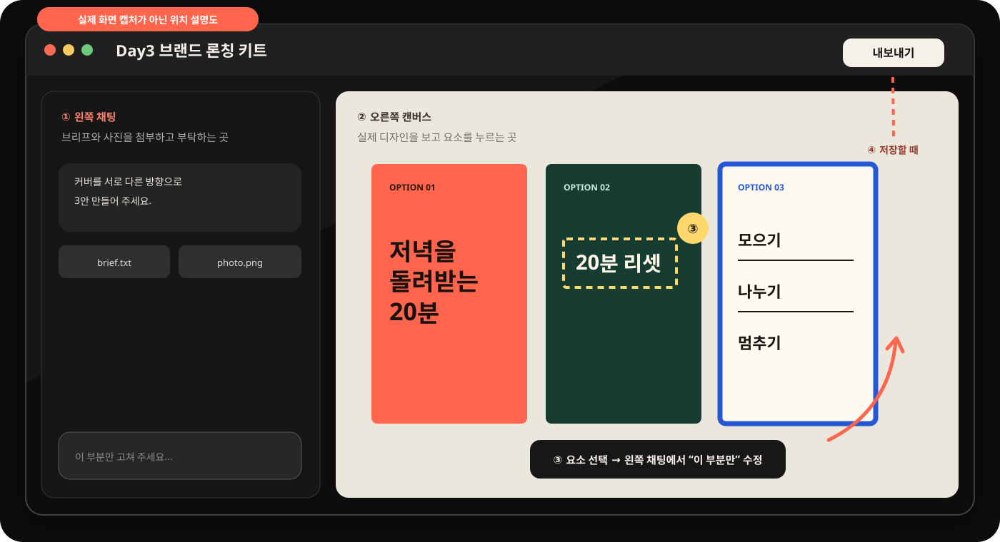

# Day 3 — Claude 디자인으로 브랜드 론칭 키트 만들기

## 오늘 만드는 것을 먼저 눌러 보세요

[완성 예시 — 커버 3안·카드뉴스 7장·스토리 1장](day03-assets/launch-kit/index.html)


예시 화면 위에서 다음을 눌러 봅니다.

1. **커버 3안** — 같은 내용도 사진형·큰 글자형·체크리스트형으로 완전히 달라집니다.
2. **카드뉴스 7장** — 넘길수록 공감에서 행동으로 이어집니다.
3. **스토리 1장** — 같은 디자인을 9:16 화면으로 확장합니다.
4. **육아·생활 / 50대 두 번째 커리어** — 주제가 바뀌어도 제작 방식은 같습니다.

오늘 결과는 카드 몇 장이 아닙니다. 한 주제를 여러 화면에 일관되게 펼친 **브랜드 론칭 디자인 키트**입니다.

```text
기능 위치 알기 → 커버 3안으로 작은 성공 → 하나 선택 → 카드뉴스 7장 → 선택 수정 → 스토리 확장
```

예상 시간은 2시간 30분입니다.

| 구간 | 시간 | 성공 화면 |
|---|---:|---|
| 자료 확인·새 디자인 열기 | 20분 | 첨부 파일 3개와 빈 캔버스가 보임 |
| 커버 3안 만들고 하나 고르기 | 35분 | 서로 다른 4:5 커버 3개가 나란히 보임 |
| 카드뉴스 7장 만들기 | 45분 | 1/7~7/7 프레임이 같은 스타일로 이어짐 |
| 선택 수정 3회·스토리 확장 | 35분 | 고른 요소만 바뀌고 9:16 프레임이 추가됨 |
| 내보내기·검수·인증 | 15분 | PDF 또는 전체 결과 캡처가 저장됨 |

## 디자인 기능은 무엇인가요?

**디자인(Design)** 은 왼쪽 채팅으로 부탁하고, 오른쪽 캔버스에서 결과를 눈으로 보며 고치는 공간입니다. 완성된 요소를 선택해 “이 부분만” 수정하고, 같은 스타일을 다른 크기로 확장할 수 있습니다.

| 기능 | 화면에서 하는 일 | 오늘 결과 |
|---|---|---|
| 채팅 | 만들 내용을 부탁 | 커버 3안 생성 |
| 캔버스 | 실제 디자인 확인 | 4:5 카드가 보임 |
| 선택 수정 | 한 요소만 고치기 | 제목·색·사진 중 하나 변경 |
| 내보내기 | 결과 파일 저장 | PDF 또는 계정에 보이는 형식 |

## 화면에서 어디에 있나요?

1. Claude Desktop을 엽니다.
2. 왼쪽 위 **☰**를 누릅니다.
3. 왼쪽 메뉴의 **디자인**을 누릅니다.
4. **새 프로젝트**를 누릅니다.
5. 왼쪽은 부탁하는 **채팅**, 오른쪽은 결과가 생기는 **캔버스**입니다.
6. 완성 후 오른쪽 위에서 **내보내기**를 찾습니다.


위 사진은 왼쪽 메뉴에서 **디자인**을 찾는 실제 캡처입니다. 디자인 작업 안으로 들어간 뒤의 위치는 아래 설명도를 봅니다.



> 위 그림은 **실제 화면 캡처가 아닌 위치 설명도**입니다. ① 왼쪽 채팅에서 부탁하고, ② 오른쪽 캔버스에서 결과를 보고, ③ 고칠 요소를 누른 뒤 왼쪽 채팅에 `선택한 부분만`이라고 요청하고, ④ 계정 화면에 보이는 내보내기로 저장하는 순서만 기억합니다.

앱 버전에 따라 메뉴 위치와 내보내기 형식은 다를 수 있습니다. 교재에 없는 PNG 버튼을 찾지 마세요. 계정에 실제로 보이는 **내보내기** 형식을 사용하고, 없으면 화면 캡처로 완주합니다.

## 준비물

1. [Day 3 시작 자료 ZIP](downloads/day03-start.zip)을 받습니다.
2. ZIP을 풀어 생긴 `day03-assets` 폴더를 엽니다.
3. `day03-assets` 안에서 아래 중 하나를 고릅니다.

| 추천 | 브리프 | 사진 |
|---|---|---|
| A — 기본 | `briefs/home-reset-brief.txt` | `images/home-reset-editorial.png` |
| B — 선택 | `briefs/second-career-brief.txt` | `images/second-career-editorial.png` |

둘 다 수업용으로 제공된 자료입니다. 사진 속 인물은 특정 실존 인물이 아닌 생성 이미지입니다. 다른 사람의 유튜브 썸네일이나 인스타 게시물을 저장해 그대로 쓰지 않습니다.

Day 2에서 `D02_닉네임_Day3브리프.txt`를 만들었다면 삭제하지 말고 둡니다. 1차 연습을 끝낸 뒤 그 파일을 첨부해 내 내용으로 한 번 더 응용합니다.

---

## 1단계 — 새 디자인 프로젝트를 엽니다

1. **디자인 → 새 프로젝트**를 누릅니다.
2. 이름을 `Day3 브랜드 론칭 키트 닉네임`으로 적습니다.
3. 선택한 브리프, 해당 사진, `brand-style.txt`를 첨부합니다.

**이렇게 되면 성공:** 왼쪽 채팅 아래에 선택한 `brief.txt`, 짝이 맞는 `.png`, `brand-style.txt` 세 파일이 보이고 오른쪽에 빈 캔버스가 보입니다. 사진과 브리프가 서로 다른 사례라면 지금 다시 고릅니다.

## 2단계 — 작은 성공: 커버 3안을 한 번에 만듭니다

```text
첨부한 브리프, 사진, brand-style.txt를 읽고
인스타그램 4:5 커버를 서로 완전히 다른 방향으로 3안 만들어 주세요.

A안 사진 중심: 사진 위에 짧고 큰 제목, 잡지 표지처럼
B안 큰 글자 중심: 사진 없이 숫자와 제목만 매우 대담하게
C안 시스템 중심: 체크리스트나 단계가 한눈에 보이게

공통 규칙:
- 세 프레임 모두 1080×1350 비율
- 제목은 최대 두 줄
- 작은 본문을 빽빽하게 넣지 않기
- 브리프의 한 줄 약속과 금지 표현 지키기
- 세 안이 색만 다른 복제품처럼 보이면 안 됨
- 설명하지 말고 캔버스에 커버 3개를 실제로 만들기
```

**이렇게 되면 성공:** 한눈에 서로 다른 커버 3개가 나란히 보입니다.

세 장이 비슷하면 아래만 보냅니다.

```text
세 안의 차이가 약합니다. 내용은 유지하고 사진형 / 타이포형 / 체크리스트형의 구성 차이를 훨씬 과감하게 만들어 주세요.
```

## 3단계 — 가장 강한 커버 하나를 고릅니다

세 안 중 멈춰 보게 만드는 하나를 고릅니다.

- 휴대폰 크기로 줄여도 제목이 읽힌다.
- 누구를 위한 내용인지 짐작된다.
- 다음 장을 넘길 이유가 생긴다.

선택한 커버를 클릭하고 보냅니다.

```text
선택한 커버를 대표 스타일로 정합니다.
이 커버의 색, 제목 글꼴 느낌, 여백, 사진 처리 규칙을 네 줄로 요약해 주세요.
다른 두 커버는 지우지 마세요.
```

## 4단계 — 같은 스타일로 카드뉴스 7장을 만듭니다

```text
선택한 커버의 디자인 규칙을 유지해 인스타 카드뉴스 7장을 만들어 주세요.

1장: 멈춰 보게 하는 표지
2장: 대상이 겪는 현실 문제
3장: 핵심 방법 3개
4장: 오늘 따라 할 순서 또는 타이머
5장: 다시 실패하지 않게 하는 기준
6장: 7일 체크 또는 작은 실험
7장: 저장하고 오늘 하나 시작하는 행동 문장

제작 규칙:
- 모두 1080×1350 비율의 분리된 프레임
- 한 장에 메시지 하나
- 제목은 두 줄, 본문은 세 줄 안쪽
- 1/7부터 7/7까지 번호 표시
- 같은 색 3개, 같은 글자 계층, 같은 여백 규칙 유지
- 사진은 제공된 사진만 사용하고 필요하면 확대·크롭하기
- 브리프에 없는 성과·통계·후기는 만들지 않기
- 설명하지 말고 캔버스에 7장을 실제로 만들기
```

**이렇게 되면 성공:** 7장이 같은 브랜드처럼 보이지만, 매 장의 구성과 역할은 다릅니다.

## 5단계 — 선택 수정 기능을 세 번 씁니다

전체를 다시 만들지 않고 정확히 한 부분만 고치는 연습입니다.

### 수정 1 — 제목

2번 카드 제목을 선택합니다.

```text
선택한 제목만 더 짧고 구체적인 한 문장으로 바꿔 주세요. 다른 요소는 움직이지 마세요.
```

### 수정 2 — 강조색

3번 카드의 숫자 3개를 선택합니다.

```text
선택한 숫자 3개만 대표 강조색으로 바꿔 주세요. 배경과 다른 글자는 유지해 주세요.
```

### 수정 3 — 사진 크롭

1번 카드 사진을 선택합니다.

```text
선택한 사진만 제목이 더 잘 읽히도록 위치와 밝기를 조정해 주세요. 인물의 얼굴이나 몸을 변형하지 마세요.
```

**이렇게 되면 성공:** 선택한 부분만 바뀌고 나머지 6장의 스타일은 그대로입니다.

원하지 않게 전체가 바뀌면 이전 버전으로 돌아가 요소를 다시 선택하고 `선택한 부분만`을 문장 맨 앞에 씁니다.

## 6단계 — 같은 디자인으로 스토리 1장을 만듭니다

```text
방금 완성한 카드뉴스의 색, 글꼴 느낌, 사진 처리 규칙을 유지해서
1080×1920 비율의 인스타 스토리 예고편 1장을 추가해 주세요.

- 카드뉴스 표지 제목을 두 줄 안쪽으로 사용
- 제공 사진 한 장 사용
- 아래에는 '새 게시물 보기 →' 행동 문장 하나만
- 새로운 색이나 다른 디자인 스타일을 추가하지 않기
- 설명하지 말고 캔버스에 실제 프레임 만들기
```

**이렇게 되면 성공:** 9:16 세로 한 장이 카드뉴스와 같은 브랜드로 보입니다.

## 7단계 — 내 주제로 응용합니다

Day 2에서 저장한 `D02_닉네임_Day3브리프.txt`가 있다면 새 디자인 프로젝트를 만들고 그 파일과 내 사용 가능 사진을 첨부합니다. `brand-style.txt`도 함께 첨부합니다. 사진이 없다면 사진 없이 **큰 글자형 + 도형**으로 진행합니다.

```text
첨부한 내 브리프로 같은 제작 과정을 반복합니다.
먼저 커버 3안을 만들고 멈춰 주세요.
사진이 없으면 큰 글자와 단순 도형만 사용해 주세요.
제공 연습 사례의 이름과 문구는 남기지 마세요.
```

커버를 고른 뒤 4~6단계 프롬프트를 차례로 사용합니다. 한 번에 전부 시키지 않는 이유는 중간마다 내가 선택해야 결과가 내 것이 되기 때문입니다.

## 8단계 — 저장하고 눈으로 검수합니다

1. 오른쪽 위 **내보내기**를 누릅니다.
2. 계정에 보이는 형식 중 PDF를 우선 저장합니다.
3. PDF가 없거나 저장이 어려우면 가장 좋은 커버와 7장 전체가 보이는 화면을 캡처합니다.
4. 파일 이름을 `D03_닉네임_브랜드키트.pdf` 또는 `D03_닉네임_브랜드키트.png`로 정합니다.

검수표:

- [ ] 커버 3안이 서로 확실히 다릅니다.
- [ ] 선택한 스타일로 카드뉴스 7장이 이어집니다.
- [ ] 1/7부터 7/7까지 순서가 맞습니다.
- [ ] 선택 수정으로 한 부분씩 세 번 고쳤습니다.
- [ ] 같은 스타일의 9:16 스토리 1장이 있습니다.
- [ ] 작은 글자·잘린 글자·근거 없는 성과가 없습니다.

## 오픈카톡 인증 — 30초

📸 **인증 캡처:** 가장 마음에 드는 커버 1장

```text
[왕초보2기 Day 3 / 닉네임]
✅ 커버 3안 + 카드뉴스 7장 완성
💬 소감:
```

전체가 담긴 PDF는 올리고 싶은 날만 — 선택입니다.

## 막혔을 때

| 상황 | 지금 보낼 문장 |
|---|---|
| 설명만 나옴 | `설명하지 말고 캔버스에 1080×1350 프레임을 실제로 만들어 주세요.` |
| 세 커버가 비슷함 | `색만 바꾸지 말고 사진형 / 큰 글자형 / 체크리스트형으로 레이아웃을 완전히 다르게 해 주세요.` |
| 카드가 7장이 아님 | `현재 결과를 지우지 말고 빠진 프레임만 추가해 정확히 7장으로 맞춰 주세요.` |
| 글자가 너무 많음 | `한 장에 한 메시지만 남기고 제목 두 줄, 본문 세 줄 안쪽으로 줄여 주세요.` |
| 한 곳 수정했는데 전체가 바뀜 | 이전 버전 → 요소 선택 → 문장 앞에 `선택한 부분만` 추가 |
| 내보내기가 다름 | 없는 메뉴를 찾지 말고 계정에 보이는 형식 또는 화면 캡처 사용 |

## 참고한 자료

- [Anthropic 공식 — Claude 디자인 시작하기](https://support.claude.com/en/articles/14604416-get-started-with-claude-design)
- [Claude 공식 영상 — Introducing Claude Design](https://www.youtube.com/watch?v=t_LBECIQQqs)
- [The Futur — Instagram 디자인 피드백과 구성 원칙](https://www.youtube.com/watch?v=qjZospdjnS0)

공식 기능 흐름에 `커버 3안 → 선택 → 7장 확장 → 요소 선택 수정 → 9:16 확장`을 결합했습니다. 참고 자료의 화면을 복제하지 않고, 수업용 생활 경험 사례와 새 디자인으로 만들었습니다.
