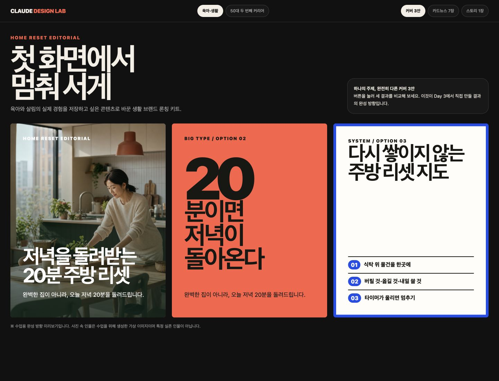
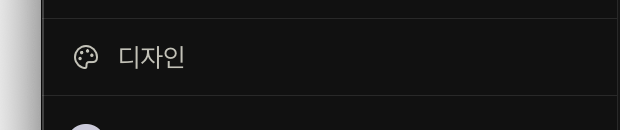
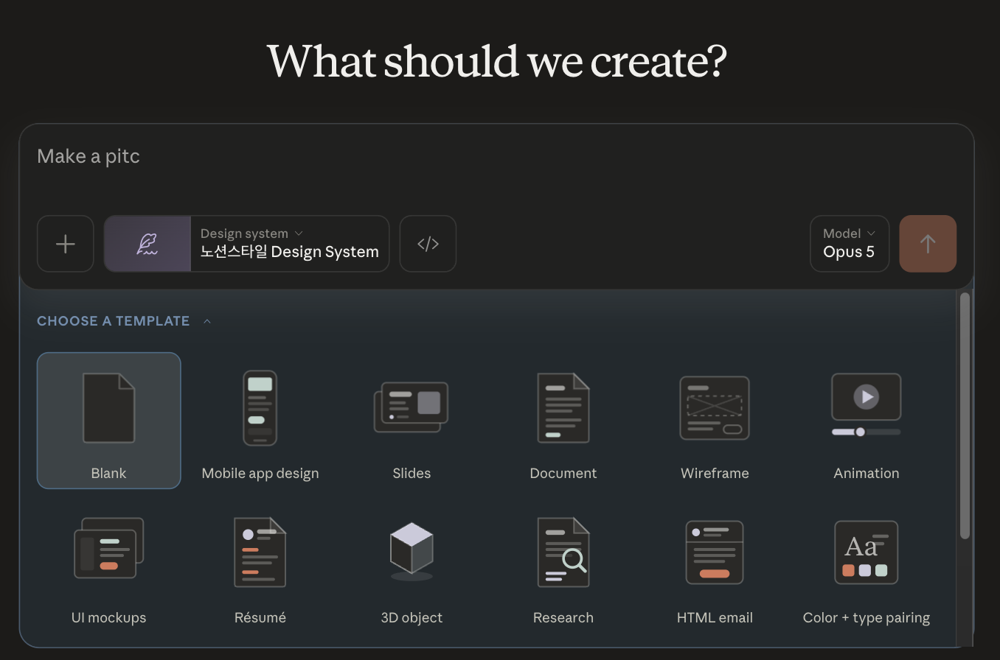
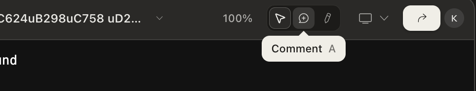
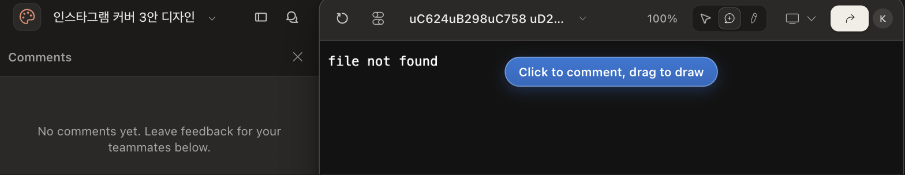
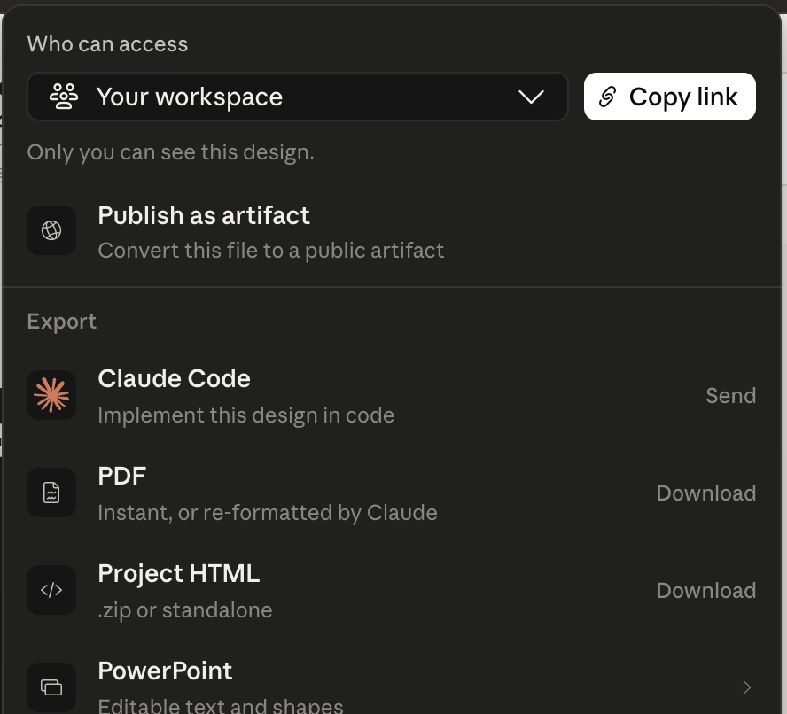
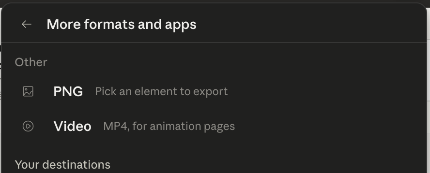

# Day 3 — Claude 디자인으로 브랜드 론칭 키트 만들기

## 오늘 만드는 것을 먼저 눌러 보세요

[완성 예시 — 커버 3안·카드뉴스 7장·스토리 1장](day03-assets/launch-kit/index.html)



예시 화면 위에서 다음을 눌러 봅니다.

1. **커버 3안** — 같은 내용도 사진형·큰 글자형·체크리스트형으로 완전히 달라집니다.
2. **카드뉴스 7장** — 넘길수록 공감에서 행동으로 이어집니다.
3. **스토리 1장** — 같은 디자인을 9:16 화면으로 확장합니다.
4. **육아·생활 / 50대 두 번째 커리어** — 주제가 달라도 제작 방식은 같다는 것을 보여 주는 예시입니다. **오늘 우리가 만드는 것은 「육아·생활」 하나입니다.**

오늘 결과는 한 주제를 여러 화면에 일관되게 펼친 **브랜드 론칭 디자인 키트**입니다.

```text
기능 위치 알기 → 커버 3안으로 작은 성공 → 하나 선택 → 카드뉴스 7장 → 한 요소만 고치기 → 스토리 확장
```

예상 시간은 2시간 30분입니다.

| 구간 | 시간 | 성공 화면 |
|---|---:|---|
| 자료 확인·새 디자인 열기 | 20분 | 첨부 파일 3개와 빈 캔버스가 보임 |
| 커버 3안 만들고 하나 고르기 | 35분 | 서로 다른 4:5 커버 3개가 나란히 보임 |
| 카드뉴스 7장 만들기 | 45분 | 1/7~7/7 프레임이 같은 스타일로 이어짐 |
| 한 요소만 고치기 3회·스토리 확장 | 35분 | 고른 요소만 바뀌고 9:16 프레임이 추가됨 |
| 내보내기·검수·인증 | 15분 | PDF 또는 전체 결과 캡처가 저장됨 |

7단계 **「내 주제로 응용하기」는 선택**입니다. 하면 40분 정도가 더 걸립니다. 6단계까지만 해도 오늘은 완주입니다.

## 디자인 기능은 무엇인가요?

**디자인(Design)** 은 왼쪽 채팅으로 부탁하고, 오른쪽 캔버스에서 결과를 눈으로 보며 고치는 공간입니다.

고치는 방법이 **두 가지로 나뉘는 것이 핵심**입니다. 전체 구성을 크게 바꿀 때는 **왼쪽 채팅**에 말하고, 한 요소만 고칠 때는 **캔버스에서 그 요소를 클릭해 그 자리에 코멘트**를 답니다. 글자는 캔버스에서 바로 고칠 수도 있습니다.

| 화면의 이름 | 하는 일 | 오늘 결과 |
|---|---|---|
| 왼쪽 채팅 | 만들 내용을 부탁 | 커버 3안 생성 |
| 오른쪽 캔버스 | 실제 디자인 확인 | 4:5 카드가 보임 |
| `Comment` (말풍선) | 캔버스에서 한 요소만 고치기 | 제목·색·사진 중 하나 변경 |
| `Share & export` (↗) | 결과 저장 | PDF·PNG로 저장 |

**메뉴 이름은 한국어(`디자인`)인데 그 안은 영어 화면입니다.** 아래에서 눌러야 할 영어 단어를 하나씩 그림으로 보여 드립니다. 지금은 베타(Beta) 기능이라 화면이 조금씩 바뀔 수 있습니다.

## 화면에서 어디에 있나요?

1. Claude Desktop을 엽니다.
2. 왼쪽 위 **☰**를 누릅니다.
3. 왼쪽 메뉴의 **디자인**을 누릅니다.



### 여기서 제일 많이 막힙니다 — `새 프로젝트` 버튼은 없습니다

**디자인은 새 창으로 열립니다.** 창 이름은 `Claude Design`이고, 화면 가운데에 **What should we create?**(무엇을 만들까요?)라고 적혀 있습니다.



여기서 **누를 버튼을 찾지 마세요.** 가운데 **입력칸에 만들 것을 적고 오른쪽 갈색 `↑`를 누르면 그때 프로젝트가 만들어집니다.** 이름은 나중에 왼쪽 위 제목을 눌러 바꿀 수 있습니다.

- 입력칸 왼쪽 **`+`** — 파일을 첨부하는 곳입니다. 오늘 브리프와 사진을 여기로 넣습니다.
- `Design system` — 여러분 화면에는 **None**으로 보입니다. **그대로 두세요.** (위 사진은 만든 사람 계정이라 다른 이름이 보입니다.)
- 아래 **CHOOSE A TEMPLATE** — 오늘은 쓰지 않습니다. 무시하고 넘어갑니다.

### 만들어진 다음 화면

왼쪽은 부탁하는 **채팅**, 오른쪽은 결과가 생기는 **캔버스**입니다. 오늘 필요한 버튼은 **오른쪽 위에 모두 모여 있습니다.**



| 아이콘 | 이름 | 언제 쓰나 |
|---|---|---|
| 화살표 | `Interact` | 기본 상태. 만든 결과를 눌러 볼 때 |
| **말풍선** | **`Comment`** | **한 요소만 고칠 때 (5단계에서 사용)** |
| 연필 | `Edit` | 글자·도형을 직접 손볼 때 (오늘은 안 씁니다) |
| 모니터 | `Present` | 크게 볼 때 |
| **↗** | **`Share & export`** | **저장할 때 (8단계에서 사용)** |

베타 기능이라 화면이 조금씩 바뀔 수 있습니다. 버튼이 안 보여도 당황하지 마세요. **오늘 결과는 화면 캡처만으로도 인증됩니다.**

## 준비물

1. [Day 3 시작 자료 ZIP](downloads/day03-start.zip)을 받습니다.
2. ZIP을 풀어 생긴 `day03-assets` 폴더를 엽니다.
3. 오늘 쓰는 자료는 **아래 세 개로 정해져 있습니다.** 고를 것이 없습니다.

```text
day03-assets → briefs → home-reset-brief.txt
day03-assets → images → home-reset-editorial.png
day03-assets → brand-style.txt
```

주제는 **「저녁을 돌려받는 20분 주방 리셋」** 하나입니다. 폴더에 `second-career`로 시작하는 파일이 하나씩 더 있지만, **완성 예시를 만들 때 쓴 것이라 오늘은 열지 않습니다.**

수업용으로 제공된 자료입니다. 사진 속 인물은 특정 실존 인물이 아닌 생성 이미지입니다. 다른 사람의 유튜브 썸네일이나 인스타 게시물을 저장해 그대로 쓰지 않습니다.

오늘 1~6단계는 위 브리프 파일만으로 끝납니다. Day 2에서 `D02_닉네임_Day3브리프.txt`를 만들었다면 삭제하지 말고 두세요. 7단계에서 내 내용으로 한 번 더 응용할 때 씁니다. 만들지 않았어도 7단계는 할 수 있습니다.

---

## 1단계 — 자료 3개를 붙이고 시작합니다

`Claude Design` 첫 화면(**What should we create?**)에서 시작합니다.

넣을 파일은 아래 **세 개**입니다. 압축을 푼 `day03-assets` 폴더 안에 있습니다.

```text
day03-assets → briefs → home-reset-brief.txt
day03-assets → images → home-reset-editorial.png
day03-assets → brand-style.txt
```

1. 가운데 입력칸 왼쪽의 **`+`** 를 누르고 첫 번째 파일을 넣습니다.
2. **`+`를 다시 눌러 두 번째, 세 번째 파일**을 넣습니다. 세 파일이 서로 다른 폴더에 있어서 한 번에 다 선택되지 않습니다.
3. 아직 `↑`를 누르지 않습니다. 다음 단계의 문장을 적은 뒤에 함께 보냅니다.

**이렇게 되면 성공:** 입력칸 안에 위 세 파일의 이름이 그대로 보입니다.

혹시 입력칸에 `second-career`로 시작하는 파일이 붙어 있다면 잘못 고른 것입니다. 입력칸에서 그 파일 이름 옆의 **X**를 눌러 빼고, `home-reset`으로 시작하는 파일을 다시 넣습니다.

**컴퓨터의 파일을 지우라는 뜻이 아닙니다.** 폴더의 `second-career` 파일 두 개는 완성 예시가 쓰는 것이라 그대로 두면 됩니다. 입력칸에 위 세 파일만 붙어 있으면 할 일은 끝입니다.

프로젝트 이름은 만들어진 뒤 왼쪽 위 제목을 눌러 `Day3 브랜드 론칭 키트 닉네임`으로 바꿀 수 있습니다. 안 바꿔도 진행에는 지장이 없습니다.

## 2단계 — 작은 성공: 커버 3안을 한 번에 만듭니다

아래를 그대로 입력칸에 붙여넣고, 오른쪽 **갈색 `↑`** 를 누릅니다. 이때 프로젝트가 만들어지고 오른쪽에 캔버스가 열립니다.

```text
첨부한 브리프, 사진, brand-style.txt를 읽고
인스타그램 4:5 커버를 서로 완전히 다른 방향으로 3안 만들어 주세요.

A안 사진 중심: 사진 위에 짧고 큰 제목, 잡지 표지처럼
B안 큰 글자 중심: 사진 없이 숫자와 제목만 매우 대담하게
C안 시스템 중심: 체크리스트나 단계가 한눈에 보이게

공통 규칙:
- 세 프레임 모두 1080×1350 비율
- 제목은 최대 두 줄
- 작은 본문을 빽빽하게 넣지 않기
- 브리프의 한 줄 약속과 금지 표현 지키기
- 세 안이 색만 다른 복제품처럼 보이면 안 됨
- 설명하지 말고 캔버스에 커버 3개를 실제로 만들기
```

**이렇게 되면 성공:** 한눈에 서로 다른 커버 3개가 나란히 보입니다.

세 장이 비슷하면 아래만 보냅니다.

```text
세 안의 차이가 약합니다. 내용은 유지하고 사진형 / 타이포형 / 체크리스트형의 구성 차이를 훨씬 과감하게 만들어 주세요.
```

## 3단계 — 가장 강한 커버 하나를 고릅니다

세 안 중 멈춰 보게 만드는 하나를 고릅니다.

- 휴대폰 크기로 줄여도 제목이 읽힌다.
- 누구를 위한 내용인지 짐작된다.
- 다음 장을 넘길 이유가 생긴다.

선택한 커버를 클릭하고 보냅니다.

```text
선택한 커버를 대표 스타일로 정합니다.
이 커버의 색, 제목 글꼴 느낌, 여백, 사진 처리 규칙을 네 줄로 요약해 주세요.
다른 두 커버는 지우지 마세요.
```

## 4단계 — 같은 스타일로 카드뉴스 7장을 만듭니다

```text
선택한 커버의 디자인 규칙을 유지해 인스타 카드뉴스 7장을 만들어 주세요.

1장: 멈춰 보게 하는 표지
2장: 대상이 겪는 현실 문제
3장: 핵심 방법 3개
4장: 오늘 따라 할 순서 또는 타이머
5장: 다시 실패하지 않게 하는 기준
6장: 7일 체크 또는 작은 실험
7장: 저장하고 오늘 하나 시작하는 행동 문장

제작 규칙:
- 모두 1080×1350 비율의 분리된 프레임
- 한 장에 메시지 하나
- 제목은 두 줄, 본문은 세 줄 안쪽
- 1/7부터 7/7까지 번호 표시
- 같은 색 3개, 같은 글자 계층, 같은 여백 규칙 유지
- 사진은 제공된 사진만 사용하고 필요하면 확대·크롭하기
- 브리프에 없는 성과·통계·후기는 만들지 않기
- 설명하지 말고 캔버스에 7장을 실제로 만들기
```

**이렇게 되면 성공:** 7장이 같은 브랜드처럼 보이지만, 매 장의 구성과 역할은 다릅니다.

## 5단계 — 한 요소만 고치기를 세 번 합니다

전체를 다시 만들지 않고 정확히 한 부분만 고치는 연습입니다.

**중요 — 이 세 번은 왼쪽 채팅에 쓰지 않습니다.** 왼쪽 채팅에 쓰면 디자인 전체가 바뀔 수 있습니다.

먼저 **코멘트 모드를 켜야 합니다.** 그냥 클릭하면 아무 일도 일어나지 않습니다.

1. 오른쪽 위 **말풍선 아이콘(`Comment`)** 을 누릅니다. 키보드 **`A`** 를 눌러도 됩니다.
2. 캔버스 위에 파란 띠로 **Click to comment, drag to draw**(클릭해서 코멘트, 끌어서 영역 지정)가 뜹니다. 왼쪽은 `Comments` 칸으로 바뀝니다. **이 두 가지가 보이면 준비 끝입니다.**
3. 고칠 요소를 **클릭**합니다. 그 자리에 적는 칸이 열립니다.
4. 아래 문장을 적고 보냅니다.
5. 세 번을 다 끝내면 **화살표(`Interact`)** 를 눌러 원래대로 돌아옵니다. 키보드 **`Esc`** 도 같습니다.



### 수정 1 — 제목

캔버스에서 2번 카드의 제목을 클릭하고, 그 자리에 이렇게 씁니다.

```text
선택한 제목만 더 짧고 구체적인 한 문장으로 바꿔 주세요. 다른 요소는 움직이지 마세요.
```

### 수정 2 — 강조색

캔버스에서 3번 카드의 숫자를 클릭하고, 그 자리에 이렇게 씁니다.

```text
선택한 숫자 3개만 대표 강조색으로 바꿔 주세요. 배경과 다른 글자는 유지해 주세요.
```

### 수정 3 — 사진 크롭

캔버스에서 1번 카드의 사진을 클릭하고, 그 자리에 이렇게 씁니다.

```text
선택한 사진만 제목이 더 잘 읽히도록 위치와 밝기를 조정해 주세요. 인물의 얼굴이나 몸을 변형하지 마세요.
```

**이렇게 되면 성공:** 코멘트를 단 부분만 바뀌고 나머지 6장의 스타일은 그대로입니다.

원하지 않게 전체가 바뀌면 왼쪽 채팅에 `방금 변경을 취소하고 직전 상태로 되돌려 주세요`라고 보낸 뒤, 캔버스에서 요소를 클릭해 다시 요청합니다. 큰 변경을 시도하기 전에 `지금 상태를 저장하고 다른 방향을 시도해 주세요`라고 미리 부탁해 두면 더 안전합니다.

## 6단계 — 같은 디자인으로 스토리 1장을 만듭니다

```text
방금 완성한 카드뉴스의 색, 글꼴 느낌, 사진 처리 규칙을 유지해서
1080×1920 비율의 인스타 스토리 예고편 1장을 추가해 주세요.

- 카드뉴스 표지 제목을 두 줄 안쪽으로 사용
- 제공 사진 한 장 사용
- 아래에는 '새 게시물 보기 →' 행동 문장 하나만
- 새로운 색이나 다른 디자인 스타일을 추가하지 않기
- 설명하지 말고 캔버스에 실제 프레임 만들기
```

**이렇게 되면 성공:** 9:16 세로 한 장이 카드뉴스와 같은 브랜드로 보입니다.

## 7단계 — 내 주제로 응용합니다 (선택)

> **여기부터는 선택입니다.** 6단계까지 했으면 오늘 목표는 끝났습니다. 시간이 없으면 **8단계로 바로 넘어가세요.**

### 7-1. 새로 시작해 자료를 넣습니다

1. 왼쪽 위 팔레트 아이콘을 눌러 `Claude Design` 첫 화면(**What should we create?**)으로 돌아갑니다. 연습 결과와 섞이지 않게 새로 시작합니다.
2. 입력칸의 **`+`** 로 `brand-style.txt`와 내 사용 가능 사진을 넣습니다. 사진이 없으면 넣지 않아도 됩니다.
3. Day 2에서 `D02_닉네임_Day3브리프.txt`를 저장했다면 그 파일도 함께 넣습니다.

### 7-2. 같은 과정을 내 내용으로 반복합니다

**브리프 파일을 첨부했다면** 아래를 그대로 보냅니다.

```text
첨부한 내 브리프로 같은 제작 과정을 반복합니다.
먼저 커버 3안을 만들고 멈춰 주세요.
사진이 없으면 큰 글자와 단순 도형만 사용해 주세요.
제공 연습 사례의 이름과 문구는 남기지 마세요.
```

**브리프 파일이 없다면** 아래를 복사해 일곱 줄을 내 내용으로 채워서 보냅니다. 파일 없이도 똑같이 진행됩니다.

```text
아래 브리프로 같은 제작 과정을 반복합니다.
먼저 커버 3안을 만들고 멈춰 주세요.
사진이 없으면 큰 글자와 단순 도형만 사용해 주세요.

- 브랜드 이름:
- 대상:
- 주제:
- 한 줄 약속:
- 핵심 순서 3개:
- 말투:
- 절대 쓰지 않을 표현:
```

커버를 고른 뒤 4~6단계 프롬프트를 차례로 사용합니다. 한 번에 전부 시키지 않는 이유는 중간마다 내가 선택해야 결과가 내 것이 되기 때문입니다.

사진이 없다면 사진 없이 **큰 글자형 + 도형**으로 진행합니다.

## 8단계 — 저장합니다

**1~6단계로 만든 연습 키트**를 저장합니다. 7단계까지 했다면 둘 중 마음에 드는 쪽 하나만 저장하면 됩니다.

오른쪽 위 **↗ (`Share & export`)** 를 누릅니다. 아래와 같은 칸이 열립니다.



### 인스타에 올릴 카드 한 장씩 저장하기 (오늘 추천)

카드뉴스는 **한 장씩 이미지로** 있어야 인스타에 올릴 수 있습니다.

- **캔버스에서 각 카드 오른쪽 위의 `⤓ PNG` 버튼**을 누르면 그 카드 한 장이 이미지로 저장됩니다. 7장이면 일곱 번 누릅니다.
- 또는 `Share & export` → **More formats and apps** → **PNG**(`Pick an element to export`)를 골라 저장할 요소를 고릅니다.



### 전체를 한 파일로 저장하기

`Share & export`의 **Export** 아래에서 고릅니다.

| 고를 것 | 결과 |
|---|---|
| **PDF → Download** | 전체가 한 파일로 저장됩니다. 보관용으로 가장 편합니다. |
| **Project HTML → Download** | 웹 화면 그대로 저장됩니다 (`.zip`). |
| **PowerPoint** | 글자를 다시 고칠 수 있는 슬라이드로 저장됩니다. |

맨 위 **`Copy link`** 는 이 디자인을 볼 수 있는 주소를 복사합니다. 다만 기본값은 **나만 볼 수 있음**(`Only you can see this design`)이라, 남에게 보여 주려면 위 칸에서 공개 범위를 바꿔야 합니다. **오늘은 필요 없습니다.**

버튼이 안 보이거나 저장이 안 되면 **화면 캡처로 대신합니다. 캡처만으로도 오늘은 완주입니다.**

파일 이름은 바꾸지 않아도 됩니다. Day 4부터는 이 파일을 쓰지 않습니다. 나중에 다시 찾고 싶다면 `다운로드` 폴더에서 파일을 오른쪽 클릭하고 **이름 바꾸기**를 눌러 `D03_닉네임_브랜드키트`로 적어 둡니다.

## 오픈카톡 인증 — 30초

📸 **인증 캡처:** 가장 마음에 드는 커버 1장

```text
[왕초보2기 Day 3 / 닉네임]
✅ 커버 3안 + 카드뉴스 7장 완성
💬 소감:
```

전체가 담긴 PDF는 올리고 싶은 날만 — 선택입니다.

## 최종 합격표

**오늘의 필수**

- [ ] 커버 3안이 서로 확실히 다릅니다.
- [ ] 고른 스타일로 카드뉴스 7장이 이어집니다.
- [ ] 1/7부터 7/7까지 순서가 맞습니다.
- [ ] 캔버스 코멘트로 한 부분씩 세 번 고쳤습니다.
- [ ] 같은 스타일의 9:16 스토리 1장이 있습니다.
- [ ] 인증 캡처 1장을 찍었습니다.

**눈으로 한 번 더**

- [ ] 너무 작은 글자, 잘린 글자, 근거 없는 성과 문구가 없습니다.
- [ ] (선택) 내 주제로 만든 커버에 연습 사례의 이름과 문구가 남아 있지 않습니다.

## 막혔을 때

| 보이는 상황 | 바로 할 일 |
|---|---|
| 설명만 나옴 | `설명하지 말고 캔버스에 1080×1350 프레임을 실제로 만들어 주세요.` |
| 세 커버가 비슷함 | `색만 바꾸지 말고 사진형 / 큰 글자형 / 체크리스트형으로 레이아웃을 완전히 다르게 해 주세요.` |
| 카드가 7장이 아님 | `현재 결과를 지우지 말고 빠진 프레임만 추가해 정확히 7장으로 맞춰 주세요.` |
| 글자가 너무 많음 | `한 장에 한 메시지만 남기고 제목 두 줄, 본문 세 줄 안쪽으로 줄여 주세요.` |
| 한 곳 수정했는데 전체가 바뀜 | 왼쪽 채팅에 `직전 상태로 되돌려 주세요`를 보낸 뒤, **말풍선(`Comment`)을 켜고** 요소를 클릭해 다시 요청합니다. |
| `새 프로젝트` 버튼이 없음 | 원래 없습니다. 가운데 입력칸에 적고 오른쪽 **갈색 `↑`** 를 누르면 그때 만들어집니다. |
| 요소를 클릭해도 코멘트 칸이 안 열림 | 코멘트 모드가 꺼져 있습니다. 오른쪽 위 **말풍선(`Comment`)** 을 먼저 누릅니다. 파란 안내 띠가 보이면 켜진 것입니다. |
| 화면이 전부 영어라 무섭다 | 오늘 누를 영어 단어는 `Comment`와 `Share & export` **두 개뿐**입니다. 나머지는 붙여넣기입니다. |
| 내보내기 형식이 교재와 다름 | 베타 기능이라 바뀔 수 있습니다. 보이는 형식이나 화면 캡처를 씁니다. 캡처로도 인증됩니다. |
| 새 프로젝트가 앞 결과를 모름 | 7단계의 새 방은 앞 대화를 모릅니다. "아까처럼" 대신 4~6단계 프롬프트를 통째로 다시 붙여넣습니다. |

## 참고한 자료

- [Anthropic 공식 — Claude 디자인 시작하기](https://support.claude.com/en/articles/14604416-get-started-with-claude-design)
- [Claude 공식 영상 — Introducing Claude Design](https://www.youtube.com/watch?v=t_LBECIQQqs)
- [The Futur — Instagram 디자인 피드백과 구성 원칙](https://www.youtube.com/watch?v=qjZospdjnS0)

공식 기능 흐름에 `커버 3안 → 선택 → 7장 확장 → 캔버스 코멘트로 요소 수정 → 9:16 확장`을 결합했습니다. 참고 자료의 화면을 복제하지 않고, 수업용 생활 경험 사례와 새 디자인으로 만들었습니다.
