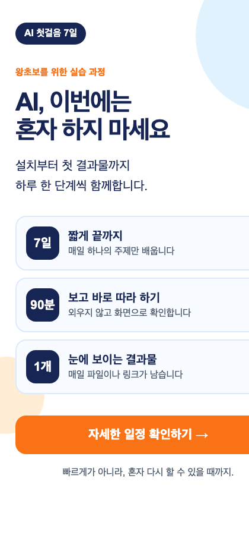

# Day 3 — Claude Design으로 내 첫 홍보물 만들기

## 이 기능은 무엇인가요?

**Claude Design**은 말로 요청하면 오른쪽 캔버스에 디자인과 작동하는 프로토타입을 만들고, 대화·직접 편집·댓글로 고치는 기능입니다. 오늘은 코드를 쓰지 않고 작은 시각 결과 세 개를 만든 뒤, 한 장짜리 세로 홍보물로 합칩니다.

2026년 8월 기준 Claude Design은 **베타**이며 웹과 Claude Desktop의 Pro·Max·Team·Enterprise 요금제에서 사용할 수 있습니다. Enterprise는 관리자가 꺼 두었을 수 있습니다. 메뉴가 없다면 결제부터 하지 말고 운영자에게 화면을 보여 주세요.

## Claude Desktop 화면에서 어디에 있나요?

처음에는 아래 순서만 따라 누릅니다.

1. Claude Desktop을 엽니다.
2. 화면 왼쪽 위의 **☰ 메뉴**가 접혀 있으면 한 번 누릅니다.
3. 왼쪽 메뉴의 **Design**을 한 번 누릅니다.
4. **New project** 또는 **새 디자인 만들기**를 누릅니다.
5. 이름을 적고 만들기를 누르면 편집 화면이 열립니다.
6. 화면 **왼쪽 Chat**에 부탁을 적고, **오른쪽 Canvas**에서 만들어진 모습을 봅니다.
7. Canvas의 글자나 버튼을 선택하면 그 부분만 직접 고치거나 댓글을 남길 수 있습니다.
8. 완성 뒤 오른쪽 위의 **Share** 또는 **Export**를 사용합니다.


운영자 캡처 목록과 번호 콜아웃:

- 캡처 D3-1, Claude Desktop 왼쪽 메뉴: `① Design`
- 캡처 D3-2, Design 첫 화면: `① New project` `② 최근 프로젝트`
- 캡처 D3-3, 편집 화면: `① Chat` `② Canvas` `③ 직접 편집` `④ 댓글`
- 캡처 D3-4, 내보내기 화면: `① 현재 버전` `② Share` `③ Export`
- 캡처 D3-5, 모바일 공유 링크: `① 제목 가독성` `② 행동 버튼`
- Mac과 Windows 화면을 각각 준비하고, 기능이 보이지 않는 화면 예시도 한 장 둡니다.

### Day 2와 선택해서 이어 쓰기

Day 2 안내 페이지를 완성했다면 그 결과의 제목·대상·핵심 정보 세 가지를 오늘 `design-brief.txt` 대신 **선택해서** 사용합니다. 공개 링크나 대표 화면을 Design에 첨부하고 `이 자료의 사실과 정보 순서는 유지하고, 디자인만 새로 만들어 주세요.`라고 요청하면 됩니다. Day 2 결과가 없거나 공유하기 곤란하면 제공된 `design-brief.txt`만으로 Day 3을 완전히 끝낼 수 있습니다.

### Design 메뉴가 없을 때도 완주하는 길

Design이 보이지 않으면 새로 결제하거나 설치를 반복하지 않습니다. Claude Desktop의 일반 **Chat**에서 새 대화를 열고 `day03-assets/design-brief.txt`를 첨부한 뒤 아래 프롬프트를 그대로 보냅니다.

```text
첨부한 디자인 브리프의 사실과 문장만 사용해서 휴대폰용 세로 홍보물 HTML Artifact를 실제로 만들어 주세요.

구성:
1. 과정 이름 작은 라벨
2. 핵심 제목과 보조 문장
3. 7일 / 90분 / 결과물 1개 정보 카드
4. '자세한 일정 확인하기' 버튼
5. 마지막 약속 문장

조건:
- 설명만 하지 말고 오른쪽에 실제 HTML Artifact를 만드세요.
- 휴대폰용 세로 화면이며 남색, 하늘색, 주황색만 사용하세요.
- 버튼을 누르면 '준비물: 컴퓨터, Claude 계정, 휴대폰'이 열리게 하세요.
- 외부 사진, 설치, API 키는 사용하지 마세요.
- 자료에 없는 가격, 날짜, 후기, 성과는 만들지 마세요.
- 완성 뒤 제목과 버튼이 휴대폰에서 읽히는지 스스로 확인하세요.
```

오른쪽 Artifact에서 버튼을 직접 누릅니다. 작동하면 **Publish**로 링크를 복사하거나, Publish가 없으면 결과 전체 화면을 캡처합니다. 이후 아래 5단계의 자기 주제 프롬프트를 같은 대화에 보내면 Design 경로와 동일한 인증물을 만들 수 있습니다. 인증문에는 `Design 대체: HTML Artifact`라고 적습니다.

## 오늘 남는 결과



작은 결과 세 개:

1. 제목 배너
2. 숫자 정보 카드
3. 행동 버튼 카드

메인 결과 한 개:

- 작은 결과를 합친 **휴대폰용 세로 홍보물**

마지막에는 자기 주제와 문장, 색을 넣은 두 번째 버전을 만듭니다.

## 시간표 — 총 2시간 40분

| 순서 | 시간 | 하는 일 | 눈에 보이는 완료 표시 |
|---|---:|---|---|
| 기능 이해 | 20분 | Chat과 Canvas, 선택·수정·공유 위치 확인 | 빈 디자인 프로젝트가 열림 |
| 작은 결과 3개 | 45분 | 배너·숫자 카드·버튼 카드 제작 | 캔버스에 세 결과가 보임 |
| 메인 결과물 | 45분 | 세 요소를 세로 홍보물로 합침 | 한 장 홍보물이 완성됨 |
| 자기 주제 응용 | 30분 | 문장·색·대상을 바꿈 | 두 번째 버전이 생김 |
| 휴대폰 검수·인증 | 20분 | 공유 링크와 대표 캡처 확인 | 휴대폰에서 읽힘 |

## 준비물

- Claude Design이 보이는 Claude Desktop 유료 계정
- [Day 3 시작 자료 ZIP 한 번에 받기](downloads/day03-start.zip)
- [압축을 푼 뒤 처음 읽을 안내](day03-assets/README_FIRST.md)
- 휴대폰
- 자기 주제, 대상, 핵심 문장 한 줄

오늘은 사진을 검색하거나 생성하지 않습니다. 도형·색·글자만으로 완주하므로 저작권과 인물 초상권 문제를 줄일 수 있습니다.

## 1단계 — Design 프로젝트 열기

1. 왼쪽 **Design**을 누릅니다.
2. **New project**를 누릅니다.
3. 이름을 `왕초보2기 Day3 닉네임`으로 적습니다.
4. `day03-assets/design-brief.txt`를 첨부합니다. 첨부가 어렵다면 파일을 열어 전체 내용을 복사해 첫 대화에 붙여넣습니다.
5. Canvas가 빈 화면으로 열렸는지 확인합니다.

**성공 화면:** 왼쪽에 대화 입력칸, 오른쪽에 빈 캔버스가 함께 보입니다.

## 2단계 — 작은 결과물 세 개 만들기

각 프롬프트를 하나씩 보내고 결과를 눈으로 본 뒤 다음으로 갑니다.

### 결과 1: 제목 배너

```text
첨부한 디자인 브리프를 읽고 제목 배너 하나를 만들어 주세요.
크기는 휴대폰 가로폭에 맞는 1080×400 비율입니다.
핵심 제목과 보조 문장만 넣고, 남색 배경과 흰 글자를 사용하세요.
제목은 가장 크게, 보조 문장은 제목의 절반 크기로 보여 주세요.
사진과 아이콘은 넣지 마세요.
```

### 결과 2: 숫자 정보 카드

```text
같은 프로젝트 안에 숫자 정보 카드 하나를 추가해 주세요.
'7일 / 90분 / 결과물 1개' 세 숫자를 같은 크기의 칸 세 개로 보여 주세요.
각 숫자 아래에 뜻을 짧게 쓰고, 휴대폰에서 한눈에 읽히게 해 주세요.
밝은 하늘색 배경과 남색 글자를 사용하세요.
```

### 결과 3: 행동 버튼 카드

```text
같은 프로젝트 안에 행동 버튼 카드 하나를 추가해 주세요.
문구는 '자세한 일정 확인하기'입니다.
주황색 버튼과 버튼 아래 안심 문구 '설치부터 함께합니다'를 넣으세요.
버튼을 눌렀을 때 '준비물: 컴퓨터, Claude 계정, 휴대폰' 안내가 열리는 프로토타입으로 만드세요.
```

세 번째 결과에서는 버튼을 실제로 눌러 준비물 문구가 나타나는지 확인합니다.

## 3단계 — 메인 세로 홍보물 만들기

```text
지금 만든 제목 배너, 숫자 정보 카드, 행동 버튼 카드를 하나의 휴대폰용 세로 홍보물로 합쳐 주세요.

위에서 아래 순서:
1. 과정 이름 작은 라벨
2. 핵심 제목과 보조 문장
3. 7일 / 90분 / 결과물 1개
4. 자세한 일정 확인하기 버튼
5. '빠르게가 아니라, 혼자 다시 할 수 있을 때까지.' 문장

요구사항:
- 1080×1920 세로 비율로 만드세요.
- 바깥 여백을 넉넉히 두고 글자가 화면 끝에 닿지 않게 하세요.
- 색은 브리프의 남색, 하늘색, 주황색 세 가지만 사용하세요.
- 제목은 휴대폰에서 3초 안에 읽히게 두 줄 이내로 하세요.
- 같은 내용이 반복되면 하나를 지우세요.
- 버튼 동작은 유지하세요.
```

완성 예시: [세로 홍보물 예시 열기](day03-assets/expected/design-example.html)

## 4단계 — 보고 고치기

디자인 용어를 몰라도 됩니다. 화면에서 불편한 곳을 그대로 말합니다.

### 제목이 작을 때

```text
휴대폰에서 제목이 먼저 보이지 않습니다.
제목을 지금보다 크게 하고, 다른 문장은 줄여 주세요.
제목과 버튼 사이의 정보 순서는 유지하세요.
```

### 글자가 너무 많을 때

```text
이 화면을 5초 동안 본다고 생각하고 반복되는 문장을 찾아 주세요.
핵심 뜻은 유지하면서 전체 글자 수를 약 30% 줄여 주세요.
줄인 문장 목록을 먼저 보여 주고 반영하세요.
```

### 특정 부분만 바꿀 때

캔버스에서 바꿀 요소를 선택하거나 댓글을 붙인 뒤 보냅니다.

```text
선택한 부분만 수정해 주세요.
버튼 색을 주황색으로 더 선명하게 하고, 버튼 글자는 흰색으로 유지하세요.
다른 부분의 위치와 문장은 바꾸지 마세요.
```

## 5단계 — 자기 주제로 응용하기

완성본의 새 버전을 만든 뒤 대괄호 네 곳만 바꿉니다.

```text
현재 홍보물의 레이아웃과 버튼 기능을 유지한 채 제 주제로 새 버전을 만들어 주세요.

주제: [반려견 첫 산책 모임]
대상: [처음 반려견을 키우는 동네 주민]
핵심 제목: [첫 산책, 혼자 걱정하지 마세요]
강조 색: [초록색]

과정 자료에 있던 7일과 90분은 삭제하고,
대신 [토요일 오전 / 60분 / 소수 산책]을 보여 주세요.
없는 장소와 가격은 만들지 마세요.
```

자기 버전에서 원래 과정의 `7일`, `90분`이 남지 않았는지 확인합니다.

## 6단계 — 공유와 휴대폰 검수

1. 가장 최신 버전이 선택되어 있는지 봅니다.
2. **Share**를 눌러 보기 링크를 복사합니다. 계정에 따라 조직 내부 공유만 가능할 수 있습니다.
3. **Export**가 보이면 PNG 또는 제공되는 이미지 형식으로 내보냅니다.
4. 파일 이름을 `D03_닉네임_디자인.png`로 바꿉니다.
5. 링크를 휴대폰에서 열고 제목과 버튼을 확인합니다.
6. 공개 링크가 없는 계정은 내보낸 이미지 한 장으로 기본 완주합니다.

## 완성 판정

- [ ] Claude Design의 Chat과 Canvas를 구분할 수 있다.
- [ ] 제목 배너, 숫자 카드, 버튼 카드가 화면에 보인다.
- [ ] 버튼을 누르면 준비물 안내가 열린다.
- [ ] 세 요소가 세로 홍보물 한 장으로 합쳐졌다.
- [ ] 자기 주제·대상·제목·색이 반영됐다.
- [ ] 휴대폰에서 제목을 읽을 수 있다.
- [ ] 공개 링크 또는 이미지 파일 한 개가 있다.
- [ ] 개인정보, 근거 없는 가격·성과, 무단 사진이 없다.

여덟 항목 중 일곱 개 이상이면 완료입니다. 단, 메인 홍보물과 제출 파일이 없으면 완료가 아닙니다.

## 막혔을 때 가장 짧은 복구

| 보이는 상황 | 할 일 |
|---|---|
| Design 메뉴가 없음 | 이 페이지 위쪽의 **Design 메뉴가 없을 때도 완주하는 길**로 이동해 일반 Chat에서 HTML Artifact를 만듭니다. 임의 결제하지 않습니다. |
| Canvas가 비어 있음 | `설명하지 말고 오른쪽 Canvas에 실제 디자인을 만들어 주세요.`라고 보냅니다. |
| 첨부가 안 됨 | `design-brief.txt`를 열어 전체 글을 복사해 대화에 붙여넣습니다. |
| 한 부분을 말했는데 전체가 바뀜 | 이전 버전으로 돌아가 바꿀 요소를 선택하고 `선택한 부분만` 프롬프트를 보냅니다. |
| 글자가 잘림 | `1080×1920 안전 여백 안에서 모든 글자가 보이게 크기와 줄바꿈을 조정해 주세요.`라고 보냅니다. |
| Share가 안 됨 | 공개를 멈추고 Export로 이미지 한 장을 저장합니다. |

같은 화면에서 5분 넘게 막히면 계정명과 다른 프로젝트를 가린 화면을 참가자방에 올립니다. 임의로 추가 결제하지 않습니다.

## 오픈카톡 인증

대표 이미지 한 장과, 있다면 보기 링크 하나만 올립니다.

```text
[왕초보2기 Day 3 / 닉네임]
오늘 만든 것: Claude Design으로 만든 휴대폰용 세로 홍보물
내 주제: ___
결과물: D03_닉네임_디자인.png + 보기 링크(있을 때만)
Design에서 배운 것: 대화와 Canvas 선택으로 한 부분씩 고치는 방법
내가 직접 바꾼 것: 제목 / 대상 / 숫자 정보 / 강조 색
```

## 공식 레퍼런스와 따라 볼 영상

- [Anthropic 공식 — Claude Design 시작하기](https://support.claude.com/en/articles/14604416-get-started-with-claude-design): Chat·Canvas·직접 편집·댓글·공유의 공식 흐름과 현재 제공 요금제
- [Claude 공식 YouTube — Introducing Claude Design](https://www.youtube.com/watch?v=t_LBECIQQqs): 말로 디자인을 만들고 다듬는 실제 화면 예시
- [Anthropic 공식 — Claude Desktop 설치와 제공 기능](https://support.claude.com/en/articles/10065433-install-claude-desktop): Mac·Windows 설치와 현재 요금제별 기능

영상의 디자인을 베끼지 않습니다. “말로 만들기 → 화면에서 고르기 → 한 부분 수정 → 공유”라는 작업 순서만 참고합니다.
