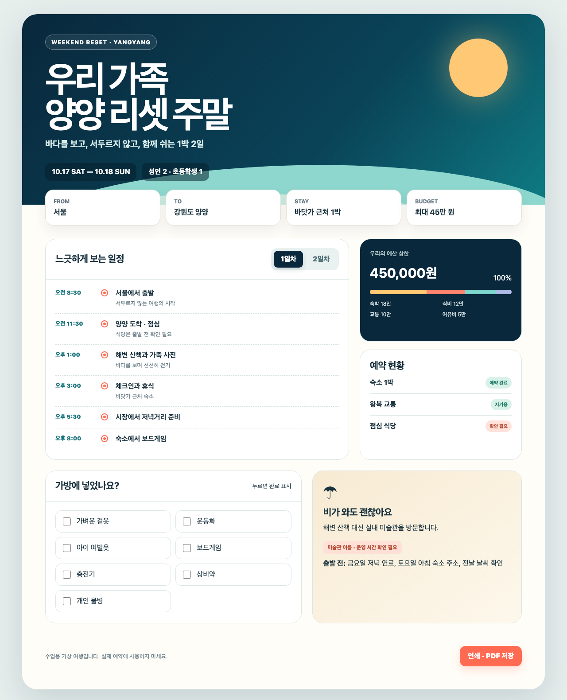
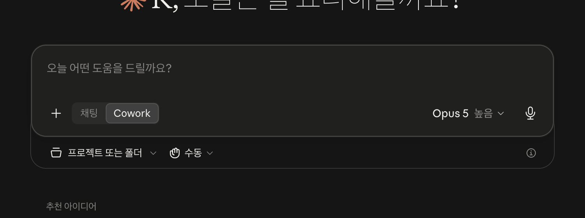
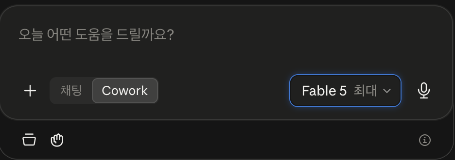
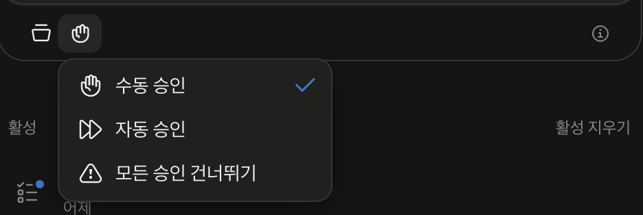
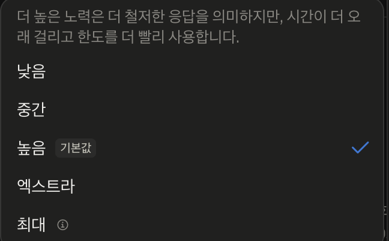

# Day 4 — Cowork로 가족 여행 브리핑북 만들기

흩어진 메모 세 장이 **휴대폰으로 바로 공유할 수 있는 여행 브리핑북**으로 바뀝니다. 코드를 배우는 날이 아닙니다. Claude Desktop의 **Cowork**에게 안전한 폴더 하나를 맡기고, 작업 계획을 확인하고, 실제 파일을 받는 날입니다.

## 오늘 완성할 것



[움직이는 완성 예시 열기](day04-assets/completed-example.html)

메모에는 일정, 예산, 준비물이 따로 적혀 있습니다. Cowork가 세 파일을 읽어 앞의 두 파일을 만들고, 마지막 PDF는 수강생이 브라우저에서 직접 저장합니다.

1. `여행자료_점검표.md` — 읽은 파일, 빠진 정보, 충돌 여부
2. `D04_가족여행_브리핑북.html` — 일정·예산·준비물을 한 화면에 모은 완성본
3. `D04_가족여행_브리핑북.pdf` — 완성 HTML을 인쇄해 수강생이 저장하는 최종 인증 파일

완성 HTML에서는 **1일차/2일차 일정 전환**, **준비물 체크**, **PDF 인쇄**가 실제로 작동합니다.

## 오늘의 학습 흐름

| 순서 | 배우는 기능 | 작은 성공 | 눈에 보이는 결과 |
|---|---|---|---|
| 1 | Cowork와 폴더 권한 | 연습 폴더 하나만 연결 | 폴더 이름 확인 |
| 2 | 여러 파일 읽기 | 메모 세 장의 차이를 표로 정리 | `여행자료_점검표.md` |
| 3 | 계획 확인과 승인 | 만들 파일과 순서를 먼저 확인 | Cowork 작업 계획 |
| 4 | 실제 파일 만들기 | 초안 한 번 수정 | 여행 브리핑북 HTML |
| 5 | 내 상황에 응용 | 제목·일정·준비물 바꾸기 | 내 이름의 PDF |

## Cowork는 무엇인가요?

**채팅**은 대화창에서 답을 받습니다. **Cowork**는 내가 허용한 폴더의 여러 파일을 읽고, 순서를 세우고, 실제 결과 파일까지 만듭니다.

```text
채팅: “여행 계획을 알려 줘” → 대화창에 답
Cowork: 메모 3개 읽기 → 빠진 정보 찾기 → 브리핑북 파일 만들기
```

오늘 수강생이 꼭 경험할 기능은 세 가지입니다.

- **폴더 지정:** Claude가 볼 수 있는 작업 범위를 내가 정합니다.
- **수동 승인:** 파일을 만들거나 바꾸기 전에 Claude가 멈추고 나에게 물어봅니다.
- **계획 확인:** Cowork가 무엇을 할지 읽은 뒤 진행시킵니다.

## 화면에서 어디에 있나요?

Claude Desktop 홈의 입력창 아래를 봅니다.



> **오늘은 반드시 Claude Desktop 앱에서 합니다.** 인터넷 브라우저(claude.ai)로 들어가면 내 컴퓨터 폴더를 고를 수 없고 `프로젝트`만 나옵니다.

1. 입력창 안쪽의 **`Cowork`** 를 누릅니다. 오른쪽 위에 **베타** 표시가 보이면 켜진 것입니다.



2. 입력창 **아래에 아이콘 두 개**가 새로 생깁니다. 왼쪽 **서류함 모양**을 눌러 **프로젝트 또는 폴더**를 고릅니다.
3. 그 옆 **손 모양**은 승인 방식입니다. **`수동 승인`에 체크가 되어 있는지만 확인하고 그대로 둡니다.** 원래 기본값이라 대부분 이미 되어 있습니다.



> `모든 승인 건너뛰기`는 **절대 고르지 마세요.** Claude가 물어보지 않고 파일을 바꿉니다.

4. 오른쪽의 **모델과 노력(Effort)은 손대지 마세요.** 기본값이 오늘 필요한 값입니다.



> 노력을 `엑스트라`나 `최대`로 올리면 **답이 느려지고 하루 사용량을 훨씬 빨리 씁니다.** 화면에도 그렇게 적혀 있습니다. 7일을 완주해야 하니 기본값 **높음** 그대로 두세요.

베타 기능이라 화면이 조금씩 바뀔 수 있습니다. **발송**은 다른 날 쓰는 기능이며, 오늘은 누르지 않습니다.

## 예상 시간

| 구간 | 예상 시간 | 완료 표시 |
|---|---:|---|
| 기능과 폴더 이해 | 20분 | 연습 폴더 연결 |
| 작은 성공 | 25분 | 점검표 파일 생성 |
| 메인 제작 | 55분 | HTML 브리핑북 완성 |
| 수정·PDF·인증 | 40분 | 휴대폰에서 PDF 확인 |

처음이라면 약 2시간 20분을 잡으세요. 중간에 막혀도 완성 예시와 비교하면 다시 이어갈 수 있습니다.

## 0. 시작 자료 받기

[Day 4 시작 자료 ZIP 받기](downloads/day04-start.zip)

> 압축을 푼 뒤 생기는 `day04-assets` 폴더가 오늘 작업 폴더입니다. 아래 단계에서 그 폴더 이름을 바꿉니다.

압축을 풀면 다음 세 파일이 보여야 합니다.

- `01_trip.txt` — 여행 날짜, 장소, 예산
- `02_itinerary.txt` — 1일차와 2일차 일정
- `03_checklist.txt` — 예약, 준비물, 비 오는 날 대안

### Mac

1. Finder에서 **다운로드**를 엽니다.
2. ZIP 파일을 두 번 누릅니다.
3. 생긴 폴더를 바탕 화면으로 옮깁니다.
4. 폴더 이름을 `Day04_Cowork_닉네임`으로 바꿉니다.

### Windows

1. 파일 탐색기에서 **다운로드**를 엽니다.
2. ZIP을 마우스 오른쪽으로 누르고 **모두 압축 풀기**를 누릅니다.
3. 생긴 폴더를 바탕 화면으로 옮깁니다.
4. 폴더 이름을 `Day04_Cowork_닉네임`으로 바꿉니다.

## 1. 안전한 폴더 하나만 연결하기

1. Claude Desktop 홈에서 **Cowork**를 누릅니다.
2. **프로젝트 또는 폴더**를 누릅니다.
3. 방금 만든 `Day04_Cowork_닉네임` 폴더만 선택합니다.
4. 손 모양을 눌러 **`수동 승인`** 에 체크가 되어 있는지 확인합니다.
5. 폴더 접근 확인이 나오면 이름을 보고 허용합니다.

아래 문장을 보냅니다.

```text
지금 연결된 작업 폴더의 이름만 알려 주세요.
아직 파일을 만들거나 바꾸거나 지우지 마세요.
이 폴더 밖의 자료는 사용하지 마세요.
```

**성공:** 답변에 `Day04_Cowork_닉네임`이 보입니다. 사진, 문서, 다운로드 같은 다른 개인 폴더 이름이 나오면 중지하고 폴더를 다시 고릅니다.

> 고객 명단, 계약서, 신분증, 비밀번호, API 키가 든 폴더는 연결하지 않습니다. 삭제 승인이 나타나면 **거절**합니다.

## 2. 작은 성공 — 여행자료 점검표 만들기

아래 프롬프트를 그대로 보냅니다.

```text
이 폴더의 01_trip.txt, 02_itinerary.txt, 03_checklist.txt 세 파일만 읽어 주세요.

먼저 대화창에 표를 만들어 주세요.
- 파일 이름
- 들어 있는 핵심 정보
- 서로 충돌하는 정보
- 여행 전에 확인할 빠진 정보

파일에 없는 사실은 추측하지 말고 '확인 필요'라고 적어 주세요.
표를 보여 준 다음 내 확인을 기다리세요. 아직 파일은 만들지 마세요.
```

표에 세 파일 이름이 모두 보이면 다음 문장을 보냅니다.

```text
확인했습니다. 방금 표를 여행자료_점검표.md로 새로 저장해 주세요.
원본 txt 세 개는 수정하거나 삭제하지 마세요.
```

승인 창에서 대상 파일이 오늘 폴더 안의 `여행자료_점검표.md`인지 확인한 뒤 허용합니다.

**작은 성공 완료:** Finder 또는 파일 탐색기에 `여행자료_점검표.md`가 생겼습니다. 이 한 번으로 “여러 파일 읽기 → 비교 → 실제 파일 저장”을 모두 해본 것입니다.

## 3. 메인 실습 — 여행 브리핑북 만들기

이제 결과물이 확 달라집니다. 아래 프롬프트를 한 번에 보냅니다.

```text
세 txt 파일의 사실만 사용해 '우리 가족 양양 리셋 주말' 여행 브리핑북을 만들어 주세요.

[진행 방식]
1. 먼저 만들 파일과 작업 순서를 5줄 이내의 계획으로 보여 주세요.
2. 내 승인을 기다리세요.
3. 승인 뒤 D04_가족여행_브리핑북.html을 새로 만드세요.
4. 기존 txt 세 개와 여행자료_점검표.md는 수정하거나 삭제하지 마세요.

[완성 화면]
- 휴대폰에서도 잘 보이는 세련된 한 페이지 디자인
- 첫 화면에 여행 제목, 날짜, 장소, 총예산
- 1일차와 2일차를 누르면 일정이 바뀌는 버튼
- 시간 순서가 한눈에 보이는 일정표
- 예약 완료 / 확인 필요를 다른 색으로 표시
- 준비물을 직접 체크할 수 있는 체크박스
- 비가 올 때 대체 일정과 출발 전 확인사항
- '인쇄 · PDF 저장' 버튼을 누르면 인쇄 창 열기
- 바다를 떠올리는 진한 남색, 산호색, 모래색 조합

[사실 규칙]
- 파일에 없는 주소, 전화번호, 예약번호, 날씨, 이동시간은 만들지 마세요.
- 빠진 값은 '확인 필요'로 표시하세요.
- 외부 이미지, 외부 폰트, 인터넷 연결 없이 열리게 만드세요.
- HTML, CSS, JavaScript는 한 파일 안에 넣으세요.
- 모든 버튼이 실제로 작동하는지 마지막에 확인하세요.
```

Cowork가 계획을 보여 주면 다음 세 가지를 찾습니다.

- 읽을 파일이 세 txt로 한정되어 있는가?
- 새로 만들 파일명이 맞는가?
- 원본 삭제나 덮어쓰기가 없는가?

맞으면 이렇게 답합니다.

```text
계획을 확인했습니다. 진행해 주세요.
```

파일 쓰기 승인이 나오면 파일 경로가 오늘 폴더 안인지 확인하고 허용합니다.

## 4. 완성본을 직접 눌러 보기

1. Finder 또는 파일 탐색기에서 `D04_가족여행_브리핑북.html`을 두 번 누릅니다.
2. 브라우저가 열리면 **1일차**, **2일차**를 번갈아 누릅니다.
3. 준비물 체크박스 두 개를 눌러 봅니다.
4. **인쇄 · PDF 저장** 버튼을 눌러 인쇄 창이 뜨는지 확인합니다.
5. 화면의 날짜, 예산, 일정이 원본 메모와 같은지 확인합니다.

**합격:** 디자인이 예쁜 것만으로는 부족합니다. 버튼이 작동하고, 원본에 없는 사실이 없고, 휴대폰 폭에서도 글자가 잘리지 않아야 합니다.

### 한 번만 고쳐서 완성도 올리기

처음부터 다시 만들지 말고, 이미 만든 파일에서 한 부분만 바꿉니다.

```text
D04_가족여행_브리핑북.html에서 다음 세 가지만 고쳐 주세요.
1. '확인 필요' 항목이 화면에서 더 눈에 띄게 하기
2. 준비물 체크박스 사이 간격 넓히기
3. 휴대폰 화면에서 제목이 두 줄을 넘지 않게 하기

여행의 사실과 일정은 바꾸지 마세요.
수정할 내용을 먼저 짧게 설명하고 내 승인 뒤 파일을 수정하세요.
```

승인 창에는 기존 `D04_가족여행_브리핑북.html` 하나만 보여야 합니다.

## 5. PDF로 저장하기

Claude에게 PDF 생성을 다시 맡기지 않아도 됩니다. 완성 HTML을 연 브라우저에서 직접 저장하면 가장 확실합니다.

### Mac

1. `Command + P`를 누릅니다.
2. 인쇄 화면 아래의 **PDF**를 누릅니다.
3. **PDF로 저장**을 누릅니다.
4. 파일명을 `D04_닉네임_가족여행브리핑북.pdf`로 저장합니다.

### Windows

1. `Ctrl + P`를 누릅니다.
2. 프린터에서 **Microsoft Print to PDF** 또는 **PDF로 저장**을 고릅니다.
3. 파일명을 `D04_닉네임_가족여행브리핑북.pdf`로 저장합니다.

인쇄 미리보기에서 배경색이 안 보이면 **배경 그래픽**을 켭니다. 마지막 문장이 잘리면 배율을 90%로 낮춥니다.

## 6. 내 상황으로 응용하기

기본 실습을 완성한 사람만 진행합니다. 같은 방식을 내 자료에 적용할 수 있다는 감각을 얻는 단계입니다.

예를 들어:

- 육아 중인 주부: 가족 주간 일정, 장보기 목록, 준비물을 `우리집_주간브리핑.html`로 정리
- 은퇴를 앞둔 50대: 경력 메모, 배우고 싶은 일, 한 달 계획을 `두번째커리어_출발보드.html`로 정리
- 누구나: 모임 일정, 여행 준비, 이사 체크리스트를 한 화면으로 정리

개인정보를 지운 메모 2~3개를 오늘 폴더 안에 복사한 뒤 다음 틀을 사용합니다.

```text
방금 추가한 내 메모 파일만 읽어 주세요.
먼저 공통 정보, 충돌 정보, 확인이 필요한 정보를 표로 보여 주세요.
내 승인 뒤 [원하는 파일명].html을 새로 만들어 주세요.

첫 화면에서 가장 중요한 날짜와 해야 할 일이 보이게 해 주세요.
세부 내용은 카드와 체크리스트로 정리하고, 휴대폰에서도 읽기 쉽게 만들어 주세요.
파일에 없는 사실은 만들지 말고 '확인 필요'라고 표시하세요.
원본 메모는 수정하거나 삭제하지 마세요.
```

## 7. 나와의 채팅으로 보내 최종 확인

1. 카카오톡 PC에서 **내 프로필 → 나와의 채팅**을 엽니다.
2. 완성 PDF를 대화창으로 끌어 놓습니다.
3. 휴대폰 카카오톡의 나와의 채팅에서 PDF를 엽니다.
4. 첫 화면 제목, 일정, 예산, 준비물이 읽히는지 확인합니다.
5. 개인정보나 실제 예약번호가 없는지 마지막으로 확인합니다.

## 오픈카톡 인증 — 30초

📸 **인증 캡처:** 브리핑북 첫 화면 1장 — **PC 화면이면 충분합니다.** 수업대로 휴대폰에서 열어 봤다면 그 화면이 제일 멋지지만, 필수는 아닙니다

```text
[왕초보2기 Day 4 / 닉네임]
✅ 가족 여행 브리핑북 완성
💬 소감:
```

PDF 첨부는 선택입니다.

## 최종 합격표

- [ ] Cowork에 연습 폴더 하나만 허용했다.
- [ ] `여행자료_점검표.md`가 생겼다.
- [ ] 원본 txt 세 개가 수정되지 않았다.
- [ ] HTML에서 1일차/2일차 버튼과 체크박스가 작동한다.
- [ ] 원본에 없는 사실은 `확인 필요`로 표시되어 있다.
- [ ] PDF를 휴대폰에서 열어 봤다.
- [ ] 공개 파일에 개인정보, 비밀번호, API 키가 없다.

## 막혔을 때

| 보이는 상황 | 바로 할 일 |
|---|---|
| Cowork가 보이지 않음 | Claude Desktop을 업데이트하고, 계정에서 Cowork 사용이 가능한지 확인한 뒤 앱을 다시 엽니다. |
| 폴더 선택이 무서움 | 취소한 뒤 비밀 자료가 없는 `Day04_Cowork_닉네임`만 다시 고릅니다. |
| 세 파일 중 하나를 안 읽음 | `읽은 파일 이름 세 개를 다시 적고 누락 파일만 읽어 주세요`라고 보냅니다. |
| 없는 정보를 지어냄 | `세 txt에 없는 문장에 표시하고 확인 필요로 바꿔 주세요`라고 보냅니다. |
| 삭제 승인이 나타남 | 거절하고 `기존 파일 삭제 없이 새 파일만 만드세요`라고 다시 말합니다. |
| HTML이 코드 글자로 열림 | 파일을 마우스 오른쪽으로 눌러 Chrome, Edge 또는 Safari로 엽니다. |
| 버튼이 안 눌림 | `버튼 세 개를 직접 점검하고 JavaScript 오류를 고쳐 주세요`라고 요청합니다. |
| PDF 배경색이 사라짐 | 인쇄 설정에서 **배경 그래픽**을 켭니다. |

## 공식 참고 자료

- [Cowork 시작 방법 — Anthropic Help Center](https://support.claude.com/en/articles/13345190-get-started-with-claude-cowork)
- [Cowork 초보자 권장 습관 — Anthropic](https://claude.com/blog/best-practices-for-getting-started-with-claude-cowork)
- [Cowork 제품 활용 가이드 — Anthropic](https://claude.com/blog/the-claude-cowork-product-guide)
- [Cowork 공식 소개 영상 — Anthropic YouTube](https://www.youtube.com/watch?v=UAmKyyZ-b9E)

공식 가이드의 핵심인 **충분한 자료 제공 → 원하는 완성물 명시 → 실행 전 계획 확인 → 결과 직접 검수**를 오늘 한 번에 연습합니다.

## 운영자 확인 메모

- 연결된 실제 화면: `day04-assets/screenshots/01_cowork_mode.png`
- 완성 예시 화면: `day04-assets/expected/weekend-briefing-example.png`
- 완성 예시 HTML: `day04-assets/completed-example.html`
- 시작 ZIP에는 txt 3개와 완성 예시, 화면 캡처가 포함되어야 합니다.
