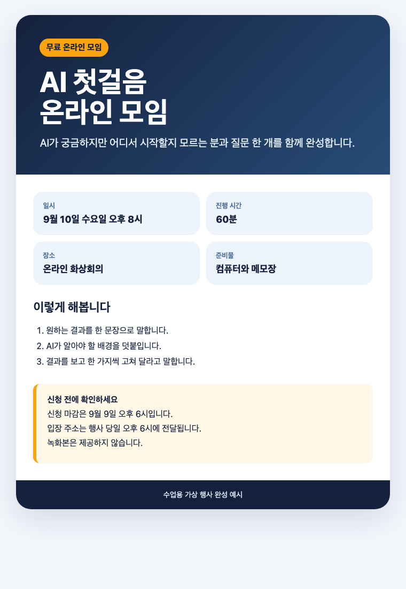

# Day 4 — Cowork로 흩어진 메모를 한 장 안내문으로 만들기

오늘은 코드를 쓰지 않습니다. Claude Desktop의 **Cowork**에게 안전한 연습 폴더를 보여 주고, 흩어진 메모 3개를 읽기 좋은 안내문 한 장으로 정리시킵니다.

## 오늘 한눈에 보기

**메모 파일 3개 → 파일 지도 → 한 장 안내문 → 내 메모 한 장 정리**

| 내가 하는 일 | Cowork가 하는 일 |
|---|---|
| 오늘 폴더 하나만 선택 | 그 안의 메모 세 개 읽기 |
| 초안의 날짜·장소·비용 확인 | 겹치거나 빠진 정보 표시 |
| 저장할 파일을 승인 | 안내문 파일로 저장 |
| 휴대폰에서 최종 문서 확인 | 긴 문장을 짧게 정리 |

> **오늘의 차이:** Chat은 답을 대화창에 써 줍니다. Cowork는 허용한 자료를 읽고 여러 단계를 거쳐 실제 파일 결과물을 만듭니다.

## 이 기능이 무엇인가요?

**Cowork(코워크)**는 Claude에게 “이 자료들을 읽고 이런 완성물을 만들어 줘”라고 일을 맡기는 기능입니다. 질문에 답만 받는 Chat과 달리, 허용한 폴더의 여러 파일을 읽고 작업 순서를 세운 다음 문서 같은 실제 결과물을 저장할 수 있습니다.

오늘은 Cowork가 컴퓨터 전체를 보는 것이 아니라 **내가 선택한 수업용 폴더만** 보게 합니다. Claude가 보여 주는 계획과 승인 요청을 사람이 확인하는 것이 수업의 핵심입니다.

## Claude Desktop 화면에서 어디에 있나요?

Claude Desktop의 **홈**에서 큰 입력칸 왼쪽 아래의 **채팅/Cowork 선택 부분**을 찾고 `Cowork`를 누릅니다.


이 화면에서 다음 순서로 누릅니다.

1. 큰 입력칸 왼쪽 아래의 **채팅/Cowork 선택 부분**을 찾습니다.
2. **Cowork**를 누릅니다. 선택되면 Cowork 글자 주변이 밝게 표시됩니다.
3. 입력칸 아래의 **프로젝트 또는 폴더**를 눌러 오늘 폴더를 선택합니다.
4. 그 오른쪽 작업 방식은 **수동(Manual)**으로 둡니다.
5. 오른쪽 모델 메뉴에서 Effort의 **높음**이 보이면 높음으로, 보이지 않으면 기본값으로 둡니다.

코워크의 **수동(Manual)**은 코워크가 파일이나 앱을 사용하는 작업을 사람이 확인하는 방식입니다. 이것은 다음 날 Code의 파일 편집·명령 권한 모드와 위치가 다릅니다. 오늘은 둘 다 자동 실행보다 사람이 확인하는 설정을 사용합니다.

Effort는 작업을 얼마나 깊게 살펴볼지 정하는 값입니다. **높음**이 보이면 고르고, 메뉴가 없으면 기본값 그대로 진행합니다.

## 오늘 쌓이는 결과물



[완성 예시를 큰 화면으로 열기](day04-assets/completed-example.html)

1. 작은 결과물: `파일목록.md` — Cowork가 읽은 파일과 역할을 적은 목록
2. 메인 결과물: `내행사_안내문.md`와 가능하면 PDF 1개
3. 내 주제 응용본: 내 메모로 만든 `내자료_한장정리.md`
4. 오픈카톡 인증: 완성 문서 화면 1장과 공개 가능한 파일

## 예상 시간

| 구간 | 왕초보 예상 시간 | 완료 표시 |
|---|---:|---|
| 기능 이해와 폴더 준비 | 30분 | 연습용 복사 폴더가 생김 |
| 작은 결과물 | 30분 | `파일목록.md`가 생김 |
| 메인 결과물 | 60분 | 안내문을 직접 읽고 수정함 |
| 내 주제 응용 | 60분 | 내 자료 한 장이 생김 |
| 검수와 인증 | 30분 | 휴대폰에서 읽어 보고 제출함 |

처음이면 약 3시간 30분을 잡으세요. 진행이 빠르면 중간에 쉬어도 됩니다.

## 시작 전에 꼭 확인

[Day 4 시작 자료 ZIP 한 번에 받기](downloads/day04-start.zip)

- Claude Desktop 최신 버전과 **유료 Claude 요금제**가 필요합니다.
- Mac과 Windows 모두 사용할 수 있습니다.
- 오늘은 원본 폴더가 아니라 **복사한 연습 폴더만** 허용합니다.
- 고객 명단, 계약서, 신분증, 비밀번호, API 키가 있는 폴더는 선택하지 않습니다.
- 삭제 요청은 하지 않습니다. 삭제 허용 창이 나오면 **Deny/거절**합니다.

## 1. 수업 폴더를 준비합니다

교재 사이트와 함께 받은 `day04-assets` 폴더를 내려받습니다. 압축 파일이라면 다음처럼 풉니다.

### Mac

1. Finder에서 **다운로드**를 엽니다.
2. 압축 파일을 두 번 누릅니다.
3. 생긴 `day04-assets` 폴더를 바탕 화면으로 끌어 놓습니다.
4. 폴더를 한 번 누르고 Return을 눌러 `Day04_Cowork_닉네임`으로 바꿉니다.

### Windows

1. 파일 탐색기에서 **다운로드**를 엽니다.
2. 압축 파일을 마우스 오른쪽으로 누르고 **모두 압축 풀기**를 누릅니다.
3. 생긴 `day04-assets` 폴더를 바탕 화면으로 옮깁니다.
4. 폴더를 마우스 오른쪽으로 누르고 **이름 바꾸기**를 골라 `Day04_Cowork_닉네임`으로 바꿉니다.

폴더 안에 `01_event.txt`, `02_program.txt`, `03_notes.txt`가 있으면 성공입니다. 각각 행사 정보, 진행 내용, 주의사항입니다. `completed-example.md`는 막혔을 때 비교하는 답안이므로 먼저 복사하지 않습니다.

## 2. Cowork를 열고 안전 범위를 정합니다

1. Claude Desktop을 열고 **홈**으로 갑니다.
2. 큰 입력칸 왼쪽 아래의 **채팅/Cowork 선택 부분**을 누릅니다.
3. **Cowork**를 누릅니다.
4. 입력칸 아래의 **프로젝트 또는 폴더**를 누릅니다.
5. `Day04_Cowork_닉네임` 폴더를 선택합니다.
6. 그 오른쪽 작업 방식을 **수동**으로 둡니다.
7. 접근 확인 화면에서 폴더 이름이 맞는지 본 뒤 허용합니다.

처음 안내 화면이 나오면 내용을 읽고 **계속** 또는 **시작**을 누릅니다. 선택한 폴더의 전체 경로가 `Day04_Cowork_닉네임`으로 끝나는지 확인합니다.

```text
지금 허용한 폴더 이름만 말해 주세요.
파일을 만들거나 바꾸거나 지우지 말고, 접근 가능한 범위가 이 폴더 하나인지 확인해 주세요.
```

**성공 화면:** 답변에 `Day04_Cowork_닉네임`이 보이고 다른 개인 폴더 이름은 나오지 않습니다.

## 3. 작은 결과물 — 파일 지도를 만듭니다

아래 문장을 복사해 Cowork에 보냅니다.

```text
이 폴더의 연습용 txt 파일 3개만 읽어 주세요.
먼저 각 파일의 이름, 한 줄 요약, 서로 겹치거나 빠진 정보를 표로 정리하세요.
내용을 지어내지 말고 파일에 없는 항목은 '없음'이라고 표시하세요.
검토가 끝나면 같은 내용을 이 폴더의 파일목록.md로 새로 저장해 주세요.
기존 파일은 수정하거나 삭제하지 마세요.
```

Cowork가 작업 순서를 보여 주면 읽고 진행을 승인합니다. 파일 쓰기 승인이 나타나면 대상이 오늘 폴더의 `파일목록.md`인지 확인한 뒤 허용합니다.

**성공 판정:** 폴더에 `파일목록.md`가 생기고, 세 txt 파일 이름이 모두 들어 있습니다.

## 4. 메인 결과물 — 안내문 한 장을 만듭니다

```text
01_event.txt, 02_program.txt, 03_notes.txt의 사실만 사용해 행사 안내문을 만들어 주세요.

완성 기준:
1. 처음 두 줄에 누구를 위한 행사인지와 얻는 결과를 씁니다.
2. 일시, 시간, 장소, 참가비, 준비물을 '한눈에 보기'로 묶습니다.
3. 진행 내용은 초보자가 이해하는 세 단계로 씁니다.
4. 신청 마감, 입장 주소 전달 시점, 녹화 여부를 빠뜨리지 않습니다.
5. 확인되지 않은 신청 링크, 연락처, 강사 이름은 만들지 않습니다.
6. 먼저 초안을 대화창에 보여 주고 내 확인을 기다립니다.
7. 내가 승인하면 내행사_안내문.md로 저장합니다.
8. 원본 txt 세 개와 파일목록.md는 바꾸지 않습니다.
```

초안에서 날짜·가격·제공 여부를 원본과 대조합니다. 맞으면 `내용을 확인했습니다. 저장해 주세요.`라고 답합니다.

### 눈으로 한 번 고칩니다

파일을 열어 제목, 한눈에 보기, 세 단계, 신청 전 확인 순서가 보이는지 확인합니다. 그다음 한 가지만 수정합니다.

```text
내행사_안내문.md의 사실은 바꾸지 말고, 휴대폰에서 빨리 읽도록 긴 문장을 줄여 주세요.
바꿀 문장을 먼저 전후 비교로 보여 주고 내 승인 뒤 수정해 주세요.
```

## 5. PDF가 필요하면 만듭니다

Cowork가 현재 환경에서 PDF를 만들 수 있다면 아래처럼 요청합니다.

```text
승인한 내행사_안내문.md를 A4 한 장의 읽기 쉬운 PDF로 만들어 주세요.
파일명은 D04_닉네임_Cowork안내문.pdf로 하고 오늘 폴더에 저장하세요.
새로운 사실이나 이미지는 추가하지 마세요.
완성 뒤 마지막 줄이 잘리지 않았는지 확인해 주세요.
```

PDF 생성이 되지 않아도 실패가 아닙니다. `내행사_안내문.md`를 열어 화면을 캡처하면 기본 완주입니다.

## 6. 내 주제로 한 번 더 만듭니다

운영체제의 메모장을 새로 배울 필요 없이 코워크에게 `내메모.txt`를 만들게 합니다. 아래 대괄호 다섯 곳을 내 말로 바꾸고 보냅니다.

```text
오늘 연습 폴더에 내메모.txt 하나만 새로 만들어 주세요.

내가 정리할 것: [초보 강사용 첫 수업 준비]
읽을 사람: [처음 강의하는 사람]
꼭 들어갈 사실 3개: [날짜 / 준비물 / 시작 시간]
빠뜨리면 안 되는 주의사항: [확정되지 않은 장소는 미정으로 표시]
완성 파일 이름: 내자료_한장정리.md

먼저 저장할 다섯 줄을 보여 주고 내 확인을 기다리세요.
기존 파일은 바꾸거나 삭제하지 마세요.
```

다섯 줄이 내 말과 같으면 `확인했습니다. 내메모.txt로 저장해 주세요.`라고 보냅니다. 승인 화면에서 오늘 폴더 안의 `내메모.txt` 하나만 추가되는지 확인합니다.

**이렇게 되면 성공:** 파일 목록에 `내메모.txt`가 보이고 열었을 때 다섯 줄이 내 말과 같습니다.

그다음 코워크에 보냅니다.

```text
내메모.txt만 읽고, 적힌 사실을 추가하거나 추측하지 않은 한 장 정리문을 만들어 주세요.
먼저 빠진 필수 정보가 있으면 한 번에 질문해 주세요.
내가 답하고 초안을 승인하면 내자료_한장정리.md로 저장하세요.
다른 파일은 수정하거나 삭제하지 마세요.
```

행사 안내, 수업 공지, 여행 준비, 모임 일정, 상품 설명 중 하나를 고르면 쉽습니다. 고객·수강생 실명과 연락처는 넣지 않습니다.

## 7. 휴대폰으로 옮겨 읽어 봅니다

1. 컴퓨터에서 `내자료_한장정리.md` 또는 만든 PDF를 찾습니다.
2. Mac은 Finder, Windows는 파일 탐색기에서 파일이 보이게 둡니다.
3. 카카오톡 PC의 **내 프로필 → 나와의 채팅**을 열고 파일을 대화창으로 끌어 놓아 전송합니다. AirDrop이나 본인 Google Drive를 써도 됩니다.
4. 휴대폰의 나와의 채팅에서 파일을 내려받아 엽니다.
5. 글자가 잘리지 않고 개인정보가 없는지 확인합니다.

`.md` 파일이 휴대폰에서 열리지 않으면 실패가 아닙니다. 컴퓨터에서 문서를 크게 연 뒤 Mac은 `Shift+Command+4`, Windows는 `Windows+Shift+S`로 결과만 캡처하고 PNG를 나와의 채팅으로 보냅니다. PDF가 있으면 PDF를 우선 사용합니다.

**이렇게 되면 성공:** 휴대폰에 PDF 또는 결과 전체 PNG가 열려 글자를 읽을 수 있습니다.

## 8. 오픈카톡 인증

올릴 것:

1. `내자료_한장정리.md` 또는 PDF
2. 휴대폰에서 결과만 연 화면 캡처 1장
3. 아래 인증문

```text
[왕초보2기 Day 4 / 닉네임]
오늘 만든 것: 흩어진 메모를 한 장으로 정리한 문서
누구를 위한 것: ___
Cowork에 맡긴 범위: 오늘 연습 폴더 1개
내가 직접 확인한 사실: ___
오늘 배운 것: 폴더 범위를 정하고 초안을 승인한 뒤 실제 파일로 받는 법
```

## 최종 합격표

- [ ] Cowork에 연습 폴더 하나만 허용했다.
- [ ] `파일목록.md`가 있고 원본 txt 세 개가 그대로 있다.
- [ ] 메인 안내문에 원본의 날짜·장소·비용·주의사항이 정확하다.
- [ ] 내 주제 결과물 하나가 추가로 있다.
- [ ] 공개 파일에 개인정보, 비밀번호, API 키가 없다.
- [ ] 다른 사람이 휴대폰에서 결과를 읽을 수 있다.

## 막혔을 때

| 보이는 상황 | 할 일 |
|---|---|
| Cowork가 안 보임 | 앱을 업데이트하고 유료 요금제인지 확인한 뒤 앱을 다시 엽니다. |
| 폴더 선택이 무서움 | 취소하고, 수업용 복사 폴더 안에 비밀 자료가 없는지 다시 봅니다. |
| 엉뚱한 사실을 추가함 | `세 txt 파일에 없는 문장을 표시하고 삭제해 주세요`라고 보냅니다. |
| 삭제 승인이 나타남 | 거절하고 `기존 파일 삭제 없이 새 파일만 만드세요`라고 다시 말합니다. |
| PDF가 안 만들어짐 | Markdown 파일과 결과 화면 캡처로 기본 완주합니다. |

## 공식 레퍼런스와 시연

- [Cowork 시작 방법 — Anthropic Help Center](https://support.claude.com/en/articles/13345190-get-started-with-claude-cowork)
- [Cowork 초보자 권장 습관 — Anthropic](https://claude.com/blog/best-practices-for-getting-started-with-claude-cowork)
- [Cowork 제품 활용 가이드 — Anthropic](https://claude.com/blog/the-claude-cowork-product-guide)
- [Cowork 공식 소개 영상 — Anthropic YouTube](https://www.youtube.com/watch?v=UAmKyyZ-b9E)

공식 가이드의 핵심인 “작업 자료를 충분히 주기, 원하는 완성물을 말하기, 시작 전에 이해한 내용을 확인하기”를 오늘 실습에 적용했습니다.

## 운영자 캡처 체크리스트

- `day04-assets/screenshots/01_cowork_mode.png`: 최신 Mac 또는 Windows 앱 홈, 모드 선택기 확대
- 현재 교재에는 실제 내용이 확인된 위 PNG 한 장만 연결했습니다. 존재하지 않거나 빈 캡처 링크는 넣지 않습니다.
