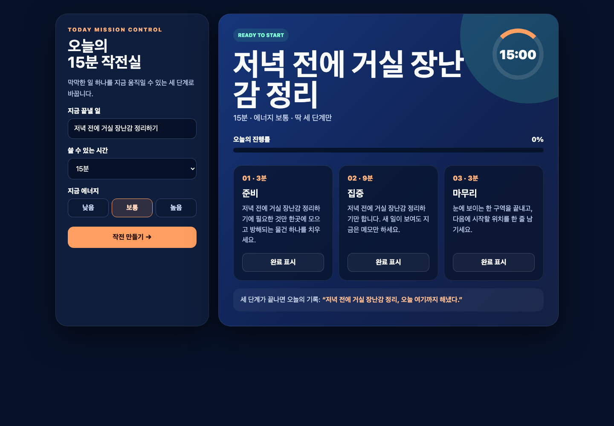
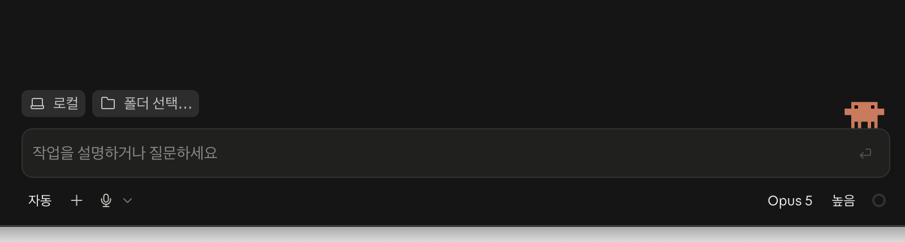

# Day 5 — Code로 `오늘의 작전실` 만들기

오늘은 Claude Desktop의 **Code**를 사용해 실제로 눌러 쓰는 웹 도구를 만듭니다. 코드를 외우는 수업이 아닙니다. Claude에게 원하는 동작을 설명하고, 내가 파일 변경을 확인하고, 브라우저에서 끝까지 눌러 보는 수업입니다.

## 오늘 완성할 것



[완성 예시 직접 눌러 보기](day05-assets/completed-example/index.html)

[먼저 한 장으로 전체 순서 보기](Day05_미니자동화.md) — 수업 중 길을 잃었을 때 이 실행표로 돌아옵니다. 같은 실행표가 시작 ZIP의 `QUICK_GUIDE.md`에도 들어 있습니다.

`오늘의 15분 작전실`은 다음처럼 작동합니다.

1. 할 일, 쓸 수 있는 시간, 현재 에너지를 입력합니다.
2. **작전 만들기**를 누르면 `준비 → 집중 → 마무리`가 나옵니다.
3. 단계별 **완료 표시**를 누르면 진행률이 `0% → 33% → 67% → 100%`로 바뀝니다.
4. 휴대폰 폭에서도 입력과 버튼이 화면 밖으로 나가지 않습니다.

육아 중인 생활자의 `저녁 장난감 정리`를 기본 예로 씁니다. 완성 뒤에는 본인의 생활·취미·업무 주제로 바꿉니다.

## 오늘의 학습 흐름

| 흐름 | 배우는 기능 | 눈에 보이는 성공 |
|---|---|---|
| 기능 공부 | Code, 폴더, 계획 모드, 수동 모드, Diff, Preview | 계획과 실행을 나눠 승인한다 |
| 쉬운 연습 | HTML 파일 한 장 생성 | 내 이름이 큰 화면으로 열린다 |
| 완성 실습 | 입력·선택·버튼·진행률 | 작전실이 실제로 움직인다 |
| 응용 | 문구·대상·색·기능 변경 | 내 주제의 도구가 된다 |
| 재사용 | `CLAUDE.md` | 새 채팅에서도 규칙이 유지된다 |

왕초보 기준 약 3시간 30분입니다. API 키, Terminal, 설치 프로그램은 필요 없습니다.

## 0. Code 화면에서 무엇을 찾나요?



| 이름 | 쉬운 뜻 | 오늘 하는 일 |
|---|---|---|
| Code | 폴더의 파일을 만들고 고치는 작업 공간 | HTML 웹 도구 만들기 |
| 로컬 | 내 컴퓨터 안에서 작업 | 오늘 폴더 선택 |
| 수동 | 바꾸기 전에 내 허락을 받는 모드 | 왕초보 기본값 |
| 계획(Plan) | 파일을 건드리지 않고 방법부터 정하는 모드 | 큰 실습의 설계 먼저 확인 |
| Diff | 바꾸기 전과 후를 비교하는 화면 | 예상 파일만 바뀌는지 확인 |
| Preview/브라우저 | 완성 화면을 직접 누르는 곳 | 버튼 네 가지 검수 |

Effort는 Claude가 문제를 얼마나 깊게 살펴볼지 정합니다. 오늘은 **높음(High)**이 보이면 높음, 메뉴가 없으면 기본값을 사용합니다.

## 1. 시작 폴더 준비

1. [Day 5 시작 자료 ZIP](downloads/day05-start.zip)을 받습니다.
2. 압축을 풀고 폴더 이름을 `Day05_Code_닉네임`으로 바꿉니다.
3. 안에 `my-info.txt`, `completed-example`, `QUICK_GUIDE.md`가 있으면 성공입니다.
4. Claude Desktop에서 **Code → 로컬 → 폴더 선택**을 누르고 이 폴더를 엽니다.
5. 권한 모드를 **수동**으로 둡니다.

첫 메시지:

```text
파일을 바꾸지 말고, 지금 열린 폴더의 이름과 보이는 파일만 알려 주세요.
오늘 폴더 밖은 읽거나 수정하지 마세요.
```

`my-info.txt`가 답에 나오면 폴더 선택에 성공했습니다.

## 2. 쉬운 성공 — 내 첫 화면

```text
이 폴더에 hello.html 하나를 만들어 주세요.
화면 가운데에 '[닉네임]님의 첫 Code 화면'이라는 아주 큰 제목과
'내가 설명하고 Claude가 만들었습니다'라는 문장을 보여 주세요.
코발트블루 배경과 살구색 버튼을 사용하세요.
외부 이미지, 설치, API는 사용하지 마세요.
먼저 바꿀 파일이 hello.html 하나인지 알려 주고 내 승인을 기다리세요.
```

Diff에서 `hello.html` 하나만 추가되는지 보고 승인합니다. 파일을 눌러 Preview에서 큰 제목이 보이면 첫 성공입니다.

## 3. 내 정보 다섯 줄 바꾸기

`my-info.txt`를 열고 기본값을 확인합니다. 처음에는 그대로 실행해도 됩니다. 내 것으로 바꿀 사람은 다음을 보냅니다.

```text
my-info.txt의 콜론 오른쪽만 내 내용으로 바꿔 주세요.

도구 이름: [예: 퇴직 준비 30분 작전실]
사용할 사람: [예: 은퇴를 앞두고 기록 정리를 미루는 50대]
안내 문장: [예: 오늘 정리할 경력 기록 하나를 적으세요.]
기본 예시: [예: 지난 프로젝트 성과 세 줄 적기]
주색: [예: 짙은 녹색과 금색]

왼쪽 항목 이름은 유지하고 변경 전후를 먼저 보여 주세요.
```

## 4. 화끈한 완성 — 작전실 만들기

먼저 입력창 아래의 모드 단추를 눌러 **계획(Plan)**으로 바꿉니다. 계획 모드에서는 아직 파일을 만들지 않고, 무엇을 만들지 먼저 확인합니다. 아래 프롬프트는 줄이지 말고 한 번에 붙여넣습니다.

```text
@my-info.txt를 읽고 index.html 하나로 작동하는 '오늘의 작전실'을 만들어 주세요.

[화면]
- 왼쪽에는 할 일 입력, 시간 15/30/45분 선택, 에너지 낮음/보통/높음 선택을 둡니다.
- 오른쪽에는 큰 작전 제목, 시간 배지, 진행률, 세 단계 카드를 보여 줍니다.
- my-info.txt의 제목, 대상, 안내 문장, 기본 예시, 주색을 반영합니다.
- 휴대폰에서는 위아래 한 줄로 배치하고 글자와 버튼을 크게 유지합니다.

[동작]
- '작전 만들기'를 누르면 입력한 일을 준비·집중·마무리 세 단계로 나눕니다.
- 선택한 전체 시간을 세 단계에 나누어 각 카드에 분 수를 표시합니다.
- 단계별 '완료 표시'를 누르면 카드 모양과 진행률이 바뀝니다.
- 빈 할 일로 누르면 먼저 입력하라는 안내와 입력 위치를 보여 줍니다.
- 다시 입력하고 작전 만들기를 누르면 이전 완료 표시를 0%로 초기화합니다.

[안전과 완료 기준]
- index.html 하나만 만들고 설치, API, 인터넷 연결을 사용하지 않습니다.
- hello.html, my-info.txt, completed-example은 수정하거나 삭제하지 않습니다.
- 지금은 계획 모드이므로 화면 구성과 바꿀 파일을 다섯 줄로 설명하고 멈춥니다.
- 아직 파일을 만들거나 수정하지 않습니다.
- 내가 계획을 승인하고 수동 모드로 바꾼 뒤 만들고, Preview에서 빈 입력, 새 작전, 완료 3회, 휴대폰 폭을 직접 점검합니다.
- 점검 결과를 통과/수정 필요 표로 알려 주세요.
```

계획에 `index.html 하나 생성`, 설치 없음, 기존 파일 보존이 보이면 성공입니다. 이제 모드 단추를 다시 눌러 **수동(Ask permissions)**으로 바꾼 뒤 보냅니다.

```text
방금 계획을 승인합니다. 이제 계획대로 index.html을 만들고 검수해 주세요.
파일을 만들기 전 승인 창을 보여 주세요.
```

승인 창과 Diff에 `index.html` 하나만 보이는지 확인하고 허용합니다. 이 동선으로 **계획 모드 → 계획 확인 → 수동 모드 → 파일 승인 → 실행**을 실제로 한 번씩 사용했습니다.

## 5. 내가 직접 누르는 네 가지 검수

| 번호 | 내가 누를 것 | 합격 화면 |
|---|---|---|
| 1 | 할 일을 지우고 작전 만들기 | 쉬운 입력 안내가 나온다 |
| 2 | 새 할 일 + 30분 + 에너지 낮음 | 제목과 `30분 · 에너지 낮음`이 나온다 |
| 3 | 완료 표시 세 번 | 진행률이 100%가 된다 |
| 4 | 창 폭을 휴대폰처럼 줄이기 | 카드가 세로로 정렬되고 잘리지 않는다 |

작동하지 않으면 코드를 직접 고치지 말고 보이는 현상을 말합니다.

```text
index.html에서 [누른 것]을 했는데 [실제로 보인 것]이 나옵니다.
기존 파일을 삭제하지 말고 원인을 한 줄로 설명한 뒤 최소한만 고쳐 주세요.
수정 뒤 같은 동작을 다시 확인해 주세요.
```

## 6. 응용 — 완전히 다른 사람의 도구로 변신

아래 중 하나를 골라 한 번에 적용합니다.

### A. 육아 중 생활자

```text
이 도구를 '저녁 20분 집 리셋'으로 바꿔 주세요.
기본 할 일은 '아이 재운 뒤 주방 조리대 비우기', 말투는 다정하고 짧게,
주색은 따뜻한 크림색과 주황색으로 바꿉니다. 기능과 모바일 배치는 유지하세요.
```

### B. 은퇴를 앞둔 50대

```text
이 도구를 '두 번째 커리어 30분 작전실'로 바꿔 주세요.
기본 할 일은 '지난 경력에서 잘한 일 세 가지 적기', 말투는 차분하고 단단하게,
주색은 짙은 녹색과 금색으로 바꿉니다. 기능과 모바일 배치는 유지하세요.
```

바뀐 제목·대상·색이 한눈에 다르고 버튼은 그대로 작동해야 합니다.

## 7. 다음 채팅도 기억할 `CLAUDE.md`

```text
@my-info.txt와 index.html을 읽고 프로젝트 루트에 CLAUDE.md를 만들어 주세요.
대상과 목표, 말투, 색, 세 단계 결과, 모바일 규칙, 개인정보 금지,
외부 설치 금지, 변경 전 계획 확인을 포함하세요.
먼저 내용을 보여 주고 승인 뒤 CLAUDE.md 하나만 만드세요.
```

새 Code 채팅을 열고 다음으로 기억을 확인합니다.

```text
이 프로젝트의 도구 이름, 사용할 사람, 반드시 유지할 기능 세 가지만 알려 주세요.
파일은 바꾸지 마세요.
```

## 오픈카톡 인증 — 30초

📸 **인증 캡처:** 완성된 「오늘의 작전실」 화면 1장

```text
[왕초보2기 Day 5 / 닉네임]
✅ 오늘의 작전실 완성
✅ 창을 줄여 휴대폰 폭 확인
💬 소감:
```

## 최종 합격표

- [ ] 수동 모드에서 오늘 폴더만 열었다.
- [ ] 계획 모드에서 큰 실습의 파일과 순서를 먼저 확인했다.
- [ ] Diff에서 예상한 파일만 승인했다.
- [ ] 세 입력에 따라 결과가 바뀐다.
- [ ] 완료 표시 세 번 뒤 100%가 보인다.
- [ ] 휴대폰 폭에서도 잘리지 않는다.
- [ ] 내 제목·대상·색으로 바꿨다.
- [ ] `CLAUDE.md`를 만들고 새 채팅에서 기억을 확인했다.
- [ ] 개인정보·API 키·남의 저작물이 없다.

## 막혔을 때

| 증상 | 가장 쉬운 복구 |
|---|---|
| Code 또는 로컬이 안 보임 | 앱 업데이트와 로그인 상태 확인 |
| 낯선 폴더 권한이 나옴 | 거절하고 `Day05_Code_닉네임`을 다시 선택 |
| Preview가 하얗게 보임 | Preview를 닫고 `index.html`을 다시 선택 |
| 예전 화면이 보임 | Preview 새로고침 |
| 완료를 눌러도 안 바뀜 | 보이는 현상을 복구 프롬프트에 그대로 적기 |
| 설치·삭제 명령이 나옴 | 거절; 오늘 결과에는 필요 없음 |

## 공식 참고

- [Claude Code Desktop 공식 가이드](https://code.claude.com/docs/en/desktop)
- [Claude Desktop 다운로드](https://claude.com/download)
