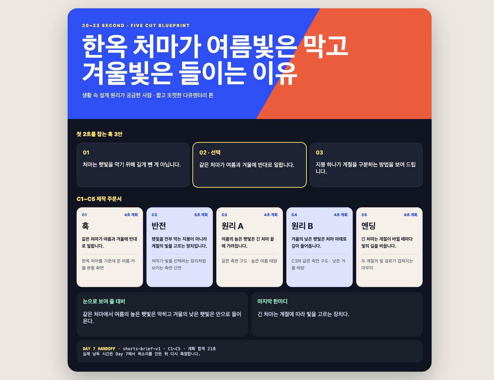

# Day 6 — Skill로 `20~23초 숏츠 주문서` 반복 만들기

오늘은 Claude Desktop의 **Skill**을 직접 실행합니다. 눈으로 보여 줄 주제 하나를 넣으면 `훅 3안 + 5문장·5컷 + 화면 주문서`가 같은 형식으로 완성됩니다. 오늘 만든 `brief.json`은 Day 7에서 그대로 읽어 실제 MP4 제작을 시작합니다.

커넥터는 선택입니다. Drive나 Notion에 공개 가능한 아이디어가 있으면 읽기 전용으로 한 건만 가져옵니다. 연결하지 않아도 제공 자료로 전원 완주할 수 있습니다.

## 오늘 완성할 것



[완성 주문서 크게 보기](day06-assets/output/shorts-brief.html) · [설치 없는 주문서 랩 직접 눌러 보기](day06-assets/shorts-brief-maker.html)

[먼저 한 장으로 전체 순서 보기](Day06_나만의스킬.md) — 같은 실행표가 시작 ZIP의 `QUICK_GUIDE.md`에도 들어 있습니다.

- 첫 1~2초용 훅 3안
- `훅 → 반전 → 원리 A → 원리 B → 엔딩` 5컷
- 컷마다 한 문장, 계획상 전체 20~23초
- 각 컷에서 보여 줄 화면과 자막
- Day 7 전달 파일 `input/brief.json` + `output/shorts-brief.html`

> 오늘 적는 초는 **기획 시간**입니다. 실제 낭독 시간은 Day 7에서 목소리를 만든 뒤 자동으로 다시 측정합니다. 각 문장이 실제로 5초를 넘으면 그 문장만 줄입니다.

## 오늘의 학습 흐름

| 흐름 | 배우는 기능 | 눈에 보이는 성공 |
|---|---|---|
| 기능 공부 | Skill·커넥터·`CLAUDE.md` 차이 | 규칙·절차·외부 자료를 구분 |
| 쉬운 연습 | 완성 랩의 주제 한 줄 변경 | 훅과 5컷이 즉시 바뀜 |
| 완성 실습 | `/shorts-brief` 실행 | Day 7용 주문서 두 파일 완성 |
| 응용 | Skill 검사 규칙 하나 추가 | 새 채팅에서도 같은 검사 반복 |
| 연결 | `brief.json` 전달 검사 | Day 7이 읽을 5문장 확인 |

왕초보 기준 약 3시간입니다. API 키, Python, Terminal은 필요 없습니다.

## 0. 기능은 각각 무엇인가요?


| 기능 | 쉬운 뜻 | 오늘 하는 일 |
|---|---|---|
| `CLAUDE.md` | 이 폴더에서 늘 지킬 말투·안전 규칙 | ZIP에 든 기본 규칙 먼저 읽기 |
| Skill | 필요할 때 `/이름`으로 부르는 작업 순서 | 5컷 주문서 반복 생성 |
| 커넥터 | Drive·Notion 같은 외부 자료 연결 | 아이디어 한 건 읽기(선택) |
| 수동(Ask permissions) | 파일을 바꾸기 전 내가 확인 | 예상한 두 파일만 승인 |
| Preview/브라우저 | 결과를 실제 화면으로 보는 곳 | 글자·모바일 폭 검수 |

**한 줄 구분:** `CLAUDE.md`는 늘 지키는 규칙, Skill은 불러서 실행하는 절차, 커넥터는 내 폴더 밖 자료로 가는 통로입니다.

## 1. 시작 폴더 열기

1. [Day 6 시작 자료 ZIP](downloads/day06-start.zip)을 받습니다.
2. 압축을 풀고 생긴 `day06-assets` 폴더 이름을 `Day06_Skill_닉네임`으로 바꿉니다.
3. 안에 `CLAUDE.md`, `shorts-brief-maker.html`, `sample-memory.txt`, `input`, `output`, `QUICK_GUIDE.md`가 있는지 봅니다.
4. Claude Desktop에서 **Code → 로컬 → 폴더 선택**으로 이 폴더를 엽니다.
5. 권한은 **수동(Ask permissions)**, Effort는 **높음(High)**이 보이면 높음으로 둡니다.

Mac에서 `.claude` 폴더가 안 보이는 것은 정상입니다. 이름 앞의 점 때문에 숨겨진 것입니다. ZIP 안에 이미 들어 있으므로 직접 만들 필요가 없습니다.

첫 메시지를 보냅니다.

```text
파일을 바꾸지 말고 지금 열린 폴더의 이름과 보이는 파일만 알려 주세요.
.claude/skills/shorts-brief/SKILL.md를 읽기 전에 CLAUDE.md의 말투·안전 규칙 세 가지를 알려 주세요.
.claude/skills/shorts-brief/SKILL.md가 있는지도 읽기 전용으로 확인해 주세요.
오늘 폴더 밖은 읽거나 수정하지 마세요.
```

폴더 이름, `shorts-brief`, `개인정보·과장 금지`가 보이면 성공입니다. 이로써 Day 5에서 배운 `CLAUDE.md`가 Skill보다 먼저 적용되는 것도 확인했습니다.

## 2. 쉬운 성공 — 완성 주문서를 먼저 움직이기

1. Finder 또는 파일 탐색기에서 `shorts-brief-maker.html`을 두 번 누릅니다.
2. 왼쪽의 **작은 연습 · 얼음 예시 한 번에 넣기**를 누릅니다.
3. 제목·대비·마지막 한마디와 오른쪽 5컷이 함께 얼음 이야기로 바뀌면 성공입니다.
4. 원하는 문장을 한 줄 고친 뒤 **5컷 주문서 만들기**를 눌러 한 번 더 바꿉니다.
5. **Day 7용 JSON 받기**와 **완성 HTML 받기**를 각각 한 번 눌러 두 파일이 내려오는지 확인합니다.

이 단계는 Skill을 쓰기 전에 최종 결과와 전달 파일을 손으로 확인하는 작은 성공입니다. 다운로드한 연습 파일은 지워도 되며, 실제 제출 파일은 다음 단계에서 Skill이 폴더 안에 만듭니다.

## 3. Skill을 직접 부르기

Code 입력창에 `/`를 입력합니다. 목록에서 `shorts-brief`를 골라 아래처럼 보냅니다.

```text
/shorts-brief
주제: 한옥 처마가 여름빛은 막고 겨울빛은 들이는 이유
대상: 생활 속 설계 원리가 궁금한 사람
눈으로 보여 줄 대비: 같은 처마에서 여름의 높은 햇빛은 막히고 겨울의 낮은 햇빛은 안으로 들어온다
마지막 한마디: 긴 처마는 햇빛을 전부 막는 지붕이 아니라 계절에 따라 빛을 고르는 장치다
말투: 짧고 또렷한 다큐멘터리 톤
```

Skill이 파일을 만들기 전에 먼저 보여 줘야 하는 것:

- 훅 3안과 추천 훅 1개
- `C1 훅 → C2 반전 → C3 원리 A → C4 원리 B → C5 엔딩`
- 컷마다 한 문장과 보여 줄 화면
- 계획상 전체 20~23초, 컷당 5초 이하
- 바꿀 파일 `input/brief.json`, `output/shorts-brief.html`

내용이 이해되고 C3·C4에서 **같은 구도에 조건 하나만 달라지는지** 봅니다. 맞으면 다음처럼 승인합니다.

```text
추천 훅으로 진행해 주세요. input/brief.json과 output/shorts-brief.html 두 파일만 만들고, 다른 파일은 바꾸지 마세요.
```

Diff 또는 변경 목록에 두 파일만 보이는지 확인한 뒤 승인합니다.

## 4. 브라우저와 JSON을 실제 검수

`output/shorts-brief.html`을 Preview 또는 브라우저로 엽니다.

| 검수 | 합격 기준 |
|---|---|
| 제목 | 2초 안에 무슨 주제인지 보인다 |
| 훅 | 서로 다른 3개와 선택한 훅이 있다 |
| 구조 | C1부터 C5가 빠짐없이 한 번씩 있다 |
| 문장 | 컷마다 내레이션 한 문장이다 |
| 비교 | C3·C4는 같은 구도에서 조건 하나만 다르다 |
| 모바일 | 창을 좁히면 카드가 세로로 놓인다 |
| 개인정보 | 실명·연락처·직장명·API 키가 없다 |

이어서 Claude에게 JSON을 읽기 전용으로 검사하게 합니다.

```text
input/brief.json을 수정하지 말고 검사해 주세요.
schema_version이 shorts-brief-v1인지,
scenes가 C1부터 C5까지 정확히 5개인지,
각 scene에 id, role, narration, visual, planned_seconds가 있는지 표로 보여 주세요.
planned_seconds 합계가 20~23인지도 알려 주세요.
```

하나라도 틀리면 다음처럼 요청합니다.

```text
방금 검사에서 실패한 항목만 고쳐 주세요.
input/brief.json과 output/shorts-brief.html의 내용이 서로 같아야 합니다.
다른 파일은 바꾸지 말고 같은 검사를 다시 해 주세요.
```

## 5. 내 주제로 바꾸기

눈으로 비교할 수 있는 주제를 고릅니다. 아래 예시를 그대로 써도 됩니다.

### A. 육아 중 생활자

```text
/shorts-brief
주제: 장난감 정리가 매일 무너지는 이유
대상: 아이를 재운 뒤 정리할 힘이 없는 사람
눈으로 보여 줄 대비: 큰 상자 하나에 모두 넣으면 다시 섞이고, 놀이별 작은 바구니 세 개로 나누면 아이도 제자리에 넣는다
마지막 한마디: 더 많이 치우는 것보다 돌아갈 자리를 작게 나누는 게 먼저다
말투: 다정하고 현실적으로
```

### B. 은퇴를 앞둔 50대

```text
/shorts-brief
주제: 직함만 적으면 내 경력이 보이지 않는 이유
대상: 퇴직 뒤 무엇을 할지 막막한 50대 직장인
눈으로 보여 줄 대비: 회사 직함만 적은 종이는 비어 보이고, 해결한 문제를 카드로 펼치면 반복해 온 능력이 보인다
마지막 한마디: 경력은 회사 이름보다 내가 반복해서 해결한 문제에 남는다
말투: 짧고 단단하게
```

두 번째 실행에서는 첫 결과와 **주제·훅·5문장·화면**이 확실히 달라야 합니다.

## 6. Skill 검사 규칙 하나 바꾸고 새 채팅 시험

```text
.claude/skills/shorts-brief/SKILL.md의 완료 검사에
'각 visual에는 화면 속 글자·간판·라벨을 만들지 않는다고 적혀 있는지 확인한다'를 추가해 주세요.
추가할 위치와 문장을 먼저 보여 주고 승인 뒤 이 파일 하나만 수정하세요.
```

새 Code 채팅을 연 뒤 `/shorts-brief`를 다시 실행합니다. 이전 대화를 기억해서가 아니라 Skill 파일의 새 규칙을 읽어 화면 속 글자 금지를 검사하면 성공입니다.

## 7. 선택 — 커넥터에서 아이디어 한 건만 가져오기

커넥터를 이미 쓰는 사람만 합니다.

1. Code 입력창 옆 **+**를 눌러 **커넥터**를 찾습니다. 앱 버전에 따라 위치나 이름이 조금 다를 수 있습니다.
2. Google Drive 또는 Notion 하나를 연결하고 요청 권한을 읽습니다.
3. 회사·고객 계정이나 공개하면 안 되는 자료는 연결하지 않습니다.
4. 다음을 보냅니다.

```text
연결된 [Google Drive 또는 Notion]에서 제목에 [검색어]가 들어간 내 메모를 찾으세요.
읽기 전용입니다. 수정·공유·삭제하지 마세요.
후보는 제목만 보여 주고 내 선택을 기다리세요.
선택한 한 건에서 공개 가능한 '주제 한 줄, 눈으로 보일 대비 한 줄'만 connector-note.md에 적으세요.
실명, 연락처, 직장명, 원문 문단은 복사하지 마세요.
```

연결하지 않는 사람은 `sample-memory.txt`를 사용하면 기본 완주입니다. 커넥터 연결 여부는 점수에 영향을 주지 않습니다.

## 8. Day 7에 넘길 폴더 만들기

1. 오늘 폴더 안에 `day06-handoff`라는 새 폴더를 만듭니다.
2. `input/brief.json`을 그 안에 복사하고 이름을 `brief.json`으로 둡니다.
3. `output/shorts-brief.html`도 같은 폴더에 복사합니다.
4. 두 파일을 직접 열어 제목이 같은지 확인합니다.
5. Day 7 시작 패키지를 풀면 이 `day06-handoff` 폴더를 `day07-start` 폴더 안으로 그대로 옮깁니다.

> Day 7은 `brief.json`의 C1~C5 내레이션을 읽어 `my-short/script.txt`를 만듭니다. HTML은 사람이 기획을 눈으로 비교하는 확인본입니다. 어느 파일도 다시 타이핑하지 않습니다.

## 오픈카톡 인증 — 30초

📸 **인증 캡처:** 완성된 숏츠 주문서 화면 1장

```text
[왕초보2기 Day 6 / 닉네임]
✅ 20~23초·5컷 숏츠 주문서 완성
💬 소감:
```

## 최종 합격표

- [ ] Skill·커넥터·`CLAUDE.md`의 차이를 말할 수 있다.
- [ ] `/shorts-brief`를 직접 골라 실행했다.
- [ ] 훅 3개와 C1~C5가 내 주제로 나왔다.
- [ ] `brief.json`의 구조와 20~23초 합계를 검사했다.
- [ ] 브라우저와 모바일 폭을 직접 확인했다.
- [ ] Skill 검사 규칙 하나를 바꾸고 새 채팅에서 시험했다.
- [ ] `day06-handoff` 안에 두 파일을 준비했다.
- [ ] 개인정보, API 키, 타인의 원문이 없다.

## 막혔을 때

| 증상 | 한 번만 할 조치 |
|---|---|
| `/shorts-brief`가 안 보임 | 같은 폴더인지 확인하고 새 Code 채팅 열기 |
| 숨김 폴더가 안 보임 | 정상; ZIP에 포함되어 있으므로 직접 만들지 않기 |
| Skill이 설명만 함 | `제안 확인 뒤 실제 두 파일을 만들어 주세요`라고 요청 |
| JSON에 scenes가 없음 | `shorts-brief-v1 구조로 C1~C5를 넣어 다시 검사해 주세요` 요청 |
| HTML과 JSON 내용이 다름 | 두 파일 제목·내레이션 일치 검사를 요청 |
| 커넥터 메뉴가 없음 | `sample-memory.txt`로 기본 완주 |
| 긴 글자가 잘림 | 해당 컷과 화면 폭을 알려 최소 수정 요청 |

## 공식 참고

- [Claude Code Desktop 공식 문서](https://code.claude.com/docs/en/desktop)
- [Claude Code Skills 공식 문서](https://code.claude.com/docs/en/slash-commands)
- [Claude Code 기능 개요](https://code.claude.com/docs/en/features-overview)
