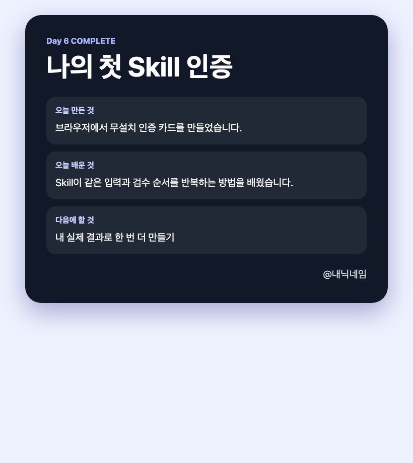

# Day 6 — 내 일을 기억하는 스킬 + 자료를 가져오는 커넥터

오늘은 긴 프롬프트를 외우지 않습니다. 제공된 **스킬(Skill)을 한 번 실행해 눈에 보이는 인증 카드**를 만들고, 원하면 커넥터(Connector)로 내 자료 하나를 읽습니다.

## 오늘 한눈에 보기

**다섯 칸 입력 → 카드 미리보기 → `/openchat-proof`로 같은 카드 다시 만들기 → 선택 커넥터**

먼저 설치 없는 `card-maker.html`로 카드를 만들어 작은 성공을 확인합니다. 그다음 스킬이 같은 순서를 기억해 다시 만드는지 시험합니다. 커넥터는 마지막 선택 실습입니다.

> **오늘의 필수 결과는 내 인증 카드입니다.** 커넥터 연결은 계정 상태에 따라 선택합니다. 스킬에 비밀번호나 API 키를 쓰지 않습니다.

## 기능과 정확한 위치

| 기능 | 쉬운 뜻 | Claude Desktop에서 찾는 곳 |
|---|---|---|
| 스킬(Skill) | 다시 부를 수 있는 작업 설명서 | Code 입력창에서 `/`, 또는 입력창 옆 **`+ → 슬래시 명령`** |
| 커넥터(Connector) | Drive·Notion 같은 외부 서비스 연결 | **Code 로컬 세션** 입력창 옆 **`+ → 커넥터`** |
| 수동(Manual) | 파일 변경·명령 전에 내가 확인 | 입력창 왼쪽 아래의 현재 모드(처음에는 `자동`일 수 있음)를 눌러 **수동** 선택 |
| 브라우저(Browser) | HTML 결과를 실제로 누르고 보는 창 | 채팅의 HTML 파일 경로 클릭, 또는 **`보기 → 브라우저`** |
| 새 세션 | 이전 대화 없이 스킬이 작동하는지 시험 | Mac `Cmd+N`, Windows `Ctrl+N`, 또는 새 세션 버튼 |

## 교재에 넣을 화면 캡처 목록

아래 이미지는 현재 실제 Claude Desktop 화면입니다. `① Code`, `② 로컬`, `③ 폴더 선택…`, `④ 자동을 눌러 수동 선택` 순서로 찾습니다.


그다음 클릭 순서는 다음과 같다.

1. 스킬: 입력창 옆 `+` → **슬래시 명령** → `openchat-proof`.
2. 커넥터: 입력창 옆 `+` → **커넥터** → Google Drive 또는 Notion.
3. 변경 확인: 변경 대상이 `input/result.json`과 `output/proof-card.html` 두 파일인지 확인 → 승인 또는 거절.
4. 결과 확인: 채팅의 `output/proof-card.html` 경로 클릭 → 브라우저 창.

스킬·커넥터·승인·결과 화면의 추가 캡처는 운영자가 개강 직전 실제 수강생 계정으로 찍습니다. 촬영 전까지 존재하지 않는 이미지를 교재에서 불러오지 않습니다.

## 오늘 끝나면 남는 것



[완성 예시 인증 카드를 큰 화면으로 열기](day06-assets/output/proof-card.html)

- `output/proof-card.html`과 휴대폰 캡처 1장
- 내 프로젝트의 `.claude/skills/openchat-proof/SKILL.md`
- 커넥터에서 읽은 자료의 `제목 + 서비스 이름 + 내가 쓸 점 1줄`
- 내 인증 카드 화면 캡처 1장
- 선택 보너스: `/openchat-proof` 실행부터 결과 확인까지 30초 영상

커넥터 연결이 계정 정책 때문에 안 되면 **스킬 결과물까지가 기본 완주**입니다. 연결 성공은 별도 배지로 표시합니다.

## 3시간 시간표

| 순서 | 시간 | 하는 일 | 눈에 보이는 성공 |
|---|---:|---|---|
| 기능 이해 | 20분 | 스킬과 커넥터 차이 보기 | 어느 쪽이 절차이고 어느 쪽이 연결인지 말한다 |
| 작은 결과 | 30분 | 기준 입력으로 카드 만들기 | 브라우저에 샘플 카드가 열린다 |
| 메인 결과 | 60분 | `/openchat-proof`로 내 카드 만들기 | 내 내용의 HTML이 생긴다 |
| 선택 커넥터 | 35분 | 내 자료 하나를 읽어 출처 메모 만들기 | 제목·서비스·활용점이 기록된다 |
| 자기 응용 | 20분 | 스킬의 질문/완료 조건 하나 바꾸기 | 새 세션에서도 바뀐 순서를 따른다 |
| 검수·인증 | 15분 | 개인정보 확인 후 카드 캡처 | 오픈카톡에 바로 올릴 수 있다 |

## 시작 전 확인

1. [Day 6 시작 자료 ZIP을 받는다](downloads/day06-start.zip). 압축을 풀고 `day06-assets` 폴더 이름을 `day06-닉네임`으로 바꾼다.
2. Claude Desktop을 최신 버전으로 업데이트한다. Mac은 **Claude → Check for Updates**, Windows는 **Help → Check for Updates**다.
3. Day 5 폴더에서 `index.html`, `my-info.txt`, `CLAUDE.md` 세 파일만 `day06-닉네임` 안으로 복사합니다. 자세한 방법은 바로 아래에 있습니다.
4. Mac Finder에서는 이름이 점으로 시작하는 `.claude` 폴더가 숨겨져 보이지 않을 수 있다. ZIP 안에 이미 들어 있으므로 새로 만들거나 옮길 필요가 없다.
5. Claude Desktop의 **Code → 로컬 → 폴더 선택…**에서 복사본을 엽니다.
6. 화면 아래의 `자동` 또는 현재 모드 이름을 눌러 **수동**을 고릅니다.
7. Windows에서 Code가 처음 열리지 않으면 [Git for Windows](https://git-scm.com/download/win)를 설치하고 Claude 앱을 완전히 종료한 뒤 다시 엽니다.

### Day 5 파일 세 개를 복사하는 방법

**Mac:** Finder에서 Day 5 폴더와 `day06-닉네임` 폴더를 각각 엽니다. Day 5 폴더에서 `Command`를 누른 채 파일 세 개를 선택하고 `Command+C`를 누릅니다. `day06-닉네임`의 빈 곳을 누르고 `Command+V`를 누릅니다.

**Windows:** 파일 탐색기에서 두 폴더를 각각 엽니다. Day 5 폴더에서 `Ctrl`을 누른 채 파일 세 개를 선택하고 `Ctrl+C`를 누릅니다. `day06-닉네임`의 빈 곳을 누르고 `Ctrl+V`를 누릅니다.

**이렇게 되면 성공:** `day06-닉네임`의 첫 화면에 `index.html`, `my-info.txt`, `CLAUDE.md`, `card-maker.html`이 함께 보입니다.

`CLAUDE.md`에는 Day 5 웹 도구의 이름, 대상, 말투, 금지 사항이 들어 있어야 합니다. 없으면 Day 5 보충 안내를 받고 먼저 만듭니다. Day 6 스킬은 이 파일을 읽어 전날 기준을 유지합니다.

## 1. 기능 이해 — 20분

| 기능 | 쉬운 뜻 | 오늘 하는 행동 |
|---|---|---|
| `CLAUDE.md` | Day 5 웹 도구의 대상·말투·금지 사항 | 전날 만든 기준을 스킬 결과에도 유지한다 |
| 스킬 | 필요할 때 부르는 작업 순서 | `/openchat-proof`로 카드를 만든다 |
| 커넥터 | 외부 자료를 읽거나 작업하는 연결 | Drive/Notion에서 공개 가능한 자료 하나를 읽는다 |

프로젝트 스킬은 `.claude/skills/<이름>/SKILL.md`에 있습니다. 이 경로는 외울 필요가 없습니다. 입력창에서 `/`를 입력하거나 `+ → 슬래시 명령`에서 실행합니다.

## 2. 작은 결과 — 설치 없는 브라우저 카드 1장

Python과 Terminal은 필요 없다.

1. Finder 또는 파일 탐색기에서 `card-maker.html`을 두 번 눌러 브라우저로 연다.
2. 닉네임, 카드 제목, 오늘 만든 것, 오늘 배운 것, 다음에 할 것 **다섯 칸을 모두** 내 내용으로 바꾼다.
3. **미리보기 반영**을 누른다.
4. 오른쪽 카드에 내 닉네임과 네 문장이 보이는지 확인한다.
5. **proof-card.html 다운로드**를 누른다.
6. 다운로드 폴더의 `proof-card.html`을 오늘 프로젝트의 `output` 폴더로 옮긴다. 같은 이름이 있으면 기존 예시 파일을 덮어써도 된다.
7. 옮긴 파일을 두 번 눌러 내 내용이 그대로 보이는지 다시 확인한다.

**성공 화면:** 검은 카드에 `Day 6 COMPLETE`, 내 카드 제목, 세 내용, 내 닉네임이 보인다. `내닉네임`이나 `고래` 같은 샘플 문구가 남으면 완료가 아니다.

Python이 이미 있는 사람은 `scripts/build_card.py`를 선택 심화로 실행해도 된다. 기본 완주에는 설치도 Terminal도 필요 없다.

## 3. 메인 결과 — 스킬을 직접 실행

1. 입력창에 `/`를 쓴다.
2. `openchat-proof`를 선택한다. 안 보이면 같은 프로젝트 폴더인지 확인하고 새 Code 세션을 연다.
3. 아래 한 줄에서 대괄호 다섯 곳을 모두 바꾼다.

```text
/openchat-proof 닉네임: [내 카톡 닉네임], 카드 제목: [나의 첫 스킬 인증], 오늘 만든 것: [AI 초보자용 웹 도구], 오늘 배운 것: [다섯 입력을 같은 순서로 검수하는 법], 다음에 할 것: [내 강의 주제로 한 번 더 실행]
```

4. 스킬이 다섯 입력과 `input/result.json`, `output/proof-card.html` 변경 계획을 보여 주면 실제 내 말과 같은지 봅니다.
5. 허용 화면에는 오늘 폴더 안의 위 두 파일만 있는지 확인한다.
6. 변경을 허용한다. 기본 과정에서는 Terminal 명령이나 Python 실행 요청이 나오면 거절한다.
7. `output/proof-card.html`을 브라우저 창에서 엽니다.
8. Claude에게 다음을 보낸다.

```text
브라우저에서 proof-card.html을 직접 확인해 주세요. 제목, 닉네임, 세 내용이 input/result.json과 같은지 검사하고, 화면이 휴대폰 폭에서도 읽히는지 확인해 주세요. 문제가 있으면 최소 변경으로 고친 뒤 다시 확인해 주세요.
```

이 단계의 핵심은 Claude가 파일만 만들고 “됐습니다”라고 말하는 데서 끝내지 않고, 브라우저에서 실제 화면을 검사하는 것입니다.

## 4. 선택 — 커넥터로 내 자료 하나만 안전하게 읽기

### 연결

1. **로컬 세션**인지 확인합니다. 클라우드/원격 세션에서는 `+` 커넥터 메뉴가 보이지 않을 수 있습니다.
2. 입력창 옆 `+` → **커넥터**를 누릅니다.
3. 자신이 이미 쓰는 서비스 하나만 고른다. 권장 순서는 Google Drive 또는 Notion이다.
4. 로그인 화면에서 요청 권한을 읽는다. 수업용이 아닌 회사·고객 계정은 연결하지 않는다.
5. 연결 뒤 채팅에 `현재 이 세션에서 사용 가능한 커넥터 이름만 알려 줘. 아무 파일도 수정하지 마.`라고 보냅니다.

### 읽기 전용 미션

공개해도 되는 본인 자료 하나를 정하고 아래를 보낸다.

```text
연결된 [Google Drive 또는 Notion]에서 제목에 [검색어]가 들어간 내 자료를 찾아 주세요.
읽기 전용으로만 작업하고 수정·공유·삭제하지 마세요.
후보가 여러 개면 제목만 보여 주고 내 선택을 기다리세요.
선택한 자료에서 다음 세 가지만 connector-note.md에 저장하세요.
1. 자료 제목
2. 서비스 이름
3. Day 6 인증 카드에 활용할 수 있는 점 한 줄
개인정보와 원문 본문은 복사하지 마세요.
```

**성공 화면:** 프로젝트 파일 목록에 `connector-note.md`가 있고, 외부 자료 전체가 아닌 세 줄만 있다.

커넥터가 없거나 연결을 원치 않으면 다음 대체 과제를 합니다.

```text
https://code.claude.com/docs/en/desktop 공식 문서를 브라우저에서 열고 스킬(Skills)과 커넥터(Connectors) 부분만 읽어 주세요.
문서 제목, 공식 URL, 내가 오늘 사용한 기능 한 줄을 connector-note.md에 적어 주세요.
```

대체 과제는 커넥터 사용 배지가 아니지만 Day 6 기본 완주에는 포함됩니다.

## 5. 자기 주제 응용

Claude에게 아래 프롬프트를 보내 `SKILL.md`의 규칙 하나만 바꾼다. 숨김 폴더를 Finder에서 직접 찾을 필요가 없다.

```text
.claude/skills/openchat-proof/SKILL.md를 읽고 공개 전 확인 단계에
"샘플 닉네임 내닉네임이 남아 있으면 완료하지 않는다" 한 줄만 추가해 주세요.
바꿀 위치와 문장을 먼저 보여 주고 내 승인 뒤 수정하세요.
다른 파일은 바꾸지 마세요.
```

또는 위 추가 문장을 아래 중 하나로 바꿔도 된다.

- 마지막에 질문할 항목 하나 추가
- 공개 전 확인할 개인정보 항목 하나 추가
- 내 업종에 맞는 결과 파일명 규칙 추가

바꾼 뒤 새 세션에서 `/openchat-proof`를 다시 실행합니다. 이전 대화가 아니라 스킬 파일의 새 규칙을 따르는지 봅니다.

## 완료 판정

- [ ] Python 설치 없이 `card-maker.html`로 내 `proof-card.html`을 만들었다.
- [ ] `/openchat-proof`를 직접 골라 내 내용으로 다시 만들었다.
- [ ] 카드의 닉네임·제목·세 문장이 모두 내가 입력한 값이다.
- [ ] 브라우저에서 Claude가 화면을 실제 검사했습니다.
- [ ] 스킬 파일의 위치와 역할을 내 말로 설명할 수 있습니다.
- [ ] 커넥터 또는 공식문서 대체 경로로 `connector-note.md`를 만들었습니다.
- [ ] 새 세션에서도 스킬이 수정한 순서를 따릅니다.
- [ ] 카드 캡처에 이메일, 파일 경로, API 키, 고객 정보가 없다.

첫 세 항목 중 하나라도 빠지면 다시 합니다. 커넥터 연결 자체는 계정 상태에 따라 선택이지만, 어떤 자료를 읽었는지 출처 메모는 반드시 남깁니다.

## 막혔을 때

| 증상 | 한 번만 할 조치 |
|---|---|
| 스킬이 목록에 없음 | 프로젝트 루트에 `.claude/skills/openchat-proof/SKILL.md`가 있는지 확인하고 새 세션 |
| `python3`/`py` 없음 | 정상이다. 기본 과정은 `card-maker.html`을 브라우저에서 사용한다 |
| 커넥터 메뉴 없음 | 로컬 세션과 앱 업데이트 확인; 계속 없으면 공식문서 대체 과제 |
| 외부 자료 후보가 너무 많음 | 날짜나 제목 단어 하나를 더 주고, 제목만 보게 합니다 |
| Claude가 자료를 수정하려 함 | 거절하고 `읽기 전용, 제목과 활용점만`으로 다시 요청 |
| 카드가 이전 내용임 | `input/result.json` 저장 여부와 출력 파일 수정 시간을 확인 |

## 오픈카톡 인증

```text
[왕초보2기 Day 6 / 닉네임]
오늘 만든 것: /openchat-proof로 만든 내 인증 카드
스킬이 반복한 순서: 입력 확인 → 카드 생성 → 화면 검수
커넥터: Google Drive 연결 성공 / Notion 연결 성공 / 공식문서 대체
읽은 자료: 제목만 적기
결과물: 카드 캡처 1장
선택 보너스: 30초 스킬 실행 영상(만든 경우만)
내일 넘길 주제: __________
```

## 공식 레퍼런스와 실제 활용 예

- [Claude Code Desktop 공식 문서](https://code.claude.com/docs/en/desktop): `+` 메뉴의 Skills·Connectors, Local 세션, Browser pane, 권한 모드.
- [Claude Code Skills 공식 문서](https://code.claude.com/docs/en/slash-commands): 프로젝트 Skill 구조와 `/skill-name` 실행.
- [Claude Code 확장 기능 개요](https://code.claude.com/docs/en/features-overview): CLAUDE.md는 항상 적용되는 규칙, Skill은 필요할 때 불러오는 절차, MCP/Connector는 외부 연결이라는 구분.
- [Anthropic 공식 활용 예—반복 프롬프트를 Skill로](https://code.claude.com/docs/en/communications-kit): Git 기록을 매일 요약하는 `/standup` 같은 반복 작업이 Skill에 적합한 사례.
