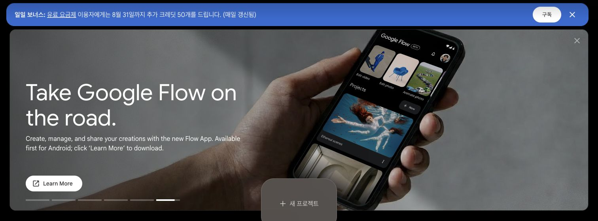
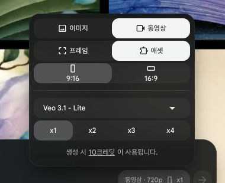

# Day 7 — 말 한마디로 20~23초 AI 쇼츠 완성하기

오늘은 설명문을 읽고 끝내지 않습니다. **Claude Desktop의 Code가 실제 파일을 만들고, 내가 Flow에서 영상 다섯 개를 고른 뒤, 자막까지 들어간 세로 MP4 한 편을 완성**합니다.

> 오늘 만드는 주제는 `한옥 처마가 여름빛은 막고 겨울빛은 들이는 이유` **하나**입니다. 주제를 고르느라 시간 쓰지 마세요. 그대로 따라 만들면 됩니다.

## 오늘 결과물

| 구간 | 눈에 보이는 작은 성공 | 남는 파일 |
|---|---|---|
| 기능 공부 | Claude가 작업 폴더와 스킬 상태를 설명 | 준비 완료 표시 |
| 쉬운 연습 | 제공 영상 3개를 자동 조립 | `D07_[닉네임]_연습.mp4` |
| 실제 제작 | 내 주제의 5컷·음성·자막을 자동 조립 | `D07_[닉네임]_쇼츠.mp4` |
| 응용 | 다음 편을 같은 방식으로 시작할 주문서 | `D07_[닉네임]_다음편.md` |

**Day 7 완주 기준은 실제 쇼츠 MP4입니다.** 연습 MP4만 만든 상태는 준비 성공이지 완주가 아닙니다.

## 오늘 사용하는 Claude Desktop 기능

| 기능 | 어디에 있나 | 오늘 하는 일 |
|---|---|---|
| **Code → 로컬** | Claude Desktop 왼쪽 위 `Code`, 새 작업의 `로컬` | 내 Mac/PC 폴더 안 파일을 읽고 실행 |
| **폴더 선택** | 로컬 작업 시작 화면 | `day07-start` 하나만 열기 |
| **Skill** | 채팅창에 `/` 입력 | `/ai-shorts`로 완성 파이프라인 호출 |
| **통합 Terminal** | Code 작업 화면의 터미널 영역 | Claude가 영상 조립 도구를 실행 |
| **파일/변경 확인** | Code 화면의 파일 목록과 변경 보기 | 생긴 대본·프롬프트·MP4 확인 |

모델은 수업에서 지정한 기본 모델, Effort는 **High**로 시작합니다. 이름이 조금 다르면 “더 깊게 생각”하는 쪽을 고릅니다. 설치와 외부 서비스 호출은 항상 승인 뒤 진행합니다.

---

## 0. 수업 전 준비 — 여기서 막히면 Day 7 전에 해결

### 0-1. 시작 폴더 받기

1. [Day 7 시작 패키지](downloads/day07-start.zip)를 누릅니다.
2. Mac은 ZIP을 두 번 누릅니다. Windows는 오른쪽 클릭 → **모두 압축 풀기**를 누릅니다.
3. 생긴 `day07-start` 폴더를 바탕화면으로 옮깁니다.
4. 폴더 안에 `README_FIRST.md`, `ai-shorts`, `demo-project`, `import_day6_brief.py`, `day06-handoff`가 보이면 성공입니다.

### 0-2. Claude Desktop에서 정확한 폴더 열기

1. Claude Desktop 왼쪽 위 **Code**를 누릅니다.
2. **로컬** → **폴더 선택…**을 누릅니다.
3. 바탕화면의 `day07-start`를 한 번 선택하고 **열기**를 누릅니다.
4. 설치나 외부 서비스 호출을 물어보면 내용을 읽고 승인합니다.

> `바탕화면` 전체나 `다운로드` 전체를 열지 않습니다. 오늘은 `day07-start` 하나만 엽니다.

### 0-3. 준비 확인과 설치

아래 문장을 그대로 보냅니다.

```text
이 폴더의 README_FIRST.md와 INSTALL_CLINIC.md를 먼저 읽어 주세요.
내 운영체제를 확인하고 쇼츠 제작에 필요한 프로그램과 ai-shorts 스킬을 점검해 주세요.
빠진 것이 있으면 한 단계씩 설명하고, 설치나 변경 전에는 반드시 내 승인을 기다리세요.
API 키 값은 읽거나 출력하지 마세요.
끝났으면 '준비 완료' 또는 막힌 한 가지를 쉬운 말로 알려 주세요.
```

Claude가 설치 계획을 보여 주면 대상이 `day07-start`와 `~/.claude/skills/ai-shorts`인지 확인한 뒤 승인합니다. **`준비 완료`를 받아야 다음으로 갑니다.**

새 Code 채팅을 열고 `/`를 입력했을 때 `ai-shorts`가 보이면 Skill 설치 성공입니다.

### 0-4. Typecast와 Flow 준비

- [Typecast 안전 연결 안내](day07-assets/TYPECAST_SETUP.md)를 엽니다.
- API 키는 Claude 채팅이나 카카오톡에 붙이지 않습니다. 안내 파일의 가려진 입력창에 본인이 직접 붙여넣습니다.
- [Google Flow](https://labs.google/fx/ko/tools/flow)에 로그인하고 화면에 표시되는 현재 크레딧을 확인합니다.
- 제작 구조는 `6초 × 5개`입니다. **실제 Flow 화면의 현재 차감 숫자에 5를 곱해 필요한 합계를 확인**합니다. 크레딧 숫자는 모델·계정·시점에 따라 달라질 수 있으므로 교재의 예전 화면과 비교하지 말고, 결제나 업그레이드는 자동으로 진행하지 않습니다.

---

## 1. 기능 공부 — 완성 파이프라인을 한 장으로 이해하기

Claude에게 보냅니다.

```text
/ai-shorts 스킬이 하는 일을 왕초보에게 설명해 주세요.
오늘 순서인 '주제 → 5문장 대본 → 목소리 선택 → 실제 낭독 길이 측정 →
Flow 영상 5개 → 다운로드 배치 → 세로 MP4 조립'을 한 줄씩 설명하세요.
내가 직접 해야 하는 일과 Claude가 하는 일을 나눠 보여 주세요.
아직 파일을 만들거나 외부 서비스를 호출하지 마세요.
```

핵심은 하나입니다.

```text
Claude가 앞부분을 준비 → 내가 Flow에서 영상 5개 생성 → Claude가 뒷부분을 조립
```

음성을 먼저 만드는 이유는 **실제 읽힌 시간을 알아야 각 영상에서 몇 초를 쓸지 정할 수 있기 때문**입니다.

---

## 2. 작은 성공 — 제공 재료로 14초 쇼츠 조립

외부 서비스와 크레딧을 전혀 쓰지 않는 연습입니다. 아래에서 `[닉네임]`만 자기 이름으로 바꿉니다.

```text
demo-project의 제공 재료만 사용해 작은 성공 연습을 해 주세요.
외부 API와 Google Flow는 호출하지 마세요.
먼저 영상 조각 3개, 목소리, 자막 시간표가 있는지 확인해 보여 주세요.
모두 있으면 원본은 건드리지 말고 D07_[닉네임]_연습.mp4로 조립하세요.
완성 뒤 결과 폴더를 열고 파일명, 길이, 1080×1920 여부, 음성과 자막 여부를 알려 주세요.
```

MP4를 두 번 눌러 직접 재생합니다.

- [ ] 세로 영상이다.
- [ ] 장면이 세 번 바뀐다.
- [ ] 목소리가 들린다.
- [ ] 한글 자막이 목소리에 맞춰 나온다.

네 개가 모두 맞으면 첫 번째 성공입니다.

> 여기서 만든 14초 영상은 **컴퓨터가 준비됐는지 확인하는 연습본**입니다. 인증용 최종 결과가 아닙니다. 바로 아래의 실제 5컷 제작으로 이어갑니다.

---

## 3. 실제 제작 시작 — Day 6 주문서 이어받기

Day 6을 완주했다면 `day07-start/day06-handoff` 안에 `brief.json`과 `shorts-brief.html`을 넣습니다. HTML을 두 번 눌러 내가 승인했던 5컷이 맞는지 먼저 봅니다.

Claude에게 보냅니다.

```text
day06-handoff/shorts-brief.html은 읽기 전용으로 열어 제목과 C1~C5를 보여 주세요.
day06-handoff/brief.json은 import_day6_brief.py로 구조를 검사해 주세요.
shorts-brief-v1, C1~C5, 계획 합계 20~23초가 모두 맞을 때만 my-short/script.txt로 가져오세요.
원본 두 파일은 수정·이동·삭제하지 마세요.
실행할 명령과 새로 생길 파일을 먼저 설명하고 내 승인을 기다리세요.
```

승인 뒤 Mac은 `python3`, Windows는 `py`로 같은 가져오기 파일을 실행합니다. 수강생이 명령을 직접 입력할 필요는 없습니다.

```text
Mac:     python3 import_day6_brief.py day06-handoff/brief.json my-short
Windows: py import_day6_brief.py day06-handoff/brief.json my-short
```

**성공 화면:** `Day 6 전달 검사 통과`, `my-short/script.txt`, 내레이션 다섯 줄이 보입니다. `day6-brief.json`과 `handoff-summary.md`도 함께 남습니다.

> 계획한 초는 아직 확정값이 아닙니다. Day 7에서 실제 목소리를 만든 뒤 컷 길이를 다시 측정합니다. 한 컷이 5초를 넘으면 그 문장만 줄입니다.

### Day 6을 건너뛴 사람 — 여기서 새 주제 고르기

주제를 못 정했으면 먼저 후보를 받습니다.

```text
/ai-shorts
건축, 생활 속 물건, 음식 원리, 교통 중에서 눈으로 보여 주기 좋은 주제 후보 8개를 주세요.
각 후보에 제목, 첫 문장, '알고 보니 반대였던 점'을 한 줄씩 붙이세요.
아직 Typecast와 Flow는 호출하지 마세요.
```

하나를 고른 뒤 보냅니다.

```text
[번호] 주제로 진행할게요.
한 문장 한 컷, 총 5문장, 전체 20~23초 대본을 만들어 주세요.
각 문장은 5초 안에 읽히게 짧게 쓰고, 확인하지 않은 숫자나 과장은 넣지 마세요.
내 승인 전에는 파일 저장, Typecast 호출, Flow 안내를 시작하지 마세요.
```

읽어 보고 이해 안 되는 문장 하나만 고칩니다.

```text
[몇 번째] 문장을 더 쉬운 말로 바꿔 전체를 다시 보여 주세요.
```

마음에 들면 승인합니다.

```text
이 대본을 승인합니다. 새 폴더 my-short를 만들고 script.txt로 저장하세요.
```

**성공 화면:** `my-short/script.txt`에 내가 승인한 5문장이 있습니다.

---

## 4. 목소리를 먼저 들어보고 선택하기

목소리를 이름만 보고 고르지 않습니다. 같은 첫 문장을 읽는 후보 다섯 개를 듣습니다.

```text
승인한 대본의 첫 문장으로 Typecast 목소리 후보 5개를 만들어 들려주세요.
차분하고 또렷한 한국어 다큐멘터리 톤으로 찾으세요.
API 키는 로컬 보안 파일에서만 불러오고 값은 절대 출력하지 마세요.
호출 전 예상 사용량과 생길 폴더를 말하고 내 승인을 기다리세요.
```

승인 뒤 Claude가 `voices` 폴더를 열어 주면 `00-전체듣기.wav`부터 듣고 번호를 고릅니다.

```text
[번호] 목소리로 정할게요. voices.json에서 그 번호의 voice_id만 읽어 my-short/voice.txt에 저장하세요.
비밀키 파일은 열거나 읽거나 바꾸지 말고, 아직 전체 대본은 합성하지 마세요.
```

**작은 성공:** 내 쇼츠의 목소리를 귀로 듣고 골랐습니다.

---

## 5. 전체 음성과 5컷 길이 확정

```text
my-short/voice.txt의 voice_id를 인자로 넘겨 선택한 목소리로 my-short/script.txt 전체를 합성해 주세요.
Mac은 run_tts_secure_mac.sh, Windows는 run_tts_secure_windows.ps1 중 맞는 안전 실행기만 사용하세요.
API 키 값은 읽거나 출력하지 마세요.
완성되면 narration.wav를 열어 들려주고, 실제 단어 시간표로 5컷 길이를 자동 계산하세요.
어느 컷이 5초를 넘으면 Flow로 가지 말고 그 문장만 짧게 고쳐 다시 확인받으세요.
```

Claude가 만들어야 하는 파일:

| 파일 | 쉬운 뜻 |
|---|---|
| `my-short/work/narration.wav` | 완성 목소리 |
| `my-short/work/words.json` | 말마다 자막이 나올 실제 시간 |
| `my-short/scenes.json` | C1~C5에서 사용할 실제 길이 |

`narration.wav`를 끝까지 듣고 잘못 읽힌 단어가 없는지 확인합니다. 발음을 고칠 마지막 시점입니다.

---

## 6. Flow용 장면 주문서 5개 만들기

```text
실제 목소리 길이에 맞춰 C1~C5 장면 주문서를 만들어 주세요.
C1 훅, C2 반전, C3 원리 A, C4 같은 구도에서 조건 하나만 바꾼 원리 B, C5 엔딩으로 구성하세요.
각 컷은 Flow에서 6초 생성하고 실제 사용할 길이를 함께 적으세요.
카메라 움직임, 재질, 빛의 방향을 구체적으로 쓰고 화면 속 글자는 만들지 않게 하세요.
prompts.md로 저장한 뒤 C1~C5 목록을 한 번에 보여 주세요. 아직 Flow는 열지 마세요.
```

**성공 화면:** `my-short/prompts.md`, `C1 C2 C3 C4 C5`, 진행률 `0/5`.

[5컷 견본 보드 열기](day07-assets/flow-board.html)에서 카드와 복사 버튼을 먼저 눌러 봅니다. 견본은 구조를 배우는 용도이며 실제 제작에서는 내 `prompts.md`를 씁니다.

---

## 7. Flow에서 세로 영상 5개 만들기

[Flow 5컷 화면 안내](day07-assets/FLOW_5CUT_GUIDE.md)를 옆에 열고 진행합니다.

### 처음 한 번만 설정

1. Flow에서 **+ 새 프로젝트**를 누릅니다.
2. 왼쪽에서 **모든 미디어**를 고릅니다.
3. 아래 입력칸 오른쪽의 설정 단추를 누릅니다.
4. **동영상 → 애셋 → 9:16 → Omni Flash → 6s → x1**을 고릅니다.
5. 만들기 전에 화면 아래의 **현재 차감 숫자**를 확인하고, 그 숫자에 5를 곱해 다섯 컷의 필요량을 계산합니다. 남은 크레딧보다 크면 생성하지 말고 수업 운영자에게 화면을 보여 줍니다.





> 크레딧 숫자는 모델·계정·시점에 따라 바뀔 수 있습니다. 남은 양이나 차감 방식이 이해되지 않으면 만들기를 누르지 말고 설정 화면을 Claude와 수업 운영자에게 보여 줍니다.

### C1부터 C5까지 반복

Claude에게 아래처럼 요청하면 긴 프롬프트를 마우스로 긁지 않아도 됩니다.

```text
C1 프롬프트만 클립보드에 복사해 주세요. 전문을 채팅에 다시 출력하지 마세요.
```

1. Flow 입력칸에 붙여넣고 **만들기**를 누릅니다.
2. 기다리지 말고 C2, C3, C4, C5도 차례로 생성에 걸어 둡니다.
3. 완성된 결과는 재생해 이상한 글자·무너진 물체가 없는지 봅니다.
4. **완성되는 순서대로 하나씩 다운로드**합니다. 파일명은 바꾸지 않습니다.


다운로드를 한꺼번에 받으면 순서를 알 수 없게 됩니다. 이미 그랬다면 당황하지 말고 다음 단계에서 확인 시트를 봅니다.

**성공 화면:** 다운로드 폴더에 최신 동영상 5개, 진행률 `5/5`.

---

## 8. 다운로드 영상 배치와 최종 조립

```text
Flow 클립 5개를 다 받았어요.
다운로드 원본은 지우거나 옮기지 말고, 먼저 배치 미리보기만 해 주세요.
C1~C5와 다운로드 파일, 실제 길이, 필요한 길이를 표로 보여 주세요.
순서가 확실하지 않으면 추측하지 말고 확인 시트를 열어 주세요.
```

표가 맞으면 말합니다.

```text
표 순서가 맞습니다. 다운로드 원본은 남겨 두고 my-short/clips로 복사해 주세요.
5/5 준비 상태를 확인한 뒤 D07_[닉네임]_쇼츠.mp4로 끝까지 조립하세요.
완성되면 결과 폴더를 열고 길이, 1080×1920, 음성, 자막, 재생 가능 여부를 알려 주세요.
```

Claude가 자동으로 하는 일:

```text
각 영상 길이 맞추기 → 1080×1920 세로 화면 → 순서대로 잇기
→ 목소리 넣기 → 실제 말 시간에 맞춘 자막 → MP4 저장
```

### 크레딧이 끝났거나 한 컷이 실패했다면

재결제부터 하지 않습니다.

```text
Flow 크레딧이 끝났어요. 지금 받은 클립만으로 완성해 주세요.
빠진 컷의 시간을 앞뒤 컷에 나누되 문장 자막 시간은 유지하고,
무엇을 바꿨는지 조립 전에 보여 주세요.
```

최신 파이프라인은 받은 클립만으로 시간을 다시 맞춰 끝까지 조립할 수 있습니다.

---

## 9. 눈과 귀로 최종 검수

- [ ] 첫 1초 안에 장면과 목소리가 바로 시작한다.
- [ ] C2에서 이야기 방향이 바뀐다.
- [ ] C3·C4가 같은 구도에서 조건 하나만 달라 비교된다.
- [ ] 마지막 목소리와 자막이 잘리지 않는다.
- [ ] 세로 화면이 늘어나거나 찌그러지지 않는다.
- [ ] 자막이 화면 맨 아래 버튼 영역에 붙지 않는다.

휴대폰으로 보내 한 번 더 재생합니다.

---

## 10. 응용 — 다음 편 주문서 남기기

```text
방금 완성한 쇼츠의 구조는 유지하고 소재만 바꿔 다음 편 후보 3개를 주세요.
각 후보에 5문장 대본의 뼈대와 C3·C4에서 바꿀 조건 하나를 적으세요.
내가 고른 1개를 D07_[닉네임]_다음편.md로 저장하세요.
Typecast와 Flow는 실행하지 마세요.
```

이 파일이 있으면 다음 영상은 `/ai-shorts 이 기획으로 이어서 만들어줘`로 시작할 수 있습니다.

## 11. 선택 보너스 10분 — 휴대폰 `발송`으로 완성 영상 확인 맡기기

`발송(Dispatch)`은 휴대폰에서 보낸 일을 켜져 있는 내 컴퓨터의 Claude Desktop이 처리하고 결과를 다시 휴대폰에 알려 주는 기능입니다. **Pro 또는 Max 요금제와 최신 Desktop·모바일 앱**이 필요합니다. 메뉴가 없거나 다른 요금제라면 건너뛰어도 Day 7 완주입니다.


### 안전한 연습 폴더 준비

1. 바탕화면에 `D07_발송_확인` 폴더를 새로 만듭니다.
2. 최종 `D07_[닉네임]_쇼츠.mp4`를 이 폴더에 **복사**합니다. 원본은 그대로 둡니다.
3. 이 폴더에는 영상 한 개만 둡니다. API 키, 개인 문서, 다운로드 전체 폴더는 연결하지 않습니다.

### Desktop과 휴대폰 연결

1. 컴퓨터에서 Claude Desktop을 최신 버전으로 업데이트하고 켜 둡니다.
2. Desktop의 **Cowork** 왼쪽 메뉴에서 **발송**을 누릅니다.
3. **시작하기 → 설정 완료**를 누릅니다. 파일 접근 범위를 고르는 화면이 나오면 `D07_발송_확인`만 허용합니다.
4. 휴대폰의 Claude 앱에서도 같은 계정으로 로그인하고 **발송(Dispatch)**을 엽니다. (앱 버전에 따라 `Cowork` 안에 있거나 바로 보일 수 있습니다.)
5. 컴퓨터가 깨어 있고 인터넷에 연결되어 있는지 확인합니다.

> 설정 화면이 컴퓨터 파일 전체처럼 넓은 권한만 제시하고 범위를 제한할 수 없다면 허용하지 말고 이 보너스를 건너뜁니다.

### 휴대폰에서 읽기 전용 요청 보내기

아래 문장을 휴대폰의 **발송**에 보냅니다.

```text
바탕화면의 D07_발송_확인 폴더에 있는 MP4 한 개를 읽기 전용으로 확인해 주세요.
파일명, 재생 시간, 화면 크기, 영상·음성 포함 여부만 표로 알려 주세요.
파일을 수정·이동·이름 변경·삭제하지 마세요.
파일을 업로드·공유·메시지 전송하거나 외부 웹사이트를 열지 마세요.
추가 권한이나 쓰기 작업이 필요하면 실행하지 말고 나에게 물어보세요.
```

발송이 권한을 요청하면 대상이 `D07_발송_확인`인지 읽고 허용합니다. 다른 폴더, 파일 변경, 외부 전송 요청이면 거절합니다. 완료 알림이 오면 휴대폰 표에서 다음을 확인합니다.

- 파일명이 `D07_[닉네임]_쇼츠.mp4`인가?
- 화면이 `1080×1920`인가?
- 영상과 음성이 모두 있는가?
- 원본 파일의 이름과 수정 시각이 그대로인가?

이 보너스는 **휴대폰에서 일을 맡기고 결과를 받는 경험**만 합니다. 오픈카톡 업로드는 수강생이 최종 영상을 직접 확인한 뒤 별도로 합니다.

## 오픈카톡 인증 — 30초

🎬 **인증 파일:** 완성한 쇼츠 **MP4를 그대로** 올립니다 — 오늘은 캡처보다 영상입니다.
(API 키나 크레딧 화면은 올리지 않습니다)

```text
[왕초보2기 Day 7 / 닉네임]
✅ 내 첫 AI 쇼츠 완성
✅ 영상 재생 확인 (PC든 휴대폰이든)
💬 소감:
```

## 막혔을 때 Claude에게 하는 말

| 상황 | 그대로 보낼 말 |
|---|---|
| 준비가 안 됨 | `다 설치됐는지 다시 확인하고, 안 된 한 가지만 쉽게 알려줘.` |
| 목소리 파일을 못 찾음 | `목소리 샘플 폴더를 열어줘.` |
| 긴 프롬프트 복사가 어려움 | `C3 프롬프트만 클립보드에 복사해줘.` |
| 다운로드 순서가 섞임 | `다운로드 순서를 추측하지 말고 확인 시트를 열어줘.` |
| 한 컷이 짧음 | `짧은 컷 번호와 필요한 길이만 알려줘.` |
| 크레딧이 없음 | `지금 받은 클립만으로 시간을 다시 맞춰 완성해줘.` |
| 중간에 멈춤 | `현재 파일을 확인하고 마지막으로 성공한 단계부터 이어서 해줘.` |
| 결과 위치를 모름 | `결과 폴더를 열어줘.` |

## 참고

- [Google Flow](https://labs.google/fx/ko/tools/flow)
- [Google Flow 공식 도움말](https://labs.google/fx/tools/flow/faq)
- [Typecast 개발자 페이지](https://studio.typecast.ai/developers/api)
- [교재에 반영한 최신 파이프라인 기록](day07-assets/AI_SHORTS_VERSION.md)
- [발송 공식 사용 안내 — Anthropic](https://claude.com/docs/cowork/guide/dispatch)
- [Claude Code Desktop 공식 안내](https://code.claude.com/docs/en/desktop#sessions-from-dispatch)
