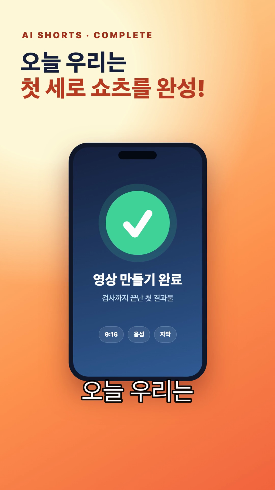

# Day 7 — 휴대폰 Dispatch에서 시작해 AI 쇼츠 MP4까지

오늘은 새 자동화를 만들지 않는다. 운영자가 실제 사용하는 **`/ai-shorts` 기준 패키지**를 설치하고, API 없는 데모로 MP4를 직접 조립한다. 이어서 내 다음 쇼츠의 기획안을 별도 파일로 만들고, 마지막에는 휴대폰 Dispatch에서 그 기획을 Desktop의 Code 세션으로 이어 본다.

## 기능과 정확한 위치

| 기능 | 쉬운 뜻 | Claude Desktop에서 찾는 곳 |
|---|---|---|
| Dispatch | 휴대폰에서 일을 보내고 완료·승인 알림을 받는 지속 대화 | Desktop **Cowork 탭 → Dispatch**, 모바일 Claude 앱의 **Dispatch** |
| Dispatch Code 세션 | Dispatch가 개발 작업을 Code로 넘긴 세션 | Desktop **Code 탭 왼쪽 세션 목록**, `Dispatch` 배지 |
| `/ai-shorts` Skill | 대본→TTS→씬 설계→클립 배치→영상 조립 순서를 기억한 설명서와 스크립트 | Code 입력창에서 `/`, 또는 입력창 옆 **`+ → Slash commands`** |
| Terminal | 검사·조립 명령을 붙여넣는 창 | Code 상단 **Views → Terminal**, Mac·Windows 모두 `Ctrl`+`` ` `` |
| Browser pane | 완성 MP4를 재생하고 보는 창 | 채팅의 MP4 경로 클릭, 또는 **Views → Browser** |

> Dispatch는 현재 Pro/Max에서 제공되며 Team/Enterprise에서는 제공되지 않을 수 있다. 모바일 연결이나 요금제 때문에 Dispatch를 못 써도 **Local Code 데모 MP4 완성**으로 Day 7 기본 완주는 할 수 있다.

## 교재에 넣을 화면 캡처 목록

아래 이미지는 현재 실제 Desktop의 Dispatch 진입 화면이다. `① Cowork`, `② Dispatch`, `③ 연결 안내` 순서로 찾는다.


나머지 클릭 순서는 다음과 같다.

1. 모바일: Claude 앱 → **Dispatch** → 연결된 컴퓨터 확인 → 메시지 입력.
2. Desktop 결과: **Code** → 왼쪽 세션 목록 → `Dispatch` 배지가 붙은 세션.
3. Skill: Code 입력창 옆 `+` → **Slash commands** → `ai-shorts`.
4. 검사와 재생: **Views → Terminal** → 성공 문장 확인 → 채팅의 MP4 경로 클릭.

모바일·Dispatch 세션·Skill·Terminal 화면은 운영자가 개강 직전 실제 계정으로 추가 촬영한다. 촬영 전까지 존재하지 않는 이미지를 교재에서 불러오지 않는다.

## 오늘 결과물

- API 없이 직접 조립한 `D7_닉네임_조립연습.mp4` — 1080×1920, 음성·자막 포함
- 내 주제로 만든 `D7_닉네임_다음편기획.md`
- `D7_기준_쇼츠.mp4`와 내 결과를 나란히 보여 주는 캡처
- `/ai-shorts`를 호출한 화면
- Dispatch 완료 화면 또는 Local 대체 인증

실제 기준 MP4의 10초 지점은 아래처럼 보인다. 완성 영상에서 세로 화면과 큰 한글 자막이 같은 형태로 보이면 된다.



## 3시간 30분 시간표

| 순서 | 시간 | 하는 일 | 성공 표시 |
|---|---:|---|---|
| 기능 이해 | 20분 | 실제 파이프라인과 Dispatch 위치 보기 | 자동/수동 단계를 구분한다 |
| 설치 | 30분 | 기준 Skill을 사용자 폴더에 복사 | 새 세션에서 `/ai-shorts`가 보인다 |
| 작은 결과 | 45분 | API 없는 데모 검사·조립 | 기준 MP4와 같은 규격이 나온다 |
| 메인 결과 | 60분 | 기준 영상 조립 + 내 다음 편 6컷 기획 | MP4와 내 기획안이 따로 생긴다 |
| Dispatch | 30분 | 휴대폰에서 다음 기획을 Code로 전달 | Desktop에 Dispatch 배지 세션 |
| 검수·인증 | 25분 | 재생·보안·권리 확인 | 오픈카톡 제출 완료 |

## 1. 파이프라인 이해

```text
주제·대본 → Typecast 음성/타임스탬프 → Flow 씬 프롬프트
          → 사람이 Flow 클립 생성 → 자동 배치·검사 → FFmpeg MP4 조립
```

- `/ai-shorts`가 자동화하는 것: 대본·프롬프트·파일 구조, Typecast TTS 호출, 받은 클립 배치, 길이 검사, 1080×1920 크롭, 자막·음성 합성.
- 사람이 하는 것: 주제와 사실 승인, Google Flow에서 클립 생성·다운로드, 결과 품질과 사용 권리 확인.
- 중요한 순서: 실제 운영에서는 **TTS를 먼저** 만든다. 낭독 시간으로 씬 사용 길이를 정한 뒤 Flow 영상을 만든다.

오늘 데모는 이미 만든 샘플 음성과 타임스탬프를 사용하므로 Typecast 키도 Flow 계정도 필요 없다.

## 2. 기준 패키지 설치

1. [Day 7 시작 패키지 ZIP을 받는다](downloads/day07-start.zip). 약 15MB이며 받은 뒤 압축을 푼다.
2. Claude Code Desktop에서 그 폴더를 Local로 연다.
3. 권한은 **Manual(구 Ask permissions)**로 둔다.
4. 다음 프롬프트를 붙여넣는다.

```text
나는 컴퓨터 왕초보입니다. 이 폴더에는 운영자가 검증한 ai-shorts Skill과 demo-project가 있습니다.
기존 ai-shorts 코드는 수정하거나 새로 만들지 마세요.

1. 내 운영체제가 Mac인지 Windows인지 확인하세요.
2. 설치 전에 Python 3와 ffmpeg가 있는지만 읽기 전용으로 확인하세요.
3. install_mac.sh 또는 install_windows.ps1 중 맞는 파일 하나의 작업 내용을 쉬운 말로 설명하세요.
4. 설치할 위치가 내 사용자 폴더의 .claude/skills/ai-shorts인지 보여 주고 내 확인을 기다리세요.
5. 내가 승인하면 설치 스크립트를 실행하고, 완료 뒤 새 Code 세션을 열어 /ai-shorts를 확인하라고 안내하세요.
6. API 키를 묻거나 출력하지 마세요.
```

Mac에서 운영자가 승인한 명령:

```bash
bash install_mac.sh
```

Windows PowerShell에서 운영자가 승인한 명령:

```powershell
powershell -ExecutionPolicy Bypass -File .\install_windows.ps1
```

Python 또는 ffmpeg가 없으면 여기서 멈춘다. 왕초보가 인터넷의 임의 설치 명령을 고르지 않는다. 운영자는 개강 전에 Mac/Windows용 Python·ffmpeg 설치 안내와 기준 컴퓨터를 준비한다.

설치 후 **새 Code 세션**을 열고 입력창에 `/`를 쓴다. `ai-shorts`가 보이면 설치 성공이다.

## 3. 작은 결과 — API 없는 데모 MP4

`demo-project`에는 다음이 이미 있다.

```text
script.txt             대본
prompts.md             세 장면 설계
scenes.json            클립과 사용할 길이
clips/c01~c03.mp4      샘플 세로 클립
work/narration.wav     샘플 음성
work/words.json        자막 시간표
D7_기준_쇼츠.mp4        운영자 기준 완성본
```

아래 프롬프트를 붙여넣는다.

```text
기존 ai-shorts Skill의 scripts/check.py와 scripts/build.py만 사용해 demo-project를 검사하고 조립해 주세요.
새 파이프라인이나 새 빌드 코드를 만들지 마세요.
먼저 실행할 명령 두 줄과 생길 결과 파일을 보여 주고 내 승인을 기다리세요.
API 호출, Typecast TTS, Flow 접속은 하지 마세요. 제공된 narration.wav와 words.json을 그대로 사용하세요.
완성 파일명은 demo-project/D7_내닉네임_조립연습.mp4로 해 주세요.
완성 뒤 길이, 해상도, 음성 존재 여부를 검사하고 Browser pane에서 재생해 주세요.
```

직접 붙여넣을 기준 명령은 `day07-assets/README.md`의 Mac/Windows 부분에 있다. 경로를 임의로 바꾸지 않는다.

**성공 문장:** `3/3 준비됨`, `build.py 실행 가능`, 마지막 줄에 `14.00s 1080x1920`이 차례로 보인다.

완성 MP4를 Browser pane에서 재생하고 다음을 확인한다.

- 세 장면이 순서대로 바뀐다.
- 한국어 음성이 들린다.
- 흰색 자막이 음성과 비슷한 시점에 나온다.
- 세로 9:16 화면이 찌그러지지 않는다.

## 4. 메인 결과 — 기준 영상은 그대로, 내 다음 편은 새 기획으로

API 없는 기본 과정에서 샘플 음성·자막·장면 순서를 바꾸면 서로 어긋난다. 그래서 기준 영상은 **조립 연습본**으로 정직하게 표시하고, 내 주제는 별도의 **6컷 다음 편 기획안**으로 만든다. 샘플 `prompts.md`, `scenes.json`, `narration.wav`, `words.json`은 수정하지 않는다.

```text
/ai-shorts의 최신 6컷 기준으로 내 다음 쇼츠 기획안을 만들고 싶습니다.
주제: [내 주제]
대상: [볼 사람]
전하고 싶은 한 문장: [한 문장]

기존 파이프라인 코드는 수정하지 마세요.
먼저 훅부터 완성까지 6컷의 역할, 화면, 카메라 움직임을 표로 제안하고 내 승인을 기다리세요.
승인 뒤 demo-project/D7_닉네임_다음편기획.md에 저장하세요.
데모의 prompts.md, scenes.json, narration.wav, words.json, D7_기준_쇼츠.mp4는 바꾸지 마세요.
아직 Typecast나 Flow를 호출하지 말고, 필요한 다음 준비물만 마지막에 적어 주세요.
```

이 단계에서 완성되는 것은 **검증된 기준 영상 조립본 + 내 다음 편 제작 설계**다. 실제 내 음성과 장면까지 들어간 새 영상은 다음 운영 경로에서 만든다.

## 5. 실제 운영 경로 — Typecast + Flow

운영 경로는 계정·비용·권리를 확인한 사람만 한다.

1. `/ai-shorts 주제: …, 대상: …`로 대본을 만든 뒤 사실과 문장을 승인한다.
2. `TYPECAST_API_KEY`와 `TYPECAST_VOICE`는 운영자가 마련한 안전한 환경변수에 저장한다. 채팅에 붙여넣지 않는다.
3. `tts.py`로 `work/narration.wav`와 `work/words.json`을 먼저 만든다.
4. 실제 낭독 시간으로 `prompts.md`와 `scenes.json`을 확정한다.
5. Google Flow에서 C1부터 순서대로 생성해 다운로드한다.
6. `ingest.py` 미리보기 후 `--apply`, 이어서 `check.py`, 마지막으로 `build.py`를 실행한다.

패키지의 한 번 실행 래퍼 `make-short.sh`는 Mac/Linux 셸용이다. Windows 수강생은 `tts.py → ingest.py → check.py → build.py`를 PowerShell에서 순서대로 실행한다. 웹 플랜과 API 플랜, Flow 크레딧은 별개일 수 있으므로 실행 당일 공식 계정 화면을 확인한다.

## 6. Dispatch — 휴대폰에서 다음 쇼츠를 맡기기

### Desktop 설정 캡처 지점

1. Claude Desktop의 **Cowork → Dispatch**를 연다.
2. 화면 안내에 따라 휴대폰 연결 또는 QR/연결 설정을 완료한다.
3. 연결된 컴퓨터 이름이 본인 컴퓨터인지 확인한다.
4. 개인정보를 가린 뒤 `01-desktop-dispatch-start.png`용 화면을 찍는다.

### 모바일 설정 캡처 지점

1. 같은 계정으로 Claude 모바일 앱에 로그인한다.
2. **Dispatch**를 연다.
3. 연결된 컴퓨터와 메시지 입력칸이 보이는 화면을 찍는다.
4. 알림 권한은 원할 때만 허용한다. 잠금화면에 민감한 작업명이 보일 수 있다.

### 보낼 프롬프트

```text
내 데스크톱의 day07-assets/demo-project를 대상으로 Claude Code 세션을 열어 주세요.
기존 ai-shorts 파이프라인 코드는 수정하지 마세요.
다음 쇼츠 주제는 [주제], 대상은 [대상]입니다.
script.txt는 바꾸지 말고 prompts.md에 훅·전환·완성 3장면 기획 초안만 작성하세요.
외부 서비스 접속, API 호출, 결제, 파일 삭제는 하지 마세요.
완료하면 바꾼 파일 하나와 검토할 질문 하나를 알려 주세요.
```

Desktop의 **Code 탭 왼쪽 목록**에 Dispatch 배지 세션이 나타나는지 확인한다. 완료 또는 승인이 필요하면 휴대폰 알림을 받고 Desktop에서 Diff를 본다. Dispatch가 문서 작업으로 판단해 Cowork에서 끝냈다면 `이 작업을 Claude Code 세션으로 열어 demo-project의 prompts.md에 저장해 주세요.`라고 명확히 요청한다.

Dispatch를 사용할 수 없는 사람은 새 Local Code 세션에서 같은 프롬프트를 실행하고 인증문에 `Local 대체`라고 쓴다.

## 완료 판정

- [ ] 새 세션에서 `/ai-shorts`가 보인다.
- [ ] 원본 파이프라인 코드를 수정하지 않았다.
- [ ] `check.py` 결과가 `3/3 준비됨`이다.
- [ ] 새 MP4가 14초, 1080×1920이며 음성·자막이 있다.
- [ ] 기준 MP4를 덮어쓰지 않고 `D7_닉네임_조립연습.mp4`를 따로 만들었다.
- [ ] 내 주제의 `D7_닉네임_다음편기획.md` 6컷 기획이 있다.
- [ ] Dispatch 배지 Code 세션 또는 Local 대체 세션을 확인했다.
- [ ] API 키·이메일·개인 경로·결제 화면이 인증물에 없다.

첫 다섯 항목은 필수다. `MP4가 존재한다`만으로 통과하지 않고 직접 재생해야 한다.

## 막혔을 때

| 화면/증상 | 조치 |
|---|---|
| `/ai-shorts`가 없음 | 설치 위치 확인 후 Claude Code 새 세션 |
| `ffmpeg not found` | 임의 설치를 멈추고 OS와 화면을 운영자에게 전달 |
| `Pillow` 오류 | 설치 스크립트가 만든 Skill 내부 `.venv` Python을 사용했는지 확인 |
| `3/3`이 아님 | 없는 씬 또는 짧은 씬 번호만 확인; 원본을 삭제하지 않음 |
| 음성은 있는데 자막 없음 | `work/words.json`과 Skill 내부 Python 사용 여부 확인 |
| Dispatch가 Cowork에서만 답함 | “Claude Code 세션을 열어 해당 파일에 저장”이라고 명시 |
| 휴대폰 알림이 없음 | Desktop에서 세션 상태를 확인하고 알림 설정은 선택적으로 점검 |

## 오픈카톡 인증문

```text
[왕초보2기 Day 7 / 닉네임]
오늘 만든 것: /ai-shorts 기준 파이프라인으로 조립한 세로 MP4 + 내 다음 편 기획
검사 결과: 3/3 준비됨 / 14초 / 1080×1920 / 음성·자막 확인
내 주제: __________
내가 만든 것: D7_닉네임_다음편기획.md의 6컷 설계
Dispatch: 성공 / Local 대체
결과물: D7_닉네임_조립연습.mp4 + 재생 화면 캡처
다음 운영 단계: Typecast·Flow로 내 음성과 영상 만들기
```

## 공식 레퍼런스와 실제 사례

- [Claude Code Desktop 공식 문서](https://code.claude.com/docs/en/desktop): Dispatch 세션, 모바일 알림, Skill, Terminal, Browser pane의 현재 위치와 제한.
- [휴대폰에서 Cowork 작업 맡기기—Dispatch 공식 도움말](https://support.claude.com/en/articles/13947068-assign-tasks-from-anywhere-in-claude-cowork): 휴대폰에서 데스크톱 파일·Connector·앱을 이용하는 Dispatch 설정.
- [Claude Code Skills 공식 문서](https://code.claude.com/docs/en/slash-commands): `/ai-shorts`가 사용하는 `SKILL.md` 구조.
- [Google Flow 공식 도움말](https://labs.google/fx/tools/flow/faq): Veo 기반 영상 제작, 지원 요금제와 데스크톱 Chromium 권장 환경.
- [Flow TV 공식 사례](https://labs.google/flow/tv/faq): Veo로 생성된 실제 영상 사례를 볼 때 사용한다. 구조와 카메라 움직임만 관찰하고 복제하지 않는다.
- [YouTube 자막 공식 도움말](https://support.google.com/youtube/answer/2734796): 타임스탬프가 있는 자막과 접근성의 역할을 확인한다.
- 로컬 실제 사례: `day07-assets/ai-shorts/references/prompt-formula.md`의 한옥 처마 예시는 반전 대본, 씬 프롬프트, 실제 58.7초 TTS 기반 컷 길이를 함께 보여 준다.
